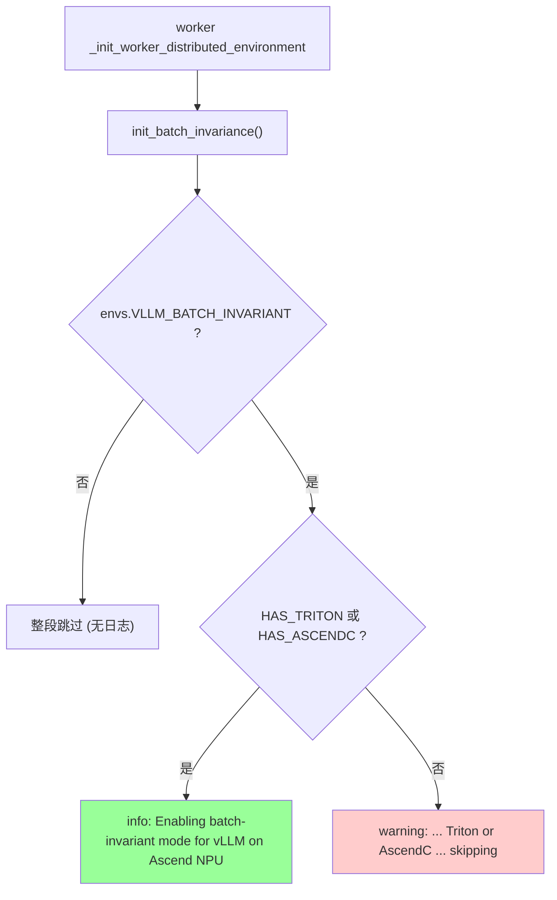
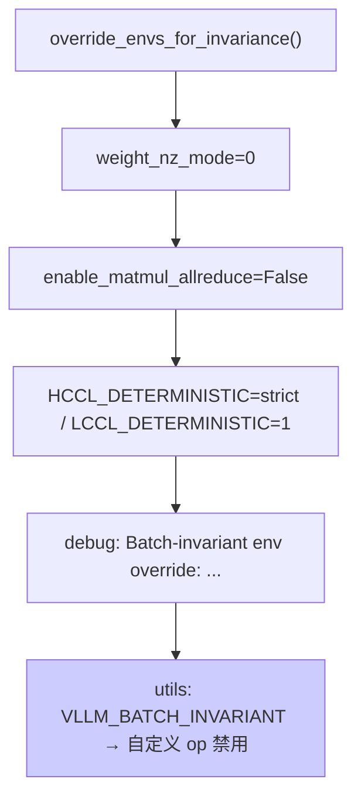
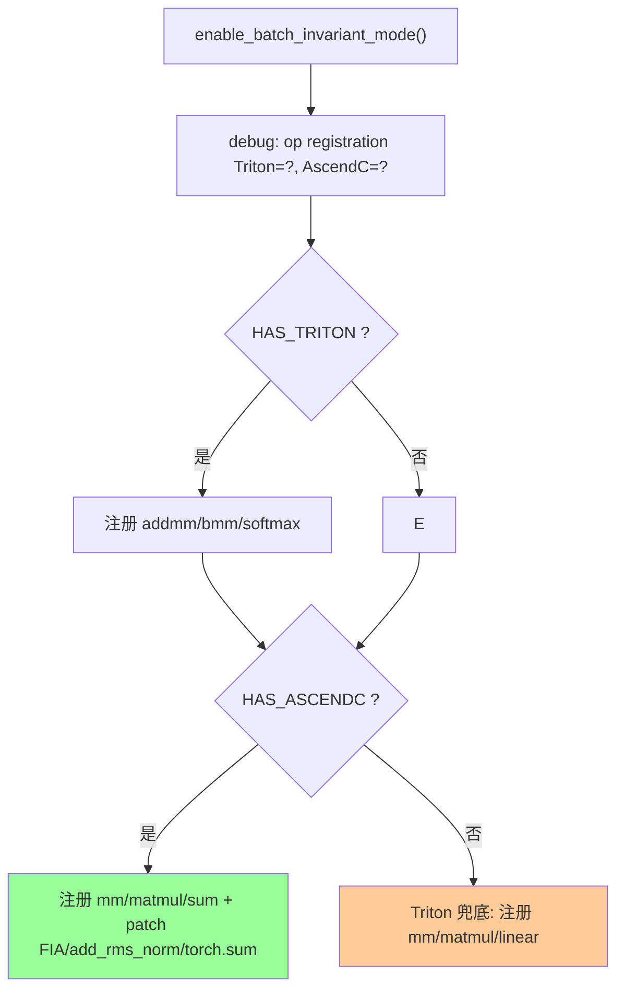
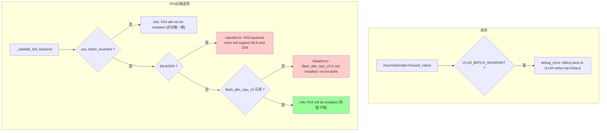
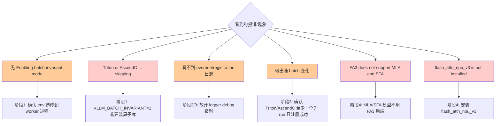

# Batch Invariance（批不变性 / 批一致性）— 日志定位指南

> **这是什么**：让模型输出与 batch 大小、以及 batch 内请求的排列顺序**无关**，从而做到确定、可复现。它对 RL/RLHF 训练尤为关键——稳定的训练依赖可复现的 rollout。实现上主要做三件事：注册一组确定性算子（matmul、softmax、sum 等），关闭会引入非确定性的优化，并固定集合通信的确定性环境。相关代码位于 `vllm_ascend/batch_invariant.py`、`vllm_ascend/ops/triton/batch_invariant/*`、`vllm_ascend/sample/sampler.py`、`vllm_ascend/platform.py`。
> **覆盖范围**：从 `VLLM_BATCH_INVARIANT=1` 在 worker 分布式初始化时触发，到运行期采样 / 注意力后端走确定性路径。
> **涉及组件**：`NPUWorker`（初始化触发）、`vllm_ascend.batch_invariant`（环境覆盖 + 算子注册）、`AscendSampler`（采样回退）、`NPUPlatform`（FA3 后端选择）（详见 [附录 A](#a-涉及仓库与组件)）。
>
> | 术语 | 含义 |
> |------|------|
> | 批不变 | 同输入在不同 batch 大小/顺序下产生**相同**输出 |
> | Triton 实现 | `HAS_TRITON` 为真时用 Triton kernel 注册 addmm/bmm/softmax/mm/matmul |
> | AscendC 实现 | `batch_invariant_ops`（`HAS_ASCENDC_BATCH_INVARIANT`）优先，注册 mm/matmul/sum 并 patch FIA/add_rms_norm |
> | 训推一致 | training-inference consistency，本特性的别称；FA3 后端仅在此场景启用 |
> | FA3 | flash_attn_npu_v3 后端，仅训推一致场景启用（牺牲性能换一致性） |
>
> **你需要准备**：
>
> - 推理侧日志：`VLLM_BATCH_INVARIANT=1 vllm serve ...` 进程的 stdout/stderr。部分为 `logger.debug`/`debug_once`，需放开 debug 级别才可见。
> - 快速过滤：`grep -E "batch-invariant|BATCH_INVARIANT|training-inference consistency|FA3" <日志文件>`
>
> **说明（重要）**：关键信号来自 `vllm_ascend.batch_invariant`、`AscendSampler` 与 `NPUPlatform._validate_fa3_backend` 打印的 `logger.info`/`warning`/`debug` 及异常文本。其中 `init_batch_invariance` 的 info/warning 默认即可见，而环境覆盖与算子注册都是 `logger.debug`，需先放开 debug 级别才能看到。另需注意：`VLLM_BATCH_INVARIANT` 是 **vLLM 上游的环境变量**，并不在 vllm-ascend 的 `envs.py` 中。
>
> **阅读优先级**：紧急排障 → 直接看下方「判断口诀」；系统了解 → 按 §一 → §二 → 附录顺序读。

## 目录

- [一、快速定位（先看这里）](#一快速定位先看这里)
- [二、分阶段详细定位](#二分阶段详细定位)
    - [2.1 阶段 1：触发与可用性检查](#21-阶段-1触发与可用性检查)
    - [2.2 阶段 2：确定性环境覆盖](#22-阶段-2确定性环境覆盖)
    - [2.3 阶段 3：批不变算子注册](#23-阶段-3批不变算子注册)
    - [2.4 阶段 4：运行期一致性路径](#24-阶段-4运行期一致性路径)
- [三、卡点速查（卡在 X → 查 Y）](#三卡点速查卡在-x--查-y)
- [四、附录](#四附录)
    - [A. 涉及仓库与组件](#a-涉及仓库与组件)
    - [B. 关键配置](#b-关键配置)
    - [C. 全量日志逐步明细](#c-全量日志逐步明细)
    - [D. 全量流程图（Mermaid）](#d-全量流程图mermaid)
    - [E. 关键节点索引](#e-关键节点索引)
    - [F. 故障场景流程](#f-故障场景流程)

---

## 一、快速定位（先看这里）

> **30 秒速判**：在日志里按下表顺序搜标志日志，**最后出现的那条 = 你走到了哪一步**；该步异常文本出现就跳对应 §二 / §三。

| 步 | 大阶段 | 标志日志（命中即「走到了」） | 正常应接着看到 | 没走到 / 报错 | 全量（表→图） |
|----|--------|------------------------------|----------------|----------------|----------------|
| 1 | 触发与可用性检查 | `Enabling batch-invariant mode for vLLM on Ascend NPU.` | 进入环境覆盖 | `Batch-invariant mode requested but Triton or AscendC ... skipping` → §2.1 | [C.1](#c1) → [D.1](#d1) |
| 2 | 确定性环境覆盖 | `Batch-invariant env override: weight_nz_mode=0, ...`（debug） | 进入算子注册 | 未生效 → 确认 debug 级别 / `get_ascend_config()` → §2.2 | [C.2](#c2) → [D.2](#d2) |
| 3 | 算子注册 | `Batch-invariant op registration: Triton=%s, AscendC=%s`（debug） | 运行期走确定性算子 | Triton/AscendC 都不可用 → §2.1 警告 | [C.3](#c3) → [D.3](#d3) |
| 4 | 运行期一致性路径 | `[sample/sampler] BATCH_INVARIANT mode enabled, falling back to vLLM native top-k/top-p`（debug_once） | 输出确定可复现 | `FA3 backend does not support MLA and SFA` / `flash_attn_npu_v3 is not installed` → §2.4 | [C.4](#c4) → [D.4](#d4) |

**判断口诀**：

- **设了 `VLLM_BATCH_INVARIANT=1` 却无 `Enabling batch-invariant mode`** → env 未被 worker 读到，或根本没走 `init_batch_invariance`（阶段 1）。
- **报 `Batch-invariant mode requested but Triton or AscendC ... skipping`** → 既无 Triton 也无 AscendC 批不变算子库（需 `VLLM_BATCH_INVARIANT=1` 构建时装库）（阶段 1）。
- **看不到 env override / op registration 日志** → 它们是 `logger.debug`，需放开 debug 级别（阶段 2/3）。
- **输出仍随 batch 变化** → 算子未注册成功，或走了非批不变路径（阶段 3/4）。
- **报 `FA3 backend does not support MLA and SFA`** → MLA/SFA 模型不支持 FA3 训推一致后端（阶段 4）。

> 跨阶段补充图：算子注册的 Triton/AscendC 分支见 [D.3](#d3)；运行期采样 + FA3 后端判定见 [D.4](#d4)。

---

## 二、分阶段详细定位

> 阅读链：**§一/§二（大框架）→ [附录 C](#c-全量日志逐步明细)（全量表）→ [附录 D](#d-全量流程图mermaid)（全量流程图）**。

### 2.1 阶段 1：触发与可用性检查

**在干什么**：worker 在初始化分布式环境之前会调用 `init_batch_invariance()`。只有当 `VLLM_BATCH_INVARIANT` 为真、且 Triton 或 AscendC 批不变算子至少有一个可用时，才会真正启用；两者都不可用时则打印告警并跳过。

| 子环节 | 关键日志 / 代码点 | 正常含义 | 异常时 / 分支 |
|--------|-------------------|----------|----------------|
| 触发点 | `worker.py:1004-1006` `_init_worker_distributed_environment` → `init_batch_invariance()` | 在分布式 init 前执行 | — |
| 开关判定 | `batch_invariant.py:147` `if envs.VLLM_BATCH_INVARIANT:` | 上游 env 为真才进入 | 未设则整段跳过（无日志） |
| 可用性分支 | `batch_invariant.py:148-153` `logger.info("Enabling batch-invariant mode for vLLM on Ascend NPU.")` | Triton 或 AscendC 可用 | 都不可用 → 走警告分支 |
| 不可用告警 | `batch_invariant.py:154-158` `logger.warning("Batch-invariant mode requested but Triton or AscendC batch-invariant ops is not available.skipping batch-invariant initialization.")` | — | 需 `VLLM_BATCH_INVARIANT=1` 构建装库 |

→ 全量表：[C.1](#c1)　→ 全量流程图：[D.1](#d1)

### 2.2 阶段 2：确定性环境覆盖

**在干什么**：`override_envs_for_invariance()` 会关闭那些会引入非确定性的优化，并把集合通信的确定性环境变量固定下来。

| 子环节 | 关键日志 / 代码点 | 正常含义 | 异常时 / 分支 |
|--------|-------------------|----------|----------------|
| 关 NZ | `batch_invariant.py:80` `ascend_config.weight_nz_mode = 0` | 关闭 NZ 权重格式 | — |
| 关 matmul allreduce | `batch_invariant.py:81` `ascend_config.enable_matmul_allreduce = False` | 关闭非确定性 allreduce 融合 | — |
| 通信确定性 | `batch_invariant.py:83-84` `HCCL_DETERMINISTIC=strict` / `LCCL_DETERMINISTIC=1` | 固定集合通信确定性 | — |
| 覆盖标志 | `batch_invariant.py:85-88` `logger.debug("Batch-invariant env override: weight_nz_mode=0, enable_matmul_allreduce=False, HCCL_DETERMINISTIC=strict, LCCL_DETERMINISTIC=1")` | 覆盖完成 | debug 级别才可见 |
| 自定义 op 关闭 | `utils.py:374-376` `if envs.VLLM_BATCH_INVARIANT ... _CUSTOM_OP_ENABLED=False` | 批不变下禁用自定义 op | — |

→ 全量表：[C.2](#c2)　→ 全量流程图：[D.2](#d2)

### 2.3 阶段 3：批不变算子注册

**在干什么**：`enable_batch_invariant_mode()` 把相关 aten 算子重定向到批不变实现：优先使用 AscendC（注册 mm/matmul/sum，并 patch FIA、add_rms_norm、torch.sum），在其不可用时改用 Triton（addmm/bmm/softmax/mm/matmul/linear）。

| 子环节 | 关键日志 / 代码点 | 正常含义 | 异常时 / 分支 |
|--------|-------------------|----------|----------------|
| 注册标志 | `batch_invariant.py:96-101` `logger.debug("Batch-invariant op registration: Triton=%s, AscendC=%s", HAS_TRITON, HAS_ASCENDC_BATCH_INVARIANT)` | 打印两种实现可用性 | debug 级别才可见 |
| Triton 注册 | `batch_invariant.py:104-108` 注册 `addmm/bmm/softmax/_softmax` | `HAS_TRITON` 为真 | — |
| AscendC 优先 | `batch_invariant.py:111-123` 注册 `mm/matmul/sum`，patch `npu_fused_infer_attention_score`/`npu_add_rms_norm`/`torch.sum` | `HAS_ASCENDC_BATCH_INVARIANT` 为真 | — |
| Triton 兜底 | `batch_invariant.py:126-132` 注册 `mm/matmul/linear` | 仅 Triton 可用时 | AscendC 性能更优 |

→ 全量表：[C.3](#c3)　→ 全量流程图：[D.3](#d3)

### 2.4 阶段 4：运行期一致性路径

**在干什么**：运行期的采样与注意力后端选择都会切换到批不变/训推一致路径：采样回退到 vLLM 原生的 top-k/top-p 实现，而 FA3 后端只在训推一致场景下才启用。

| 子环节 | 关键日志 / 代码点 | 正常含义 | 异常时 / 分支 |
|--------|-------------------|----------|----------------|
| 采样回退 | `sampler.py:149-154` `logger.debug_once("[sample/sampler] BATCH_INVARIANT mode enabled, falling back to vLLM native top-k/top-p implementation.")` → `super().forward_native` | 批不变时用原生采样 | 否则走 NPU 优化采样 |
| FA3 关闭分支 | `platform.py:813-819` `logger.info("FA3 will not be enabled when not in training-inference consistency scenario. Note that Ascend NPU will use its registered plugin backend instead.")` | 非训推一致场景不启用 FA3 | — |
| FA3 模型校验 | `platform.py:820-821` `raise ValueError("FA3 backend does not support MLA and SFA.")` | 非 MLA/SFA 才可用 | MLA/SFA 模型触发 |
| FA3 依赖校验 | `platform.py:822-833` `ValueError: flash_attn_npu_v3 is not installed ...` / `... does not provide flash_attn_with_kvcache` | 已安装且提供接口 | 缺依赖触发 |
| FA3 启用 | `platform.py:834-837` `logger.info("In training-inference consistency scenario, FA3 will be enabled, which may cause performance degradation.")` | 训推一致场景启用 FA3 | 性能下降权衡 |

→ 全量表：[C.4](#c4)　→ 全量流程图：[D.4](#d4)

---

## 三、卡点速查（卡在 X → 查 Y）

| 你卡在这里 | 落在哪个大阶段 | 优先查什么 | 常见原因 |
|------------|----------------|------------|----------|
| 设了 env 却无 `Enabling batch-invariant mode` | 阶段 1 | worker 是否读到 `VLLM_BATCH_INVARIANT` | env 未透传到 worker 进程 |
| `... Triton or AscendC ... skipping` | 阶段 1 | 是否 `VLLM_BATCH_INVARIANT=1` 构建装库 | 批不变算子库未安装 |
| 看不到 env override 日志 | 阶段 2 | 日志级别 | 该日志是 `logger.debug` |
| 看不到 op registration 日志 | 阶段 3 | 日志级别 | 该日志是 `logger.debug` |
| 输出仍随 batch 变化 | 阶段 3/4 | `Triton=?, AscendC=?` 是否都 False | 算子未注册成功 |
| 采样结果不一致 | 阶段 4 | 是否回退到原生 top-k/top-p | 未走批不变采样路径 |
| `FA3 backend does not support MLA and SFA` | 阶段 4 | 模型是否 MLA/SFA | FA3 不支持这类注意力 |
| `flash_attn_npu_v3 is not installed` | 阶段 4 | 是否安装 flash_attn_npu_v3 | FA3 依赖缺失 |
| 性能明显下降 | 阶段 2/4 | 是否启用了 FA3 / 关闭了优化 | 确定性换性能（预期权衡） |
| A5/310P 上不生效 | 阶段 1 | 硬件支持矩阵 | 当前仅 A2/A3 支持 |

**排查顺序**（与 §一 一致）：阶段 1（env 透传 / 算子库）→ 阶段 2（日志级别 / 配置覆盖）→ 阶段 3（Triton/AscendC 注册）→ 阶段 4（采样回退 / FA3 后端）。

---

## 四、附录

### A. 涉及仓库与组件

| 仓库 / 子模块 | 角色 | 关键文件 |
|---------------|------|----------|
| vllm-ascend / 批不变核心 | 触发、环境覆盖、算子注册 | `vllm_ascend/batch_invariant.py` |
| vllm-ascend / Triton 算子 | matmul/softmax/rmsnorm/mean 批不变 kernel | `vllm_ascend/ops/triton/batch_invariant/*.py` |
| vllm-ascend / 采样 | 批不变时回退原生 top-k/top-p | `vllm_ascend/sample/sampler.py`（145-160） |
| vllm-ascend / 平台 | FA3 训推一致后端选择 | `vllm_ascend/platform.py`（812-837） |
| vllm-ascend / worker | 触发点 `init_batch_invariance()` | `vllm_ascend/worker/worker.py`（1004-1006） |
| vllm-ascend / utils | 批不变下禁用自定义 op | `vllm_ascend/utils.py`（372-376） |
| 上游 vLLM | `VLLM_BATCH_INVARIANT` env 定义 | 本仓未含源码（待代码补证） |

### B. 关键配置

| 配置项 | 日志/代码体现 | 说明 |
|--------|---------------|------|
| `VLLM_BATCH_INVARIANT=1`（运行期） | `batch_invariant.py:147` | 上游 env，开启批不变模式 |
| `VLLM_BATCH_INVARIANT=1`（构建期） | `batch_invariance.md` 安装说明 | 构建时安装 AscendC 批不变算子库 |
| `--compilation-config '{"cudagraph_mode":"PIECEWISE"}'` | `batch_invariance.md` 示例 | 推荐的图模式 |
| `weight_nz_mode=0`（自动） | `batch_invariant.py:80` | 批不变下强制关 NZ |
| `enable_matmul_allreduce=False`（自动） | `batch_invariant.py:81` | 批不变下强制关 |
| `HCCL_DETERMINISTIC=strict` / `LCCL_DETERMINISTIC=1`（自动） | `batch_invariant.py:83-84` | 通信确定性 |
| `seed`（采样参数） | `batch_invariance.md` 示例 | 配合确定性算子实现可复现输出 |
| 硬件：Atlas A2 / A3 | `batch_invariance.md` | 当前支持范围（A5/其他待支持） |

### C. 全量日志逐步明细

> 阅读链：**§一/§二 → 本附录 C → [附录 D](#d-全量流程图mermaid)**。占位符（`%s`）原样保留；标「待代码补证」者位于上游 vLLM，本仓无源码不臆造。多为 `logger.debug`/`debug_once`，需放开 debug 级别。

#### C.1 阶段 1：触发与可用性检查

← §一步骤 1 · §2.1 · 流程图 → [#d1](#d1)

| 序号 | 子模块 | 日志原文 / 代码点 | 说明 |
|------|--------|-------------------|------|
| 1 | worker | `_init_worker_distributed_environment` → `init_batch_invariance()`（`worker.py:1004-1006`） | 分布式 init 前触发 |
| 2 | batch_invariant | `if envs.VLLM_BATCH_INVARIANT:`（`batch_invariant.py:147`） | 上游 env 判定 |
| 3 | batch_invariant | `logger.info("Enabling batch-invariant mode for vLLM on Ascend NPU.")`（`batch_invariant.py:149-151`） | Triton 或 AscendC 可用，启用 |
| 4 | batch_invariant（警告） | `logger.warning("Batch-invariant mode requested but Triton or AscendC batch-invariant ops is not available.skipping batch-invariant initialization.")`（`batch_invariant.py:155-158`） | 两者都不可用，跳过 |

→ 全量流程图：[#d1](#d1)

#### C.2 阶段 2：确定性环境覆盖

← §一步骤 2 · §2.2 · 流程图 → [#d2](#d2)

| 序号 | 子模块 | 日志原文 / 代码点 | 说明 |
|------|--------|-------------------|------|
| 5 | batch_invariant | `ascend_config.weight_nz_mode = 0`（`batch_invariant.py:80`） | 关 NZ |
| 6 | batch_invariant | `ascend_config.enable_matmul_allreduce = False`（`batch_invariant.py:81`） | 关 matmul allreduce 融合 |
| 7 | batch_invariant | `os.environ["HCCL_DETERMINISTIC"]="strict"` / `os.environ["LCCL_DETERMINISTIC"]="1"`（`batch_invariant.py:83-84`） | 通信确定性 |
| 8 | batch_invariant | `logger.debug("Batch-invariant env override: weight_nz_mode=0, enable_matmul_allreduce=False, HCCL_DETERMINISTIC=strict, LCCL_DETERMINISTIC=1")`（`batch_invariant.py:85-88`） | 覆盖完成（debug） |
| 9 | utils | `if envs.VLLM_BATCH_INVARIANT ... : _CUSTOM_OP_ENABLED=False`（`utils.py:374-376`） | 禁用自定义 op |

→ 全量流程图：[#d2](#d2)

#### C.3 阶段 3：批不变算子注册

← §一步骤 3 · §2.3 · 流程图 → [#d3](#d3)

| 序号 | 子模块 | 日志原文 / 代码点 | 说明 |
|------|--------|-------------------|------|
| 10 | batch_invariant | `logger.debug("Batch-invariant op registration: Triton=%s, AscendC=%s", HAS_TRITON, HAS_ASCENDC_BATCH_INVARIANT)`（`batch_invariant.py:97-101`） | 注册标志（debug） |
| 11 | batch_invariant | Triton：`impl("aten::addmm/bmm/softmax/_softmax", ..., "NPU")`（`batch_invariant.py:104-108`） | `HAS_TRITON` 为真 |
| 12 | batch_invariant | AscendC：`impl("aten::mm/matmul/sum", ..., "NPU")` + patch `npu_fused_infer_attention_score`/`npu_add_rms_norm`/`torch.sum`（`batch_invariant.py:111-123`） | AscendC 优先 |
| 13 | batch_invariant | Triton 兜底：`impl("aten::mm/matmul/linear", ..., "NPU")`（`batch_invariant.py:126-132`） | 仅 Triton 可用时 |

→ 全量流程图：[#d3](#d3)

#### C.4 阶段 4：运行期一致性路径（含故障相关）

← §一步骤 4 · §2.4 · 流程图 → [#d4](#d4)

| 序号 | 子模块 | 日志原文 / 代码点 | 说明 |
|------|--------|-------------------|------|
| 14 | sampler | `logger.debug_once("[sample/sampler] BATCH_INVARIANT mode enabled, falling back to vLLM native top-k/top-p implementation.")`（`sampler.py:150-153`） | 采样回退原生实现 |
| 15 | platform | `logger.info("FA3 will not be enabled when not in training-inference consistency scenario. Note that Ascend NPU will use its registered plugin backend instead.")`（`platform.py:815-818`） | 非训推一致不启用 FA3 |
| 16 | platform（异常） | `raise ValueError("FA3 backend does not support MLA and SFA.")`（`platform.py:820-821`） | MLA/SFA 模型不支持 |
| 17 | platform（异常） | `ValueError: flash_attn_npu_v3 is not installed but FA3 backend is requested. ...`（`platform.py:822-826`） | 缺依赖 |
| 18 | platform（异常） | `ValueError: flash_attn_npu_v3 is installed but does not provide flash_attn_with_kvcache. ...`（`platform.py:828-833`） | 依赖不完整 |
| 19 | platform | `logger.info("In training-inference consistency scenario, FA3 will be enabled, which may cause performance degradation.")`（`platform.py:834-836`） | 启用 FA3（性能权衡） |

→ 全量流程图：[#d4](#d4)

### D. 全量流程图（Mermaid）

← [附录 C](#c-全量日志逐步明细) · §一/§二

#### D.1 阶段 1：触发与可用性检查

← 全量表 [#c1](#c1)

#### D.2 阶段 2：确定性环境覆盖

← 全量表 [#c2](#c2)

#### D.3 阶段 3：批不变算子注册

← 全量表 [#c3](#c3)

#### D.4 阶段 4：运行期一致性路径

← 全量表 [#c4](#c4)

### E. 关键节点索引

| 阶段 | 关键日志 / 信号 | 说明 |
|------|-----------------|------|
| 1 | `Enabling batch-invariant mode for vLLM on Ascend NPU.` | 启用成功标志 |
| 1 | `Batch-invariant mode requested but Triton or AscendC ... skipping` | 算子库缺失 |
| 2 | `Batch-invariant env override: ...` | 环境覆盖完成（debug） |
| 3 | `Batch-invariant op registration: Triton=%s, AscendC=%s` | 算子注册（debug） |
| 4 | `[sample/sampler] BATCH_INVARIANT mode enabled, falling back ...` | 采样走批不变路径 |
| 4 | `FA3 will not be enabled when not in training-inference consistency scenario.` | 非训推一致不启用 FA3 |
| 4 | `FA3 backend does not support MLA and SFA.` | MLA/SFA 不支持 FA3 |
| 4 | `In training-inference consistency scenario, FA3 will be enabled ...` | 启用 FA3（性能权衡） |

### F. 故障场景流程

