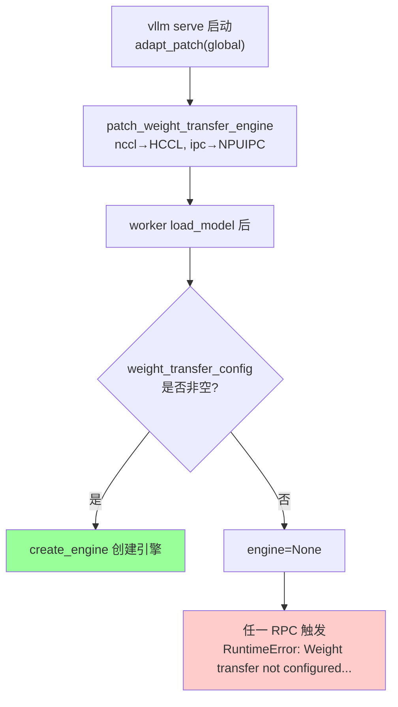
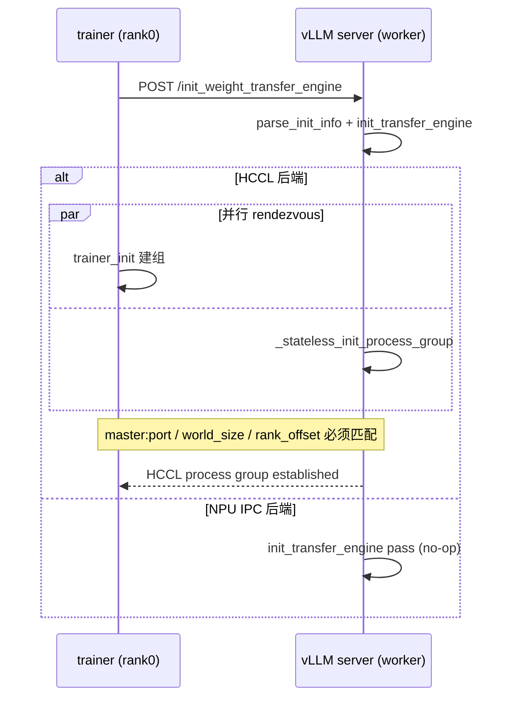
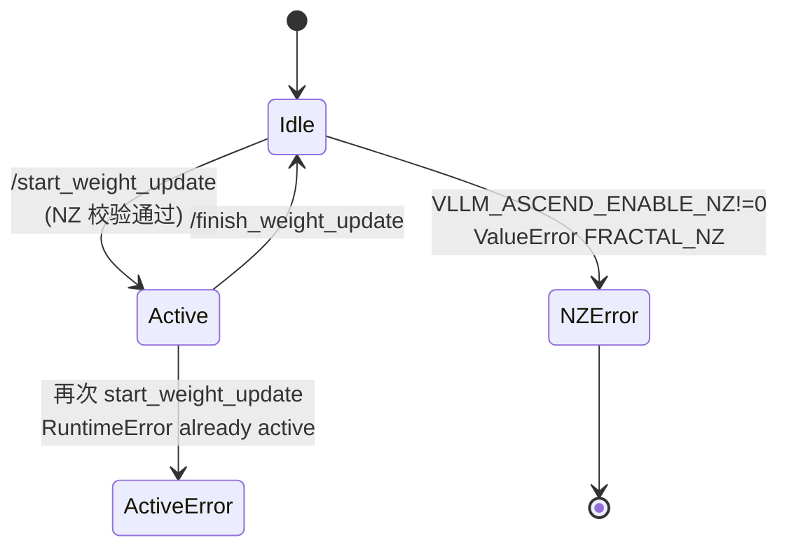
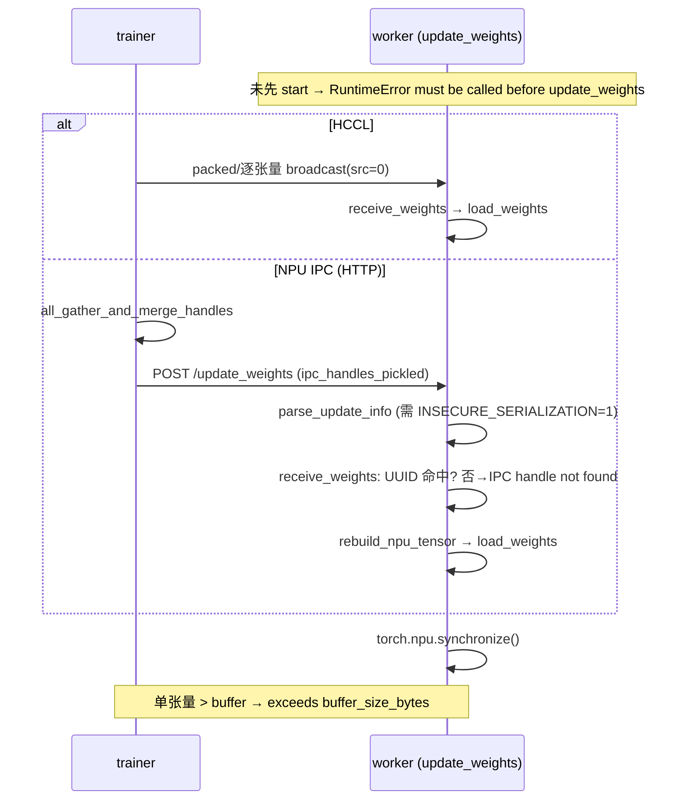
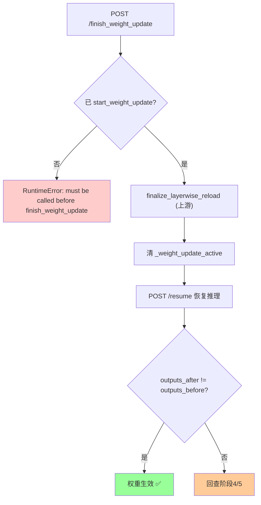
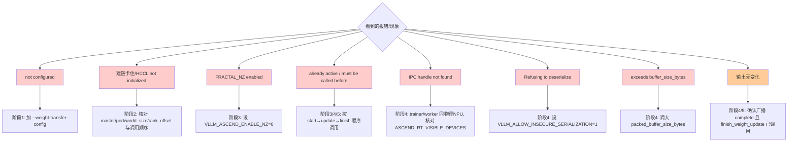

# RL 权重同步（RLHF Weight Transfer）— 日志定位指南

> **这是什么**：vLLM-Ascend 在 RL/RLHF 训推一体场景下，把训练侧（trainer）最新权重同步到推理侧（vLLM worker）的链路。对应代码在 `vllm_ascend/distributed/weight_transfer/`（HCCL / NPU IPC 两种后端）、`vllm_ascend/worker/worker.py`（控制面 RPC）与 `vllm_ascend/patch/platform/patch_weight_transfer_engine.py`（后端注册）。
> **覆盖范围**：从 `vllm serve` 启动时创建权重传输引擎，到一次完整的「暂停推理 → 同步权重 → 恢复推理」结束。
> **涉及组件**：trainer（训练进程）、vLLM API server（dev-mode 控制面 HTTP 端点）、vLLM/NPU worker、HCCL/NPU-IPC 数据面（详见 [附录 A](#a-涉及仓库与组件)）。
>
> | 术语 | 含义 |
> |------|------|
> | trainer | 训练进程，权重源，HCCL 组内固定为 rank 0 |
> | worker | vLLM 推理 worker（`NPUWorker`），接收并加载权重 |
> | HCCL 后端 | 通过 `--weight-transfer-config '{"backend": "nccl"}'` 选择，trainer 与 worker 可在**不同** NPU，走广播（broadcast） |
> | NPU IPC 后端 | 通过 `--weight-transfer-config '{"backend": "ipc"}'` 选择，trainer 与 worker 必须在**同一物理** NPU，走 IPC handle |
> | packed | 把多个张量打包进一块大 buffer 再传输，减少通信次数（HCCL 广播 / IPC 拷贝） |
> | layerwise reload | checkpoint 格式权重的逐层就地重载（`initialize/finalize_layerwise_reload`，上游 vLLM） |
> | 控制面 | `/init_weight_transfer_engine`、`/start_weight_update`、`/update_weights`、`/finish_weight_update`、`/pause`、`/resume` 等 HTTP 端点（仅 `VLLM_SERVER_DEV_MODE=1` 注册） |
>
> **你需要准备**：
>
> - 推理侧日志：`vllm serve` 进程的 stdout/stderr（必须带 `VLLM_SERVER_DEV_MODE=1`）。
> - 训练侧日志：`examples/rl/rlhf_http_hccl.py` / `rlhf_http_npu_ipc.py` 或 e2e 用例 `tests/e2e/.../test_*_weight_transfer.py` 的 stdout（带 `[trainer]` 前缀）。
> - 快速过滤：`grep -E "weight[_ ]transfer|update_weights|HCCL|IPC handle|layerwise|\[trainer\]" <日志文件>`
>
> **说明（重要）**：vLLM-Ascend 侧的 RL 链路代码**几乎不打印常规 `logger.info` 日志**，关键可观测信号主要是 ①示例/用例脚本的 `print`/`[trainer]` 步骤标记 ②引擎与 worker 的**异常报错文本**（`RuntimeError` / `ValueError`，命中即定位）。控制面 HTTP 端点本身、`initialize/finalize_layerwise_reload` 等位于**上游 vLLM**，本仓未包含其源码，相关日志在下文标注「待代码补证（上游 vLLM）」，不臆造。
>
> **阅读优先级**：紧急排障 → 直接看下方「判断口诀」；系统了解 → 按 §一 → §二 → 附录顺序读。

## 目录

- [一、快速定位（先看这里）](#一快速定位先看这里)
- [二、分阶段详细定位](#二分阶段详细定位)
    - [2.1 阶段 1：引擎注册与创建](#21-阶段-1引擎注册与创建)
    - [2.2 阶段 2：建链 / 引擎初始化](#22-阶段-2建链--引擎初始化)
    - [2.3 阶段 3：暂停推理与开始更新](#23-阶段-3暂停推理与开始更新)
    - [2.4 阶段 4：权重数据传输与加载](#24-阶段-4权重数据传输与加载)
    - [2.5 阶段 5：收尾与恢复](#25-阶段-5收尾与恢复)
- [三、卡点速查（卡在 X → 查 Y）](#三卡点速查卡在-x--查-y)
- [四、附录](#四附录)
    - [A. 涉及仓库与组件](#a-涉及仓库与组件)
    - [B. 关键配置](#b-关键配置)
    - [C. 全量日志逐步明细](#c-全量日志逐步明细)
    - [D. 全量流程图（Mermaid）](#d-全量流程图mermaid)
    - [E. 关键节点索引](#e-关键节点索引)
    - [F. 故障场景流程](#f-故障场景流程)

---

## 一、快速定位（先看这里）

> **30 秒速判**：按下表顺序在日志里搜「标志信号」，**最后出现的那条 = 你走到了哪一步**；若该步的「异常文本」出现，直接跳对应 §二 / §三。

| 步 | 大阶段 | 标志信号（命中即「走到了」） | 正常应接着看到 | 没走到 / 报错 | 全量（表→图） |
|----|--------|------------------------------|----------------|----------------|----------------|
| 1 | 引擎注册与创建 | 启动期无报错；`--weight-transfer-config` 被接受；worker 完成 `create_engine` | 控制面端点可访问（dev-mode） | `Weight transfer not configured...` → §三 | [C.1](#c1) → [D.1](#d1) |
| 2 | 建链 / 初始化 | trainer：`[trainer] HCCL process group established` / 示例 `Initializing weight transfer...` | `/pause` 成功 | `HCCL weight transfer not initialized...` → §2.2 | [C.2](#c2) → [D.2](#d2) |
| 3 | 暂停与开始更新 | 示例/用例 `paused; lifecycle endpoints available: True` | 进入广播/IPC 发送 | `FRACTAL_NZ mode is enabled...` / `start_weight_update called while ... active` → §2.3 | [C.3](#c3) → [D.3](#d3) |
| 4 | 权重数据传输 | trainer：`Broadcasting weights via HCCL...` → `weight broadcast complete` | `/finish_weight_update` 成功 | `IPC handle not found...` / `... exceeds buffer_size_bytes` / `start_weight_update must be called before update_weights` → §2.4 / §三 | [C.4](#c4) → [D.4](#d4) |
| 5 | 收尾与恢复 | 示例 `Generating text AFTER weight update:` | 推理输出**与更新前不同** | `start_weight_update must be called before finish_weight_update` → §2.5 | [C.5](#c5) → [D.5](#d5) |

**判断口诀**：

- **起不来 / RPC 报「not configured」** → 没带 `--weight-transfer-config`（阶段 1）。
- **建链卡住、两边都在等** → HCCL rendezvous 的 `master_address:master_port` / `world_size` / `rank_offset` 不匹配（阶段 2，trainer 是 rank 0，worker 从 `rank_offset=1` 起）。
- **报 `IPC handle not found`** → trainer 与 worker 不在同一物理 NPU，或 `ASCEND_RT_VISIBLE_DEVICES` 映射不一致（阶段 4，仅 IPC）。
- **报 `exceeds buffer_size_bytes`** → 单个张量比 packed buffer 还大，调大 `packed_buffer_size_bytes`（阶段 4）。
- **更新后输出没变化** → 阶段 4 广播/加载没真正生效，或 `finish_weight_update`（layerwise 收尾）未调用（阶段 5）。

> 跨阶段补充图：IPC/HCCL 两后端的发送-接收时序见 [D.4](#d4)；权重更新状态机（active 标志）见 [D.3](#d3)。

---

## 二、分阶段详细定位

> 阅读链：**§一/§二（大框架）→ [附录 C](#c-全量日志逐步明细)（全量表）→ [附录 D](#d-全量流程图mermaid)（全量流程图）**。

### 2.1 阶段 1：引擎注册与创建

**在干什么**：`vllm serve` 启动时，平台补丁把工厂里的 `nccl`/`ipc` 后端替换为 Ascend 实现；worker 加载模型后按 `weight_transfer_config` 创建引擎实例。

| 子环节 | 关键信号 / 代码点 | 正常含义 | 异常时 / 分支 |
|--------|-------------------|----------|----------------|
| 工厂后端替换 | `patch_weight_transfer_engine.py:72-73` 把 `_registry["nccl"]→HCCL`、`["ipc"]→NPUIPC` | 用户传 `nccl`/`ipc` 实际加载 Ascend 引擎 | 补丁未加载 → 仍是上游 NCCL/CUDA IPC（NPU 上不可用） |
| 引擎创建 | `worker.py:701-711` `WeightTransferEngineFactory.create_engine(...)` | `self.weight_transfer_engine` 非空 | `weight_transfer_config is None` → 引擎保持 `None` |
| 未配置保护 | `worker.py:285-288` `RuntimeError: Weight transfer not configured...` | 不应出现 | 出现说明启动未带 `--weight-transfer-config` |

→ 全量表：[C.1](#c1)　→ 全量流程图：[D.1](#d1)

### 2.2 阶段 2：建链 / 引擎初始化

**在干什么**：trainer 与 worker 建立数据面通道。HCCL 后端走无状态进程组 rendezvous（trainer=rank 0，worker=rank_offset 起）；NPU IPC 后端无需初始化（no-op）。

| 子环节 | 关键信号 / 代码点 | 正常含义 | 异常时 / 分支 |
|--------|-------------------|----------|----------------|
| 控制面入口 | `worker.init_weight_transfer_engine` `worker.py:290-295` | 解析 init_info 并调用 `init_transfer_engine` | — |
| HCCL 建组 | `hccl_engine.py:134-160` `_stateless_init_process_group` | 两侧在 `master_address:master_port` 汇合，建 `PyHcclCommunicator` | 地址/端口/world_size 不匹配 → 双方阻塞等待 |
| IPC 初始化 | `npu_ipc_engine.py:152-154` `init_transfer_engine` pass | 直接返回（no-op） | — |
| trainer 标记 | 用例 `[trainer] HCCL rendezvous at ...` → `... process group established`（`test_hccl_weight_transfer.py:265-283`）；示例 `Initializing weight transfer: master=...`（`rlhf_http_hccl.py:197`） | 建链成功 | 只见 rendezvous、无 established → 卡在建链 |
| 未初始化保护 | `hccl_engine.py:180-181` `RuntimeError: HCCL weight transfer not initialized...` | 不应出现 | 出现说明先于 init 调用了 `receive_weights` |

→ 全量表：[C.2](#c2)　→ 全量流程图：[D.2](#d2)

### 2.3 阶段 3：暂停推理与开始更新

**在干什么**：`/pause` 暂停在途推理，`/start_weight_update` 置 `_weight_update_active=True`，并在 checkpoint 格式下做 `initialize_layerwise_reload`，同时校验 NZ 已关闭。

| 子环节 | 关键信号 / 代码点 | 正常含义 | 异常时 / 分支 |
|--------|-------------------|----------|----------------|
| 暂停推理 | `/pause`（trainer 侧 `_post(server, "pause")`） | 推理暂停，准备更新 | — |
| 开始更新 | `worker.start_weight_update` `worker.py:305-324` | 置 active 标志；checkpoint 格式做 `initialize_layerwise_reload` | — |
| NZ 校验 | `worker._check_nz_disabled` `worker.py:297-303` `ValueError: FRACTAL_NZ mode is enabled...` | NZ 已关（`VLLM_ASCEND_ENABLE_NZ=0`）时静默通过 | 出现报错 → 必须设 `VLLM_ASCEND_ENABLE_NZ=0` |
| 重复开始保护 | `worker.py:309-312` `RuntimeError: start_weight_update called while a weight update is already active...` | 不应出现 | 上一次未 `finish_weight_update` |
| layerwise 初始化 | `initialize_layerwise_reload`（上游 vLLM，待代码补证） | 准备逐层重载 | — |
| 探测标记 | 用例 `paused; lifecycle endpoints available: True`（`test_hccl_weight_transfer.py:290`） | 走 vLLM main 生命周期端点 | `False` → 老版本端点缺失（IPC 用例会 skip） |

→ 全量表：[C.3](#c3)　→ 全量流程图：[D.3](#d3)

### 2.4 阶段 4：权重数据传输与加载

**在干什么**：trainer 把权重发出（HCCL 广播 / IPC handle），worker 在 `/update_weights` 里 `receive_weights` 并 `load_weights` 就地写入模型。支持 packed（分块）模式。

| 子环节 | 关键信号 / 代码点 | 正常含义 | 异常时 / 分支 |
|--------|-------------------|----------|----------------|
| trainer 发送(HCCL) | `hccl_engine.py:212-268` `trainer_send_weights` / `packed_tensor.py:18-89` `packed_broadcast_producer`；示例 `Broadcasting weights via HCCL...` | 逐块广播打包张量 | — |
| trainer 发送(IPC) | `npu_ipc_engine.py:218-249` `trainer_send_weights` → `_send_unpacked/_send_packed`；示例 `Broadcasting weights via NPU IPC (HTTP)...` | all-gather IPC handle，rank0 POST `/update_weights` | — |
| worker 接收 | `worker.update_weights` `worker.py:326-359` → `receive_weights` | 收齐并 `load_weights`，末尾 `torch.npu.synchronize()` | — |
| 顺序保护 | `worker.py:335-336` `RuntimeError: start_weight_update must be called before update_weights.` | 不应出现 | 漏了 `/start_weight_update` |
| IPC handle 校验 | `npu_ipc_engine.py:195-201` / `packed_tensor.py:301-304` `ValueError: IPC handle not found for NPU UUID ...` | UUID 命中 | trainer/worker 不在同一物理 NPU |
| IPC 反序列化校验 | `npu_ipc_engine.py:140,143-145` `Cannot specify both ...` / `Refusing to deserialize ... without VLLM_ALLOW_INSECURE_SERIALIZATION=1` | 设了 `VLLM_ALLOW_INSECURE_SERIALIZATION=1` | HTTP 模式漏设该环境变量 |
| buffer 容量校验 | `packed_tensor.py:234-239` `ValueError: Tensor '...' has size ... exceeds buffer_size_bytes=...` | 单张量 ≤ buffer | 调大 `packed_buffer_size_bytes` |
| 元数据长度校验 | `hccl_engine.py:94-102` `dtype_names/shapes should be of the same size as names` | names/dtype/shape 等长 | update_info 构造错误 |
| 完成标记 | 用例 `weight broadcast complete`（`test_hccl_weight_transfer.py:327`） | 该轮传输完成 | 只见 `broadcasting...` 无 complete → 卡在数据面 |

→ 全量表：[C.4](#c4)　→ 全量流程图：[D.4](#d4)

### 2.5 阶段 5：收尾与恢复

**在干什么**：`/finish_weight_update` 在 checkpoint 格式下做 `finalize_layerwise_reload`，清 active 标志；`/resume` 恢复推理；再次生成应观察到输出变化。

| 子环节 | 关键信号 / 代码点 | 正常含义 | 异常时 / 分支 |
|--------|-------------------|----------|----------------|
| 完成更新 | `worker.finish_weight_update` `worker.py:361-376` | 清 `_weight_update_active`；checkpoint 格式做 `finalize_layerwise_reload` | — |
| 顺序保护 | `worker.py:365-366` `RuntimeError: start_weight_update must be called before finish_weight_update.` | 不应出现 | 漏了 `/start_weight_update` |
| layerwise 收尾 | `finalize_layerwise_reload`（上游 vLLM，待代码补证） | 逐层重载收尾 | — |
| 恢复推理 | `/resume`；示例 `Generating text AFTER weight update:` | 推理恢复 | — |
| 结果校验 | 用例 `assert outputs_after != outputs_before`（`test_hccl_weight_transfer.py:342`） | 权重已生效，输出改变 | 输出不变 → 回查阶段 4/5 |
| 关闭 | `worker.shutdown` `worker.py:385-386` → `engine.shutdown()`（HCCL 释放通信器） | 资源释放 | — |

→ 全量表：[C.5](#c5)　→ 全量流程图：[D.5](#d5)

---

## 三、卡点速查（卡在 X → 查 Y）

| 你卡在这里 | 落在哪个大阶段 | 优先查什么 | 常见原因 |
|------------|----------------|------------|----------|
| RPC 报 `Weight transfer not configured` | 阶段 1 | 启动命令是否带 `--weight-transfer-config` | 未启用权重传输 |
| 后端没换成 Ascend（报 NCCL/CUDA 相关错） | 阶段 1 | `patch_weight_transfer_engine` 是否生效 | 平台补丁未加载 |
| 控制面端点 404 | 阶段 1/3 | 是否设 `VLLM_SERVER_DEV_MODE=1` | dev-mode 未开，端点未注册 |
| 建链长时间无响应、两边都在等 | 阶段 2 | `master_address/master_port/world_size/rank_offset` | rendezvous 参数不匹配 |
| 报 `HCCL weight transfer not initialized` | 阶段 2 | 是否先调 `/init_weight_transfer_engine` | 顺序错误 |
| 报 `FRACTAL_NZ mode is enabled` | 阶段 3 | `VLLM_ASCEND_ENABLE_NZ` | 未设为 0，RL 精度风险 |
| 报 `start_weight_update called while ... active` | 阶段 3 | 上一次是否 `finish_weight_update` | 状态机未收尾 |
| 报 `start_weight_update must be called before update_weights` | 阶段 4 | 是否漏 `/start_weight_update` | 顺序错误 |
| 报 `IPC handle not found for NPU UUID` | 阶段 4(IPC) | trainer/worker 是否同物理 NPU、`ASCEND_RT_VISIBLE_DEVICES` 映射 | 非共卡或映射不一致 |
| 报 `Refusing to deserialize ... INSECURE_SERIALIZATION` | 阶段 4(IPC/HTTP) | `VLLM_ALLOW_INSECURE_SERIALIZATION=1` | 未开启不安全反序列化 |
| 报 `exceeds buffer_size_bytes` | 阶段 4(packed) | `packed_buffer_size_bytes` | 单张量超过 buffer |
| 更新后推理输出无变化 | 阶段 4/5 | 广播是否 complete、`/finish_weight_update` 是否调用 | 数据面未生效或 layerwise 未收尾 |

**排查顺序**（与 §一 步骤一致）：阶段 1（配置/补丁/dev-mode）→ 阶段 2（建链参数）→ 阶段 3（NZ/状态机）→ 阶段 4（同卡/buffer/序列化/顺序）→ 阶段 5（finish/resume/结果对比）。

---

## 四、附录

### A. 涉及仓库与组件

| 仓库 / 子模块 | 角色 | 关键文件 |
|---------------|------|----------|
| vllm-ascend / 后端注册 | 工厂替换 nccl→HCCL、ipc→NPUIPC | `vllm_ascend/patch/platform/patch_weight_transfer_engine.py`、`vllm_ascend/distributed/weight_transfer/__init__.py` |
| vllm-ascend / HCCL 引擎 | 广播式权重传输 | `vllm_ascend/distributed/weight_transfer/hccl_engine.py` |
| vllm-ascend / NPU IPC 引擎 | 共卡 IPC handle 传输 | `vllm_ascend/distributed/weight_transfer/npu_ipc_engine.py` |
| vllm-ascend / packed 工具 | 打包广播/打包 IPC 的 producer/consumer | `vllm_ascend/distributed/weight_transfer/packed_tensor.py` |
| vllm-ascend / worker | 控制面 RPC + 状态机 + layerwise 调度 | `vllm_ascend/worker/worker.py`（284-386, 701-711） |
| trainer（示例/用例） | 权重源，rank 0，发送侧步骤标记 | `examples/rl/rlhf_http_hccl.py`、`examples/rl/rlhf_http_npu_ipc.py`、`tests/e2e/.../test_*_weight_transfer.py` |
| 上游 vLLM | dev-mode 控制面端点、`initialize/finalize_layerwise_reload`、`WeightTransferEngineFactory` | 本仓未含源码（待代码补证） |

### B. 关键配置

| 配置项 | 日志/代码体现 | 说明 |
|--------|---------------|------|
| `--weight-transfer-config '{"backend":"nccl"}'` | 阶段 1 创建 HCCL 引擎 | 选 HCCL 后端（可跨 NPU） |
| `--weight-transfer-config '{"backend":"ipc"}'` | 阶段 1 创建 NPU IPC 引擎 | 选 NPU IPC 后端（必须共物理 NPU） |
| `VLLM_SERVER_DEV_MODE=1` | 控制面端点注册 | 不设则 `/update_weights` 等返回 404 |
| `VLLM_ASCEND_ENABLE_NZ=0` | `worker._check_nz_disabled` `worker.py:297-303` | RL 场景必须关 NZ，否则报错 |
| `VLLM_ALLOW_INSECURE_SERIALIZATION=1` | `npu_ipc_engine.py:142-145` | IPC + HTTP 模式反序列化 handle 必需 |
| `ASCEND_RT_VISIBLE_DEVICES` | `npu_generate_uuid` `npu_ipc_engine.py:93-99` | 逻辑→物理 NPU 映射，决定 IPC UUID |
| `--load-format dummy` | 示例/用例启动参数 | 用假权重起服务，便于验证「更新前后输出不同」 |
| `packed` / `packed_buffer_size_bytes` | `packed_tensor.py:14-15, 234-239` | 打包传输开关与 buffer 大小（默认 1 GiB） |
| `enable_sleep_mode_extra_cleanup` | `additional_config.md` | RL 负载的 sleep 模式额外清理（HCCL 组释放等） |
| `refresh` | `additional_config.md` | rlhf / ut/e2e 用例刷新全局 Ascend 配置 |

### C. 全量日志逐步明细

> 阅读链：**§一/§二 → 本附录 C → [附录 D](#d-全量流程图mermaid)**。下表「日志原文」中的占位符（`{name}`、`...`）原样保留；标「待代码补证」者位于上游 vLLM，本仓无源码不臆造。多数为**异常文本**（命中即定位）与**脚本步骤标记**。

#### C.1 阶段 1：引擎注册与创建

← §一步骤 1 · §2.1 · 流程图 → [#d1](#d1)

| 序号 | 子模块 | 日志原文 / 代码点 | 说明 |
|------|--------|-------------------|------|
| 1 | patch/platform | `WeightTransferEngineFactory._registry["nccl"] = lambda: HCCLWeightTransferEngine`（`patch_weight_transfer_engine.py:72`） | 启动期后端替换，无日志，是关键节点 |
| 2 | patch/platform | `_registry["ipc"] = _load_npu_ipc_engine`（`patch_weight_transfer_engine.py:73`） | ipc → NPU IPC 引擎 |
| 3 | worker | `WeightTransferEngineFactory.create_engine(config, parallel_config, model)`（`worker.py:707-711`） | 仅当 `weight_transfer_config is not None` 时创建 |
| 4 | worker（异常） | `RuntimeError: Weight transfer not configured. Please set weight_transfer_config to enable weight transfer.`（`worker.py:286-288`） | 引擎为 None 时任一 RPC 触发 |

→ 全量流程图：[#d1](#d1)

#### C.2 阶段 2：建链 / 引擎初始化

← §一步骤 2 · §2.2 · 流程图 → [#d2](#d2)

| 序号 | 子模块 | 日志原文 / 代码点 | 说明 |
|------|--------|-------------------|------|
| 5 | worker | `init_weight_transfer_engine(init_info)` → `parse_init_info` + `init_transfer_engine`（`worker.py:290-295`） | 控制面 `/init_weight_transfer_engine` 入口 |
| 6 | HCCL 引擎 | `_stateless_init_process_group(master_address, master_port, rank, world_size, device)`（`hccl_engine.py:154-160, 322-336`） | rendezvous 建 `PyHcclCommunicator` |
| 7 | NPU IPC 引擎 | `init_transfer_engine`: `pass`（`npu_ipc_engine.py:152-154`） | no-op |
| 8 | trainer（标记） | `[trainer] HCCL rendezvous at {master}:{port} (world_size={n}) ...`（`test_hccl_weight_transfer.py:265`） | 建链开始 |
| 9 | trainer（标记） | `[trainer] trainer_init returned, waiting for server init RPC ...`（`test_hccl_weight_transfer.py:280`） | trainer 侧组建完成 |
| 10 | trainer（标记） | `[trainer] HCCL process group established`（`test_hccl_weight_transfer.py:283`） | 双方建链成功 |
| 11 | 示例 | `Initializing weight transfer: master={address}:{port}`（`rlhf_http_hccl.py:197`） | 示例脚本建链打印 |
| 12 | HCCL 引擎（异常） | `RuntimeError: HCCL weight transfer not initialized. Call init_transfer_engine() first.`（`hccl_engine.py:181`） | 先于 init 调 `receive_weights` |

→ 全量流程图：[#d2](#d2)

#### C.3 阶段 3：暂停推理与开始更新

← §一步骤 3 · §2.3 · 流程图 → [#d3](#d3)

| 序号 | 子模块 | 日志原文 / 代码点 | 说明 |
|------|--------|-------------------|------|
| 13 | 控制面 | `/pause`（trainer `_post(server,"pause")`） | 暂停在途推理 |
| 14 | worker | `start_weight_update(is_checkpoint_format)` 置 `_weight_update_active=True`（`worker.py:305-324`） | checkpoint 格式时 `initialize_layerwise_reload` |
| 15 | worker（异常） | `ValueError: FRACTAL_NZ mode is enabled. This may cause model parameter precision issues in the RL scenarios. Please set VLLM_ASCEND_ENABLE_NZ=0.`（`worker.py:299-303`） | NZ 未关 |
| 16 | worker（异常） | `RuntimeError: start_weight_update called while a weight update is already active. Call finish_weight_update first.`（`worker.py:310-312`） | 状态机未收尾 |
| 17 | 上游 vLLM | `initialize_layerwise_reload(model)`（`worker.py:317-321` 调用，实现在上游） | 待代码补证（上游 vLLM） |
| 18 | trainer（标记） | `[trainer] paused; lifecycle endpoints available: {bool}`（`test_hccl_weight_transfer.py:290`） | 生命周期端点探测结果 |

→ 全量流程图：[#d3](#d3)

#### C.4 阶段 4：权重数据传输与加载

← §一步骤 4 · §2.4 · 流程图 → [#d4](#d4)

| 序号 | 子模块 | 日志原文 / 代码点 | 说明 |
|------|--------|-------------------|------|
| 19 | 示例 | `Broadcasting weights via HCCL...`（`rlhf_http_hccl.py:258`） | HCCL trainer 开始广播 |
| 20 | 示例 | `Largest tensor: {x} GiB, packed buffer: {y} GiB`（`rlhf_http_hccl.py:244-246`） | packed buffer 自适应大小 |
| 21 | 示例 | `Broadcasting weights via NPU IPC (HTTP)...`（`rlhf_http_npu_ipc.py:169`） | IPC trainer 开始发送 |
| 22 | trainer（标记） | `[trainer] broadcasting {n} tensors via HCCL (packed) ...`（`test_hccl_weight_transfer.py:306`） | 广播张量数 |
| 23 | HCCL 引擎 | `trainer_send_weights` → `packed_broadcast_producer` / 逐张量 `group.broadcast`（`hccl_engine.py:212-268`, `packed_tensor.py:18-89`） | 发送侧数据面 |
| 24 | NPU IPC 引擎 | `trainer_send_weights` → `_send_unpacked`/`_send_packed` → `_do_send`（`npu_ipc_engine.py:218-406`） | all-gather handle，rank0 POST/ray 下发 |
| 25 | worker | `update_weights(update_info)` → `receive_weights(..., load_weights)` + `torch.npu.synchronize()`（`worker.py:326-359`） | 接收并就地加载 |
| 26 | worker（异常） | `RuntimeError: start_weight_update must be called before update_weights.`（`worker.py:336`） | 漏 start |
| 27 | IPC 引擎（异常） | `ValueError: IPC handle not found for NPU UUID {physical_npu_id}. Available UUIDs: {...}. This may indicate that the trainer and worker are not co-located on the same physical NPU (node).`（`npu_ipc_engine.py:196-201`） | 非共卡 |
| 28 | packed 工具（异常） | `ValueError: IPC handle not found for NPU UUID {physical_npu_id}. Available UUIDs: {...}`（`packed_tensor.py:302-304`） | packed IPC 非共卡 |
| 29 | IPC 引擎（异常） | `ValueError: Cannot specify both ipc_handles and ipc_handles_pickled`（`npu_ipc_engine.py:140`） | 两种 handle 同时给 |
| 30 | IPC 引擎（异常） | `ValueError: Refusing to deserialize ipc_handles_pickled without VLLM_ALLOW_INSECURE_SERIALIZATION=1`（`npu_ipc_engine.py:143-145`） | HTTP 模式未开不安全反序列化 |
| 31 | packed 工具（异常） | `ValueError: Tensor '{name}' has size {n} bytes, which exceeds buffer_size_bytes={m}. Increase buffer_size_bytes to at least {n}.`（`packed_tensor.py:235-239`） | 单张量超 buffer |
| 32 | HCCL 引擎（异常） | `ValueError: dtype_names should be of the same size as names: got {a} and {b}`（shapes 同类，`hccl_engine.py:94-102`） | update_info 元数据长度不一致 |
| 33 | trainer（标记） | `[trainer] trainer finished sending weights, waiting for server update RPC ...`（`test_hccl_weight_transfer.py:324`） | 发送完成 |
| 34 | trainer（标记） | `[trainer] background POST /update_weights done` / `... FAILED: {exc!r}`（`test_hccl_weight_transfer.py:129-132`） | 服务端 RPC 结果 |
| 35 | trainer（标记） | `[trainer] weight broadcast complete`（`test_hccl_weight_transfer.py:327`） | 该轮传输完成 |

→ 全量流程图：[#d4](#d4)

#### C.5 阶段 5：收尾与恢复（含故障相关）

← §一步骤 5 · §2.5 · 流程图 → [#d5](#d5)

| 序号 | 子模块 | 日志原文 / 代码点 | 说明 |
|------|--------|-------------------|------|
| 36 | worker | `finish_weight_update()` 清 `_weight_update_active`（`worker.py:361-376`） | checkpoint 格式做 `finalize_layerwise_reload` |
| 37 | worker（异常） | `RuntimeError: start_weight_update must be called before finish_weight_update.`（`worker.py:365-366`） | 漏 start |
| 38 | 上游 vLLM | `finalize_layerwise_reload(model, model_config)`（`worker.py:369-373` 调用，实现在上游） | 待代码补证（上游 vLLM） |
| 39 | 控制面 / 示例 | `/resume`；`Generating text AFTER weight update:`（`rlhf_http_hccl.py:281`） | 恢复推理 |
| 40 | trainer（标记） | `[trainer] outputs AFTER weight update: {...}`（`test_hccl_weight_transfer.py:336`） | 更新后输出 |
| 41 | 用例（断言） | `assert outputs_after != outputs_before, "server weights did not change after HCCL transfer"`（`test_hccl_weight_transfer.py:342`） | 结果校验 |
| 42 | worker | `shutdown()` → `weight_transfer_engine.shutdown()`（`worker.py:385-386`，HCCL 释放通信器 `hccl_engine.py:207-210`） | 资源释放 |

→ 全量流程图：[#d5](#d5)

### D. 全量流程图（Mermaid）

← [附录 C](#c-全量日志逐步明细) · §一/§二

#### D.1 阶段 1：引擎注册与创建

← 全量表 [#c1](#c1)

#### D.2 阶段 2：建链 / 引擎初始化

← 全量表 [#c2](#c2)

#### D.3 阶段 3：暂停与开始更新（状态机）

← 全量表 [#c3](#c3)

#### D.4 阶段 4：权重数据传输与加载

← 全量表 [#c4](#c4)

#### D.5 阶段 5：收尾与恢复

← 全量表 [#c5](#c5)

### E. 关键节点索引

| 阶段 | 关键日志 / 信号 | 说明 |
|------|-----------------|------|
| 1 | `Weight transfer not configured...` | 未启用权重传输（反向标志） |
| 2 | `[trainer] HCCL process group established` | 建链成功 |
| 2 | `HCCL weight transfer not initialized...` | init 顺序错误 |
| 3 | `FRACTAL_NZ mode is enabled...` | NZ 未关，RL 精度风险 |
| 3 | `paused; lifecycle endpoints available: True` | 进入生命周期更新 |
| 4 | `Broadcasting weights via HCCL...` / `... NPU IPC (HTTP)...` | 数据面开始传输 |
| 4 | `IPC handle not found for NPU UUID ...` | 非共卡（IPC） |
| 4 | `... exceeds buffer_size_bytes` | packed buffer 过小 |
| 4 | `weight broadcast complete` | 该轮传输完成 |
| 5 | `assert outputs_after != outputs_before` | 权重生效结果校验 |

### F. 故障场景流程

