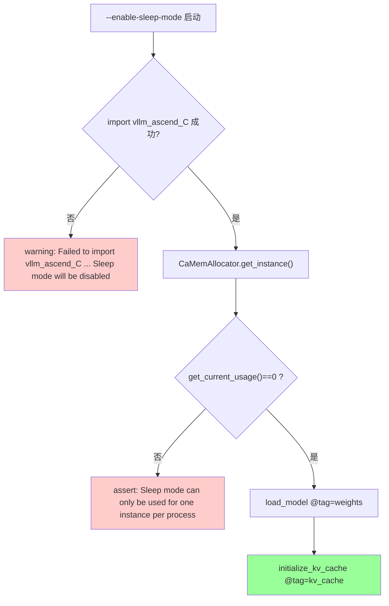
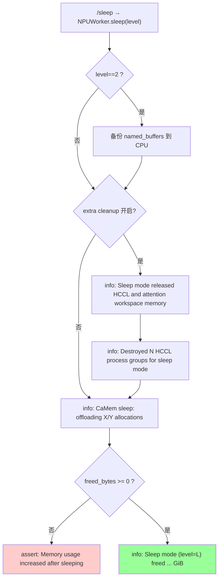
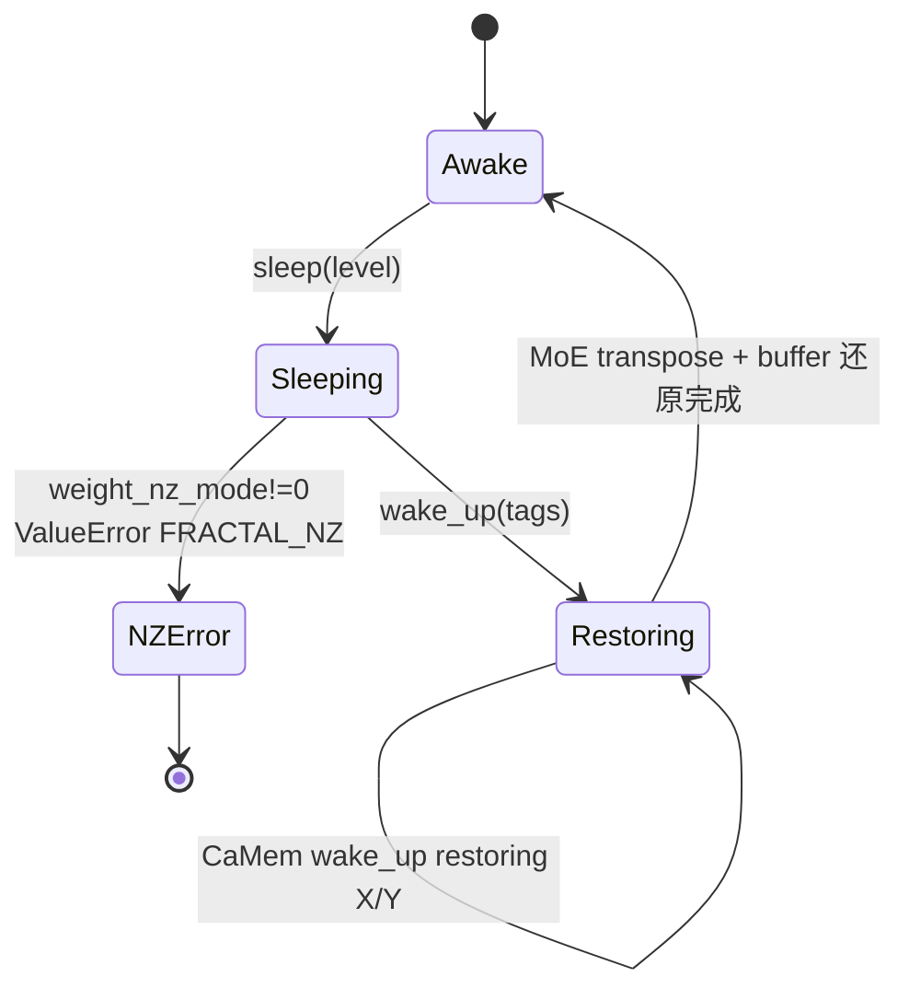
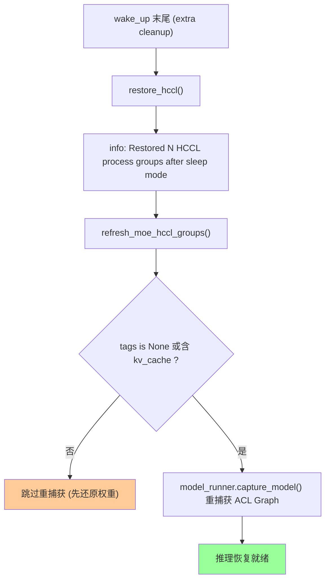
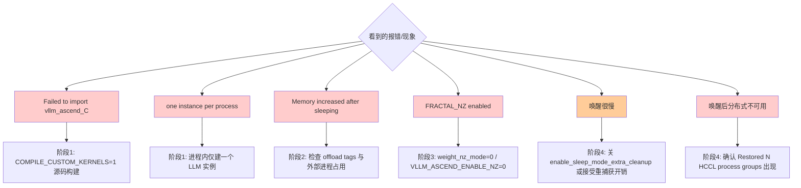

# Sleep Mode（睡眠模式）— 日志定位指南

> **这是什么**：在 RL/RLHF 后训练（PPO、GRPO、DPO 等）中，生成与训练交替进行、争抢同一块 NPU 显存。睡眠模式让推理引擎在训练阶段先把自己占用的显存（模型权重与 KV cache）临时让给 trainer——由基于 AscendCL 的自定义内存池分配器 `CaMemAllocator` 把权重换出到 CPU、并丢弃 KV cache，等训练结束后再通过 `wake_up` 还原。相关代码位于 `vllm_ascend/device_allocator/{camem,sleep_mem_optimized}.py` 与 `vllm_ascend/worker/worker.py`。
> **覆盖范围**：从 `--enable-sleep-mode` 启动建立内存池，到一次完整的「`sleep(level)` → `wake_up(tags)`」循环结束。
> **涉及组件**：vLLM API server（dev-mode `/sleep`、`/wake_up`、`/is_sleeping` 端点）、`NPUWorker`、`CaMemAllocator`、`SleepWakeupManager`（ACL Graph + HCCL 额外清理）（详见 [附录 A](#a-涉及仓库与组件)）。
>
> | 术语 | 含义 |
> |------|------|
> | Level 1 | 权重 offload 到 CPU，KV cache 丢弃；适合复用同一模型 |
> | Level 2 | 权重与 KV cache 全部丢弃；适合切换/更新模型 |
> | tag | 内存池标签，`weights` / `kv_cache` / `default` / `sleep_persistent`；决定 offload/restore 范围 |
> | extra cleanup | `enable_sleep_mode_extra_cleanup=True` 时额外释放 ACL Graph workspace 与 HCCL 进程组，省更多显存但唤醒更慢 |
> | CaMemAllocator | 单例的 CANN 内存池可插拔分配器，sleep 时按 tag offload/discard |
>
> **你需要准备**：
>
> - 推理侧日志：`vllm serve --enable-sleep-mode` 进程的 stdout/stderr（在线服务需 `VLLM_SERVER_DEV_MODE=1` 暴露端点）。
> - 快速过滤：`grep -E "CaMem (sleep|wake_up)|Sleep mode|HCCL process groups|vllm_ascend_C|FRACTAL_NZ" <日志文件>`
>
> **说明（重要）**：本特性的关键信号主要来自 `CaMemAllocator`、`SleepWakeupManager` 以及 `NPUWorker.sleep`/`wake_up` 打印的 `logger.info`/`logger.warning`，外加少量断言与异常文本；其中 `logger.info` 默认即可见。控制面端点（`/sleep`、`/wake_up`、`/is_sleeping`）由上游 vLLM 实现，本仓不含其源码，因此下文统一标注「待代码补证（上游 vLLM）」，不做臆测。
>
> **阅读优先级**：紧急排障 → 直接看下方「判断口诀」；系统了解 → 按 §一 → §二 → 附录顺序读。

## 目录

- [一、快速定位（先看这里）](#一快速定位先看这里)
- [二、分阶段详细定位](#二分阶段详细定位)
    - [2.1 阶段 1：启用与内存池标记](#21-阶段-1启用与内存池标记)
    - [2.2 阶段 2：进入睡眠（sleep）](#22-阶段-2进入睡眠sleep)
    - [2.3 阶段 3：唤醒与内存恢复（wake_up）](#23-阶段-3唤醒与内存恢复wake_up)
    - [2.4 阶段 4：ACL Graph / HCCL 恢复与就绪](#24-阶段-4acl-graph--hccl-恢复与就绪)
- [三、卡点速查（卡在 X → 查 Y）](#三卡点速查卡在-x--查-y)
- [四、附录](#四附录)
    - [A. 涉及仓库与组件](#a-涉及仓库与组件)
    - [B. 关键配置](#b-关键配置)
    - [C. 全量日志逐步明细](#c-全量日志逐步明细)
    - [D. 全量流程图（Mermaid）](#d-全量流程图mermaid)
    - [E. 关键节点索引](#e-关键节点索引)
    - [F. 故障场景流程](#f-故障场景流程)

---

## 一、快速定位（先看这里）

> **30 秒速判**：在日志里按下表顺序搜标志日志，**最后出现的那条 = 你走到了哪一步**；该步异常文本出现就跳对应 §二 / §三。

| 步 | 大阶段 | 标志日志（命中即「走到了」） | 正常应接着看到 | 没走到 / 报错 | 全量（表→图） |
|----|--------|------------------------------|----------------|----------------|----------------|
| 1 | 启用与内存池标记 | 启动期**无** `Failed to import vllm_ascend_C` 警告 | `/sleep` 可被调用 | `Failed to import vllm_ascend_C ... Sleep mode will be disabled` / `Sleep mode can only be used for one instance per process` → §2.1 | [C.1](#c1) → [D.1](#d1) |
| 2 | 进入睡眠 | `CaMem sleep: offloading X/Y allocations` → `Sleep mode (level=L) freed ... GiB` | 显存下降，`/is_sleeping` 为真 | `Memory usage increased after sleeping`（断言） → §2.2 | [C.2](#c2) → [D.2](#d2) |
| 3 | 唤醒-内存恢复 | `CaMem wake_up: restoring X/Y allocations` | 权重/KV 还原 | `FRACTAL_NZ mode is enabled ...` → §2.3 | [C.3](#c3) → [D.3](#d3) |
| 4 | 图/通信恢复 | `Restored N HCCL process groups after sleep mode.` | 推理恢复可用 | 唤醒卡住/`capture_model` 重捕获慢 → §2.4 | [C.4](#c4) → [D.4](#d4) |

**判断口诀**：

- **启动报 `Failed to import vllm_ascend_C`** → 未编译自定义内核（需 `COMPILE_CUSTOM_KERNELS=1` 源码构建），睡眠模式被禁用（阶段 1）。
- **`Sleep mode can only be used for one instance per process`** → 同进程创建了多个 LLM 实例（阶段 1，`CaMemAllocator` 是单例）。
- **断言 `Memory usage increased after sleeping`** → sleep 后显存不降反升，offload/discard 异常（阶段 2）。
- **唤醒报 `FRACTAL_NZ mode is enabled`** → NZ 权重格式在 RL 下有精度风险，需 `weight_nz_mode=0`（阶段 3）。
- **唤醒很慢** → 开了 `enable_sleep_mode_extra_cleanup`，`wake_up` 需重建 HCCL 并 `capture_model()` 重捕获 ACL Graph（阶段 4，属预期权衡）。

> 跨阶段补充图：sleep/wake_up 内存状态机见 [D.3](#d3)；extra cleanup 的 ACL Graph + HCCL 子流程见 [D.4](#d4)。

---

## 二、分阶段详细定位

> 阅读链：**§一/§二（大框架）→ [附录 C](#c-全量日志逐步明细)（全量表）→ [附录 D](#d-全量流程图mermaid)（全量流程图）**。

### 2.1 阶段 1：启用与内存池标记

**在干什么**：启用 `--enable-sleep-mode` 后，worker 会取得全局唯一的 `CaMemAllocator`，并分别在 `tag="weights"` 与 `tag="kv_cache"` 两个内存池上下文中完成 `load_model` 和 KV cache 初始化。打上标签后，后续 `sleep` 才能按标签精确决定哪些显存换出、哪些直接丢弃。

| 子环节 | 关键日志 / 代码点 | 正常含义 | 异常时 / 分支 |
|--------|-------------------|----------|----------------|
| 内核可用性 | `camem.py:66-67` `logger.warning("Failed to import vllm_ascend_C:%s. Sleep mode will be disabled. ", e)` | 不出现该警告 = 内核已编译 | 出现 → 需 `COMPILE_CUSTOM_KERNELS=1` 源码构建 |
| 单例校验 | `worker.py:690-691` `assert ... "Sleep mode can only be used for one instance per process."` | 单实例正常 | 同进程多实例触发 |
| 权重池标记 | `worker.py:688-699` `use_memory_pool(tag="weights")` 下 `load_model` | 权重打 `weights` 标签 | — |
| KV 池标记 | `worker.py:925-933` `use_memory_pool(tag="kv_cache")` 下 `initialize_kv_cache` | KV 打 `kv_cache` 标签 | — |
| 段配置校验 | `camem.py:152-157` `assert "expandable_segments:True" not in conf` | 未启用 expandable segments | 启用了 → 与内存池不兼容 |

→ 全量表：[C.1](#c1)　→ 全量流程图：[D.1](#d1)

### 2.2 阶段 2：进入睡眠（sleep）

**在干什么**：`/sleep` 请求进入 `NPUWorker.sleep(level)`。其顺序为：level 2 先把模型 buffer 备份到 CPU；若开启了 extra cleanup，则先清理 ACL Graph workspace 并销毁 HCCL 进程组；最后由 `CaMemAllocator.sleep` 按标签把权重换出、其余丢弃。

| 子环节 | 关键日志 / 代码点 | 正常含义 | 异常时 / 分支 |
|--------|-------------------|----------|----------------|
| 备份 buffer(L2) | `worker.py:221-223` `self._sleep_saved_buffers = {...}` | level 2 时备份 named_buffers | level 1 跳过 |
| 额外清理(可选) | `sleep_mem_optimized.py:47-58` `logger.info("Sleep mode released HCCL and attention workspace memory: %.3f GiB.", ...)` | 开关开启时清 ACL Graph + HCCL | 默认关闭则跳过 |
| 销毁 HCCL | `sleep_mem_optimized.py:178-180` `logger.info("Destroyed %d HCCL process groups for sleep mode.", num_destroyed)` | 销毁 > 0 个进程组 | 未初始化分布式则跳过 |
| 分配器 offload | `camem.py:197-203` `logger.info("CaMem sleep: offloading %s/%s allocations (tags=%s)", ...)` | 按 offload_tags 拷到 CPU，其余 discard | `sleep_persistent` 标签保留不动 |
| 结果与校验 | `worker.py:234-241` `assert ... "Memory usage increased after sleeping."` + `logger.info("Sleep mode (level=%s) freed %.2f GiB memory, %.2f GiB memory is still in use.", ...)` | freed ≥ 0 且打印释放量 | 断言失败 → offload 未真正释放 |

→ 全量表：[C.2](#c2)　→ 全量流程图：[D.2](#d2)

### 2.3 阶段 3：唤醒与内存恢复（wake_up）

**在干什么**：`/wake_up` 请求进入 `NPUWorker.wake_up(tags)`。其顺序为：先校验 NZ 已关闭，再由 `CaMemAllocator.wake_up` 重新映射显存并从 CPU 把权重拷回，随后还原 MoE 权重的转置布局；若是 level 2，还会把此前备份的 buffer 一并还原。

| 子环节 | 关键日志 / 代码点 | 正常含义 | 异常时 / 分支 |
|--------|-------------------|----------|----------------|
| NZ 校验 | `worker.py:244-249` `ValueError: FRACTAL_NZ mode is enabled. This may cause model parameter precision issues in the RL scenarios. Please set weight_nz_mode=0 via --additional-config.` | NZ 关闭时静默通过 | 出现报错 → 设 `weight_nz_mode=0` |
| 分配器 restore | `camem.py:227-233` `logger.info("CaMem wake_up: restoring %s/%s allocations (tags=%s)", ...)` | 按 tags 重映射并拷回 | `tags=["weights"]` 仅还原权重 |
| MoE 权重还原 | `worker.py:255-272` `w2_weight`/`w13_weight` 转置还原 | 非量化且含 weights 时还原 transpose | 量化模型跳过 |
| buffer 还原(L2) | `worker.py:274-279` 从 `_sleep_saved_buffers` 拷回 | level 2 还原成功后清空备份 | level 1 无备份 |

→ 全量表：[C.3](#c3)　→ 全量流程图：[D.3](#d3)

### 2.4 阶段 4：ACL Graph / HCCL 恢复与就绪

**在干什么**：当开启 extra cleanup 时，`wake_up` 会在收尾阶段重新建立 HCCL 进程组、刷新 MoE dispatcher 的 HCCL 元数据，并在需要时调用 `capture_model()` 重新捕获 ACL Graph。这一步往往是唤醒延迟的主要来源。

| 子环节 | 关键日志 / 代码点 | 正常含义 | 异常时 / 分支 |
|--------|-------------------|----------|----------------|
| 恢复 HCCL | `sleep_mem_optimized.py:182-186` `logger.info("Restored %d HCCL process groups after sleep mode.", num_restored)` | 还原进程组 | — |
| 刷新 MoE HCCL | `sleep_mem_optimized.py:162-170` `refresh_moe_hccl_groups` | 刷新 token dispatcher HCCL | 无 MoE 则空操作 |
| 重捕获 ACL Graph | `sleep_mem_optimized.py:121-128` `wakeup` → `model_runner.capture_model()` | `tags=None` 或含 `kv_cache` 时重捕获 | `tags=["weights"]` 跳过（等 KV 就绪再捕获） |
| 跳过条件 | `sleep_mem_optimized.py:122-125` 提前 return | level 2 分阶段唤醒先还原权重 | — |

→ 全量表：[C.4](#c4)　→ 全量流程图：[D.4](#d4)

---

## 三、卡点速查（卡在 X → 查 Y）

| 你卡在这里 | 落在哪个大阶段 | 优先查什么 | 常见原因 |
|------------|----------------|------------|----------|
| 启动报 `Failed to import vllm_ascend_C` | 阶段 1 | 是否 `COMPILE_CUSTOM_KERNELS=1` 源码构建 | 自定义内核未编译，睡眠禁用 |
| `Sleep mode can only be used for one instance per process` | 阶段 1 | 进程内 LLM 实例数 | 单例分配器被多实例占用 |
| `expandable_segments` 断言失败 | 阶段 1 | `PYTORCH_NPU_ALLOC_CONF` | 与内存池不兼容 |
| `/sleep` 404 | 阶段 1/2 | 是否 `VLLM_SERVER_DEV_MODE=1` | dev-mode 未开，端点未注册 |
| 断言 `Memory usage increased after sleeping` | 阶段 2 | offload tags / 显存占用 | 未真正释放或外部进程占用 |
| sleep 后显存仍很高 | 阶段 2 | `CaMem sleep: offloading X/Y` 的比例 | 多数分配带 `sleep_persistent` 或非池内分配 |
| 唤醒报 `FRACTAL_NZ mode is enabled` | 阶段 3 | `weight_nz_mode` / `VLLM_ASCEND_ENABLE_NZ` | NZ 格式，RL 精度风险 |
| 唤醒后输出错乱 | 阶段 3 | MoE 权重转置 / buffer 还原是否完成 | transpose/buffer 未还原 |
| 唤醒非常慢 | 阶段 4 | 是否开 `enable_sleep_mode_extra_cleanup` | 需重建 HCCL + `capture_model()` 重捕获 |
| 唤醒后分布式不可用 | 阶段 4 | `Restored N HCCL process groups` 是否出现 | HCCL 进程组未恢复 |

**排查顺序**（与 §一 一致）：阶段 1（内核/单例/dev-mode）→ 阶段 2（offload 比例/释放断言）→ 阶段 3（NZ/restore/权重还原）→ 阶段 4（HCCL 恢复/图重捕获）。

---

## 四、附录

### A. 涉及仓库与组件

| 仓库 / 子模块 | 角色 | 关键文件 |
|---------------|------|----------|
| vllm-ascend / 分配器 | CANN 内存池单例，按 tag offload/restore | `vllm_ascend/device_allocator/camem.py` |
| vllm-ascend / 额外清理 | ACL Graph + HCCL 的 sleep/wakeup 管理 | `vllm_ascend/device_allocator/sleep_mem_optimized.py` |
| vllm-ascend / worker | `sleep`/`wake_up` 入口、内存池标记、NZ 校验 | `vllm_ascend/worker/worker.py`（145-148, 218-282, 688-699, 922-933） |
| vllm-ascend / 配置 | `enable_sleep_mode_extra_cleanup`、`weight_nz_mode` | `vllm_ascend/ascend_config.py`（162, 241） |
| 上游 vLLM | dev-mode 端点 `/sleep`、`/wake_up`、`/is_sleeping`，`enable_sleep_mode` | 本仓未含源码（待代码补证） |

### B. 关键配置

| 配置项 | 日志/代码体现 | 说明 |
|--------|---------------|------|
| `--enable-sleep-mode` | `worker.py:145, 689, 925` | 启用睡眠模式与内存池标记 |
| `VLLM_SERVER_DEV_MODE=1` | 控制面端点注册 | 不设则 `/sleep` `/wake_up` 返回 404 |
| `COMPILE_CUSTOM_KERNELS=1` | `camem.py:57-67` 导入 `vllm_ascend_C` | 源码构建自定义内核（< v0.12.0rc1 需要） |
| `enable_sleep_mode_extra_cleanup` | `ascend_config.py:162`；`worker.py:225-227,280-282` | 额外释放 ACL Graph workspace + HCCL，唤醒更慢 |
| `weight_nz_mode` / `VLLM_ASCEND_ENABLE_NZ=0` | `worker.py:244-249` | 唤醒前必须关 NZ，否则报错 |
| `PYTORCH_NPU_ALLOC_CONF`（无 `expandable_segments:True`） | `camem.py:152-157` | 与内存池不兼容 |
| `sleep(level=1\|2)` / `wake_up(tags=["weights"\|"kv_cache"])` | `worker.py:218,243` | 睡眠等级与分阶段唤醒 |

### C. 全量日志逐步明细

> 阅读链：**§一/§二 → 本附录 C → [附录 D](#d-全量流程图mermaid)**。占位符（`%s`、`%.2f`、`N`）原样保留；标「待代码补证」者位于上游 vLLM，本仓无源码不臆造。

#### C.1 阶段 1：启用与内存池标记

← §一步骤 1 · §2.1 · 流程图 → [#d1](#d1)

| 序号 | 子模块 | 日志原文 / 代码点 | 说明 |
|------|--------|-------------------|------|
| 1 | camem | `logger.warning("Failed to import vllm_ascend_C:%s. Sleep mode will be disabled. ", e)`（`camem.py:67`） | 内核未编译 → 睡眠禁用 |
| 2 | worker | `assert allocator.get_current_usage() == 0, "Sleep mode can only be used for one instance per process."`（`worker.py:691`） | 单例校验 |
| 3 | worker | `use_memory_pool(tag="weights")` 包裹 `load_model`（`worker.py:692-699`） | 权重打 `weights` 标签 |
| 4 | worker | `use_memory_pool(tag="kv_cache")` 包裹 `initialize_kv_cache`（`worker.py:927-933`） | KV 打 `kv_cache` 标签 |
| 5 | camem（异常） | `assert "expandable_segments:True" not in conf`（`camem.py:153-157`） | 段配置不兼容内存池 |

→ 全量流程图：[#d1](#d1)

#### C.2 阶段 2：进入睡眠（sleep）

← §一步骤 2 · §2.2 · 流程图 → [#d2](#d2)

| 序号 | 子模块 | 日志原文 / 代码点 | 说明 |
|------|--------|-------------------|------|
| 6 | worker | `self._sleep_saved_buffers = {name: buffer.cpu().clone() ...}`（`worker.py:221-223`） | level 2 备份 buffer |
| 7 | SleepWakeup（可选） | `logger.info("Sleep mode released HCCL and attention workspace memory: %.3f GiB.", free_mem/GiB)`（`sleep_mem_optimized.py:55-58`） | extra cleanup 释放量 |
| 8 | HcclSleepWakeup | `logger.info("Destroyed %d HCCL process groups for sleep mode.", num_destroyed)`（`sleep_mem_optimized.py:180`） | 仅 num_destroyed>0 时打印 |
| 9 | camem | `logger.info("CaMem sleep: offloading %s/%s allocations (tags=%s)", offload_count, len, offload_tags)`（`camem.py:198-203`） | 按 tag offload/discard |
| 10 | worker（异常） | `assert freed_bytes >= 0, "Memory usage increased after sleeping."`（`worker.py:234`） | 显存不降反升 |
| 11 | worker | `logger.info("Sleep mode (level=%s) freed %.2f GiB memory, %.2f GiB memory is still in use.", level, freed, used)`（`worker.py:236-241`） | sleep 完成标志 |

→ 全量流程图：[#d2](#d2)

#### C.3 阶段 3：唤醒与内存恢复（wake_up）

← §一步骤 3 · §2.3 · 流程图 → [#d3](#d3)

| 序号 | 子模块 | 日志原文 / 代码点 | 说明 |
|------|--------|-------------------|------|
| 12 | worker（异常） | `ValueError: FRACTAL_NZ mode is enabled. This may cause model parameter precision issues in the RL scenarios. Please set weight_nz_mode=0 via --additional-config.`（`worker.py:246-249`） | NZ 未关 |
| 13 | camem | `logger.info("CaMem wake_up: restoring %s/%s allocations (tags=%s)", restore_count, len, tags or "all")`（`camem.py:228-233`） | 按 tags 重映射并拷回 |
| 14 | worker | MoE `w2_weight`/`w13_weight` transpose 还原（`worker.py:255-272`） | 非量化且含 weights 时 |
| 15 | worker | 从 `_sleep_saved_buffers` 还原 buffer（`worker.py:274-279`） | level 2 还原后清空备份 |

→ 全量流程图：[#d3](#d3)

#### C.4 阶段 4：ACL Graph / HCCL 恢复与就绪（含故障相关）

← §一步骤 4 · §2.4 · 流程图 → [#d4](#d4)

| 序号 | 子模块 | 日志原文 / 代码点 | 说明 |
|------|--------|-------------------|------|
| 16 | HcclSleepWakeup | `logger.info("Restored %d HCCL process groups after sleep mode.", num_restored)`（`sleep_mem_optimized.py:186`） | 恢复进程组（wakeup 末尾打印） |
| 17 | HcclSleepWakeup | `refresh_moe_hccl_groups()` 刷新 token dispatcher HCCL（`sleep_mem_optimized.py:162-170`） | 无 MoE 则空操作 |
| 18 | AclGraphSleepWakeup | `wakeup`：`tags is not None and "kv_cache" not in tags` → 直接 return（`sleep_mem_optimized.py:121-125`） | 分阶段唤醒先还原权重 |
| 19 | AclGraphSleepWakeup | `model_runner.capture_model()` 重捕获 ACL Graph（`sleep_mem_optimized.py:126-128`） | 唤醒延迟主因 |
| 20 | 上游 vLLM | `/is_sleeping` 查询睡眠态（实现在上游） | 待代码补证（上游 vLLM） |

→ 全量流程图：[#d4](#d4)

### D. 全量流程图（Mermaid）

← [附录 C](#c-全量日志逐步明细) · §一/§二

#### D.1 阶段 1：启用与内存池标记

← 全量表 [#c1](#c1)

#### D.2 阶段 2：进入睡眠（sleep）

← 全量表 [#c2](#c2)

#### D.3 阶段 3：唤醒与内存恢复（状态机）

← 全量表 [#c3](#c3)

#### D.4 阶段 4：ACL Graph / HCCL 恢复与就绪

← 全量表 [#c4](#c4)

### E. 关键节点索引

| 阶段 | 关键日志 / 信号 | 说明 |
|------|-----------------|------|
| 1 | `Failed to import vllm_ascend_C ... Sleep mode will be disabled` | 内核未编译（反向标志） |
| 1 | `Sleep mode can only be used for one instance per process` | 单例冲突 |
| 2 | `CaMem sleep: offloading X/Y allocations` | 进入 offload |
| 2 | `Destroyed N HCCL process groups for sleep mode` | extra cleanup 销毁 HCCL |
| 2 | `Sleep mode (level=L) freed ... GiB` | sleep 完成 |
| 2 | `Memory usage increased after sleeping` | sleep 异常断言 |
| 3 | `FRACTAL_NZ mode is enabled ...` | NZ 未关 |
| 3 | `CaMem wake_up: restoring X/Y allocations` | 进入 restore |
| 4 | `Restored N HCCL process groups after sleep mode` | 唤醒就绪标志 |

### F. 故障场景流程

