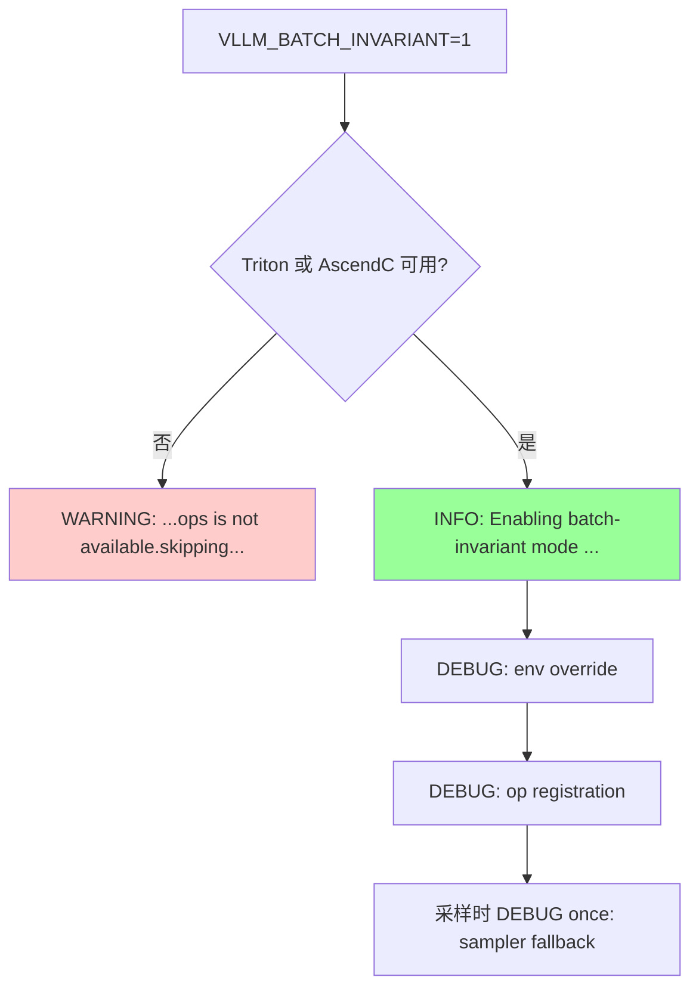
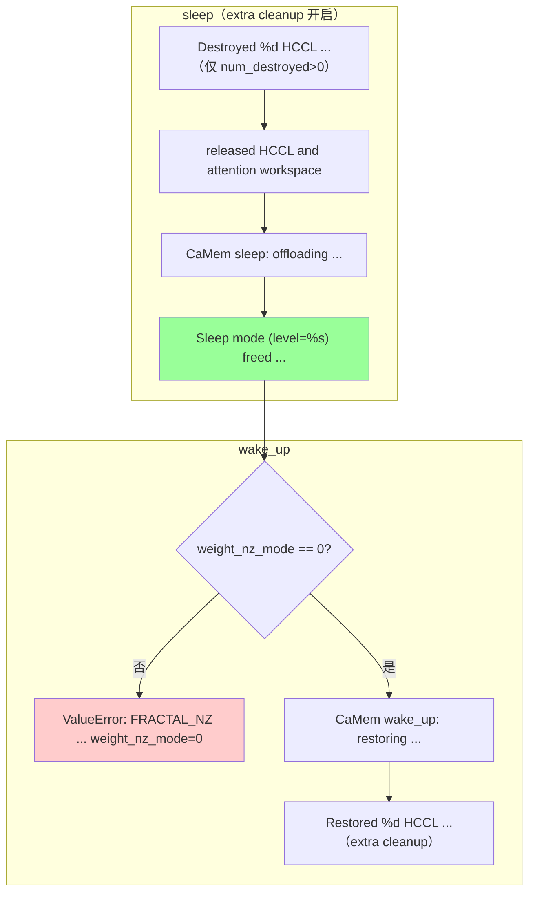
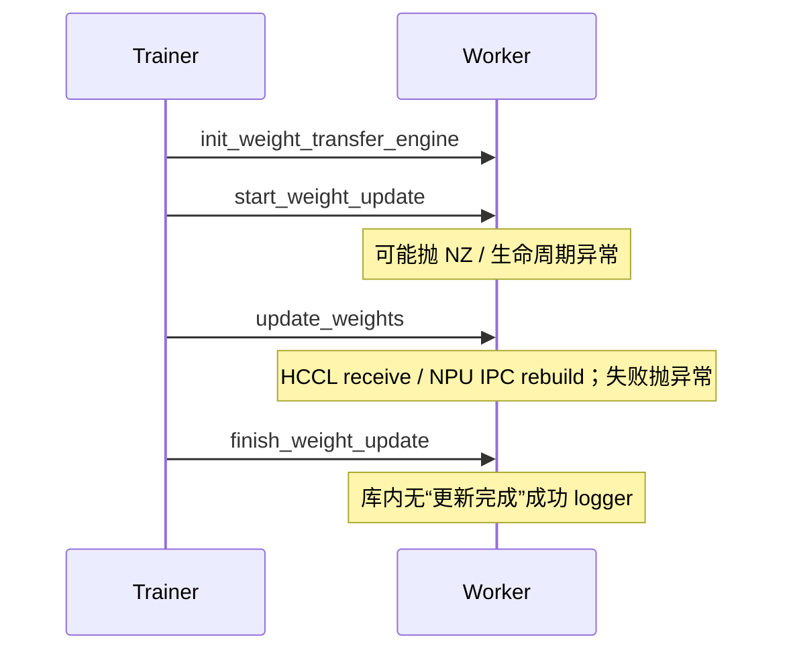
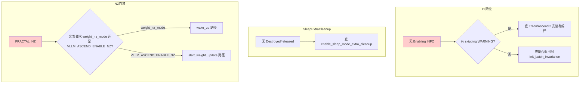

# vLLM Ascend RL 场景 — 日志定位指南

> **这是什么**：vllm-ascend 中 RL 相关能力分为 Batch Invariance、Sleep Mode、Weight Transfer。本文只收录 `vllm_ascend` **库内已核对**的 logger / 异常原文，用于日志定位。
>
> **涉及组件**：`worker`、`batch_invariant.py`、`device_allocator`、`distributed/weight_transfer`（详见 [附录 A](#a-涉及仓库与组件)）
>
> **与功能文档关系**
>
> | # | 能力 | 功能说明 | 本文定位重点 |
> | --- | --- | --- | --- |
> | **①** | **Batch Invariance** | [batch_invariance](../../user_guide/feature_guide/batch_invariance.md) | 是否真正开启 / 降级 |
> | **②** | **Sleep Mode** | [sleep_mode](../../user_guide/feature_guide/sleep_mode.md) | sleep/wake 与 extra cleanup 日志顺序 |
> | **③** | **Weight Transfer** | `examples/rl/`、`distributed/weight_transfer/` | **无库内成功路径日志**；失败看异常原文 |
>
> **开启方式**
>
> | 能力 | 方式 |
> | --- | --- |
> | Batch Invariance | `export VLLM_BATCH_INVARIANT=1` |
> | Sleep Mode | `--enable-sleep-mode`（或 `enable_sleep_mode=True`） |
> | Extra Cleanup | `--additional-config '{"enable_sleep_mode_extra_cleanup": true}'`（默认关闭） |
> | Weight Transfer | `--weight-transfer-config '{"backend":"nccl"}'`（HCCL）或 `'{"backend":"ipc"}'`（NPU IPC）；HTTP 控制面需 `VLLM_SERVER_DEV_MODE=1` |
>
> **功能的约束条件**
>
> | 条件 | 说明 | 违反后果 |
> | --- | --- | --- |
> | `weight_nz_mode=0` | `wake_up` 要求关闭 NZ | 抛 `ValueError`（见 §2.2） |
> | `VLLM_ASCEND_ENABLE_NZ=0` | `start_weight_update` 要求关闭 NZ | 抛 `ValueError`（见 §2.3） |
> | IPC + HTTP | 需 `VLLM_ALLOW_INSECURE_SERIALIZATION=1` | 抛反序列化 `ValueError`（见 §2.3） |
> | Ascend backend 别名 | 配置写 `"nccl"` / `"ipc"`，factory patch 到 HCCL / NPU IPC | 非错误；勿按 CUDA NCCL 理解 |
>
> **你需要准备**：
>
> - 查看配置：是否满足上表「开启方式」与「约束条件」
> - 日志文件：vLLM 服务 stdout / worker 日志
> - 快速过滤：
>     - Batch：`grep -E "batch-invariant|BATCH_INVARIANT" 日志文件`
>     - Sleep/Wake：`grep -E "Sleep mode|CaMem |Destroyed .* HCCL|Restored .* HCCL|FRACTAL_NZ" 日志文件`
>     - Weight Transfer 失败：`grep -E "Weight transfer not configured|start_weight_update|HCCL weight transfer not initialized|ipc_handles_pickled|IPC handle not found|VLLM_ASCEND_ENABLE_NZ" 日志文件`
>
> **总流程**：

---

## 一、快速定位（先看这里）

> **30 秒速判**：在日志里搜下面几步的标志日志，**最后出现的那条 = 你卡在哪一步**，直接跳对应 §二或 §三。  
> Weight Transfer **没有**库内成功标志日志；若 sleep/wake 已过、热更新失败，直接看 §2.3 异常表。

| 步骤 | 大阶段 | 标志日志 | 正常含义 | 没走到 → | 备查（表 → 图） |
| --- | --- | --- | --- | --- | --- |
| 1 | Batch Invariance | `Enabling batch-invariant mode for vLLM on Ascend NPU.` | BI 已开启 | §二.1 / §三 | [C.1](#c1) → [D.1](#d1) |
| 2 | Sleep | `Sleep mode (level=%s) freed %.2f GiB memory` | sleep 主流程结束 | §二.2 / §三 | [C.2](#c2) → [D.2](#d2) |
| 3 | Wake | `CaMem wake_up: restoring %s/%s allocations` | 开始恢复分配 | §二.2 / §三 | [C.2](#c2) → [D.2](#d2) |
| 4 | Weight Transfer | （无库内成功标志） | 成功时库内不打完成日志 | §二.3 / §三 | [C.3](#c3) → [D.3](#d3) |

---

## 二、分阶段详细定位

### 2.1 阶段 1：Batch Invariance

**在干什么**：`VLLM_BATCH_INVARIANT=1` 时，`init_batch_invariance()` 覆盖确定性环境并注册 batch-invariant 算子；采样时 `AscendSampler` 可回退到 vLLM native top-k/top-p。

| 子环节 | 关键日志 | 正常含义 | 异常时 / 分支 |
| --- | --- | --- | --- |
| 开启成功 | `Enabling batch-invariant mode for vLLM on Ascend NPU.` (INFO) | Triton 或 AscendC 至少其一可用 | 无此日志 → 看降级 WARNING，或未走到 `init_batch_invariance()` |
| 环境覆盖 | `Batch-invariant env override: weight_nz_mode=0, HCCL_DETERMINISTIC=strict, LCCL_DETERMINISTIC=1, use_deterministic_algorithms=True` (DEBUG) | 确定性开关已写入 | 默认 INFO 级别不可见 |
| 算子注册 | `Batch-invariant op registration: Triton=%s, AscendC=%s` (DEBUG) | 算子已注册 | 默认 INFO 级别不可见 |
| 降级 | `Batch-invariant mode requested but Triton or AscendC batch-invariant ops is not available.skipping batch-invariant initialization.` (WARNING) | 请求开启但后端不可用（`available.` 与 `skipping` 间无空格） | 此时不会出现 INFO 成功日志 |
| 采样回退 | `[sample/sampler] BATCH_INVARIANT mode enabled, falling back to vLLM native top-k/top-p implementation.` (DEBUG once) | 首次采样走 native 路径 | 仅采样时出现 |

→ 全量表：[C.1](#c1)
→ 全量流程图：[D.1](#d1)

### 2.2 阶段 2：Sleep / Wake

**在干什么**：释放/恢复 NPU 上由 sleep-mode allocator 管理的权重与 KV；可选 extra cleanup 额外销毁/恢复 HCCL，并清理 ACL graph workspace。

**sleep 顺序（extra cleanup 开启）**：`Destroyed HCCL`（仅 `num_destroyed > 0`）→ `released HCCL and attention workspace` → `CaMem sleep` → `Sleep mode (level=...) freed`。

**wake 顺序**：`weight_nz_mode` 门禁 → `CaMem wake_up` →（extra cleanup）`Restored HCCL`。

| 子环节 | 关键日志 | 正常含义 | 异常时 / 分支 |
| --- | --- | --- | --- |
| HCCL 销毁 | `Destroyed %d HCCL process groups for sleep mode.` (INFO) | extra cleanup 销毁了进程组 | 未开 extra cleanup，或 `num_destroyed == 0` → 不出现 |
| Extra cleanup 汇总 | `Sleep mode released HCCL and attention workspace memory: %.3f GiB.` (INFO) | HCCL + attention workspace 清理完成 | 未开 extra cleanup → 不出现 |
| CaMem offload | `CaMem sleep: offloading %s/%s allocations (tags=%s)` (INFO) | 按 tag offload/释放 | - |
| sleep 汇总 | `Sleep mode (level=%s) freed %.2f GiB memory, %.2f GiB memory is still in use.` (INFO) | sleep 结束 | - |
| wake NZ 门禁 | `FRACTAL_NZ mode is enabled. This may cause model parameter precision issues in the RL scenarios. Please set weight_nz_mode=0 via --additional-config.` (ValueError) | `wake_up` 检测到 `weight_nz_mode != 0` | 设 `weight_nz_mode=0` |
| CaMem 恢复 | `CaMem wake_up: restoring %s/%s allocations (tags=%s)` (INFO) | 按 tags 恢复 | - |
| HCCL 恢复 | `Restored %d HCCL process groups after sleep mode.` (INFO) | extra cleanup 恢复进程组 | 未开 extra cleanup → 不出现；`num_restored` 为 0 也会打 |

→ 全量表：[C.2](#c2)
→ 全量流程图：[D.2](#d2)

### 2.3 阶段 3：Weight Transfer

**在干什么**：trainer 经 HTTP 控制面驱动 worker：`init_weight_transfer_engine` → `start_weight_update` → `update_weights` → `finish_weight_update`；数据面为 HCCL broadcast 或 NPU IPC。

**库内无权重更新成功路径 logger。** 下表均为异常原文。

| 子环节 | 关键日志 / 异常 | 正常含义 | 异常时 / 分支 |
| --- | --- | --- | --- |
| 未配置 | `Weight transfer not configured. Please set weight_transfer_config to enable weight transfer.` | - | 未设 `weight_transfer_config` |
| NZ 门禁 | `FRACTAL_NZ mode is enabled. This may cause model parameter precision issues in the RL scenarios. Please set VLLM_ASCEND_ENABLE_NZ=0.` | - | `start_weight_update` 且 NZ 未关 |
| 生命周期 | `start_weight_update called while a weight update is already active. Call finish_weight_update first.` | - | 重复 start |
| 生命周期 | `start_weight_update must be called before update_weights.` | - | 未 start 就 update |
| 生命周期 | `start_weight_update must be called before finish_weight_update.` | - | 未 start 就 finish |
| HCCL 未初始化 | `HCCL weight transfer not initialized. Call init_transfer_engine() first.` | - | 未先 `init_transfer_engine` |
| IPC 反序列化 | `` Refusing to deserialize `ipc_handles_pickled` without VLLM_ALLOW_INSECURE_SERIALIZATION=1 `` | - | 未开 insecure serialization |
| IPC 同卡 | `IPC handle not found for NPU UUID ...` | - | trainer/worker 物理 NPU UUID 不一致 |

→ 全量表：[C.3](#c3)
→ 全量流程图：[D.3](#d3)

---

## 三、卡点速查（卡在 X → 查 Y）

| 你卡在这里 | 落在哪个大阶段 | 优先查什么 | 常见原因 |
| --- | --- | --- | --- |
| 开了 `VLLM_BATCH_INVARIANT` 但无 INFO 成功日志 | §二.1 | 是否有降级 WARNING；DEBUG 是否被过滤 | Triton/AscendC 均不可用；或未调用到 `init_batch_invariance()` |
| sleep 后无 `Sleep mode (level=` 汇总 | §二.2 | sleep 是否被调用 / 是否在 sleep 中异常退出 | sleep 未执行或中途失败 |
| 期望释放 HCCL/ACL workspace，但无 Destroyed/released 日志 | §二.2 | `enable_sleep_mode_extra_cleanup` | 默认关闭 |
| wake 抛 FRACTAL_NZ（要求 `weight_nz_mode=0`） | §二.2 | `weight_nz_mode` / `--additional-config` | wake 路径 NZ 未关 |
| 热更新抛 FRACTAL_NZ（要求 `VLLM_ASCEND_ENABLE_NZ=0`） | §二.3 | `VLLM_ASCEND_ENABLE_NZ` | start_weight_update 路径 NZ 未关 |
| 热更新报 start/update/finish 顺序错误 | §二.3 | 调用顺序 | 生命周期未闭环 |
| IPC 拒绝反序列化 | §二.3 | `VLLM_ALLOW_INSECURE_SERIALIZATION` | 未设为 1 |
| IPC UUID 不匹配 | §二.3 | `ASCEND_RT_VISIBLE_DEVICES` / 同卡部署 | trainer 与 worker 不在同一物理 NPU |

**排查顺序**：

1. 查 Batch INFO / WARNING → 确认一致性入口
2. 查 `Sleep mode (level=` 与 `CaMem` → 确认 sleep/wake
3. 若开了 extra cleanup，查 Destroyed / Restored 是否成对
4. 热更新失败 → 只查 §2.3 异常原文（无库内成功完成日志可证）

---

## 四、附录

### A. 涉及仓库与组件

| 仓库/模块 | 组件 | 说明 |
| --- | --- | --- |
| `vllm_ascend/batch_invariant.py` | `init_batch_invariance` | BI 初始化 |
| `vllm_ascend/sample/sampler.py` | `AscendSampler.forward_native` | BI 下 top-k/top-p 回退 |
| `vllm_ascend/worker/worker.py` | `sleep` / `wake_up` / weight update API | RL 主控制面 |
| `vllm_ascend/device_allocator/camem.py` | `CaMemAllocator` | sleep/wake 内存转存 |
| `vllm_ascend/device_allocator/sleep_mem_optimized.py` | `SleepWakeupManager` | extra cleanup |
| `vllm_ascend/distributed/weight_transfer/hccl_engine.py` | `HCCLWeightTransferEngine` | HCCL 数据面 |
| `vllm_ascend/distributed/weight_transfer/npu_ipc_engine.py` | `NPUIPCWeightTransferEngine` | NPU IPC 数据面 |
| `vllm_ascend/patch/platform/patch_weight_transfer_engine.py` | factory patch | `"nccl"`→HCCL，`"ipc"`→NPU IPC |

### B. 关键配置

| 配置项 | 日志体现 | 说明 |
| --- | --- | --- |
| `VLLM_BATCH_INVARIANT=1` | `Enabling batch-invariant mode ...` / 降级 WARNING | 开启 BI |
| `enable_sleep_mode` | `Sleep mode (level=...) freed ...` | 开启 sleep/wake |
| `enable_sleep_mode_extra_cleanup=True` | `Sleep mode released HCCL ...` / Destroyed / Restored | 额外清理（默认 `False`） |
| `weight_nz_mode=0` | 避免 wake `FRACTAL_NZ` ValueError | wake 门禁 |
| `VLLM_ASCEND_ENABLE_NZ=0` | 避免 start_weight_update `FRACTAL_NZ` ValueError | 热更新门禁 |
| `weight_transfer_config={"backend":"nccl"}` | 无成功日志；失败见 HCCL 异常 | Ascend 上映射 HCCL |
| `weight_transfer_config={"backend":"ipc"}` | 无成功日志；失败见 IPC 异常 | Ascend 上映射 NPU IPC |
| `VLLM_ALLOW_INSECURE_SERIALIZATION=1` | 反序列化 ValueError 的反例 | IPC over HTTP 必需 |
| `VLLM_SERVER_DEV_MODE=1` | （控制面 HTTP 注册，非本索引日志） | 暴露 weight transfer HTTP API |

### C. 全量日志逐步明细

阅读顺序：**大框架（§一/§二） → 全量表（附录 C） → 全量流程图（附录 D）**

#### C.1 阶段 1：Batch Invariance

← §一步骤 1 · §2.1 · 流程图 → [#d1](#d1)

| # | 子模块 | 日志原文 | 等级 | 说明 |
| --- | --- | --- | --- | --- |
| 1 | `batch_invariant.py` | `Enabling batch-invariant mode for vLLM on Ascend NPU.` | INFO | 开启成功 |
| 2 | `batch_invariant.py` | `Batch-invariant env override: weight_nz_mode=0, HCCL_DETERMINISTIC=strict, LCCL_DETERMINISTIC=1, use_deterministic_algorithms=True` | DEBUG | 环境覆盖 |
| 3 | `batch_invariant.py` | `Batch-invariant op registration: Triton=%s, AscendC=%s` | DEBUG | 算子注册 |
| 4 | `batch_invariant.py` | `Batch-invariant mode requested but Triton or AscendC batch-invariant ops is not available.skipping batch-invariant initialization.` | WARNING | 降级（无空格） |
| 5 | `sample/sampler.py` | `[sample/sampler] BATCH_INVARIANT mode enabled, falling back to vLLM native top-k/top-p implementation.` | DEBUG once | 采样回退 |

→ 全量流程图：[#d1](#d1)

#### C.2 阶段 2：Sleep / Wake

← §一步骤 2/3 · §2.2 · 流程图 → [#d2](#d2)

| # | 子模块 | 日志原文 | 等级 | 说明 |
| --- | --- | --- | --- | --- |
| 1 | `sleep_mem_optimized.py` | `Destroyed %d HCCL process groups for sleep mode.` | INFO | extra cleanup；仅 `num_destroyed > 0` |
| 2 | `sleep_mem_optimized.py` | `Sleep mode released HCCL and attention workspace memory: %.3f GiB.` | INFO | extra cleanup 汇总 |
| 3 | `camem.py` | `CaMem sleep: offloading %s/%s allocations (tags=%s)` | INFO | offload |
| 4 | `worker.py` | `Sleep mode (level=%s) freed %.2f GiB memory, %.2f GiB memory is still in use.` | INFO | sleep 汇总 |
| 5 | `worker.py` | `FRACTAL_NZ mode is enabled. This may cause model parameter precision issues in the RL scenarios. Please set weight_nz_mode=0 via --additional-config.` | ValueError | wake NZ 门禁 |
| 6 | `camem.py` | `CaMem wake_up: restoring %s/%s allocations (tags=%s)` | INFO | wake 恢复 |
| 7 | `sleep_mem_optimized.py` | `Restored %d HCCL process groups after sleep mode.` | INFO | extra cleanup 恢复 |

→ 全量流程图：[#d2](#d2)

#### C.3 阶段 3：Weight Transfer（仅异常）

← §一步骤 4 · §2.3 · 流程图 → [#d3](#d3)

| # | 子模块 | 日志原文 | 等级 | 说明 |
| --- | --- | --- | --- | --- |
| 1 | `worker.py` | `Weight transfer not configured. Please set weight_transfer_config to enable weight transfer.` | RuntimeError | 未配置 |
| 2 | `worker.py` | `FRACTAL_NZ mode is enabled. This may cause model parameter precision issues in the RL scenarios. Please set VLLM_ASCEND_ENABLE_NZ=0.` | ValueError | start NZ 门禁 |
| 3 | `worker.py` | `start_weight_update called while a weight update is already active. Call finish_weight_update first.` | RuntimeError | 重复 start |
| 4 | `worker.py` | `start_weight_update must be called before update_weights.` | RuntimeError | 顺序错误 |
| 5 | `worker.py` | `start_weight_update must be called before finish_weight_update.` | RuntimeError | 顺序错误 |
| 6 | `hccl_engine.py` | `HCCL weight transfer not initialized. Call init_transfer_engine() first.` | RuntimeError | HCCL 未 init |
| 7 | `npu_ipc_engine.py` | `` Refusing to deserialize `ipc_handles_pickled` without VLLM_ALLOW_INSECURE_SERIALIZATION=1 `` | ValueError | IPC 反序列化门禁 |
| 8 | `npu_ipc_engine.py` / `packed_tensor.py` | `IPC handle not found for NPU UUID ...` | ValueError | 同卡 UUID 不匹配 |

→ 全量流程图：[#d3](#d3)

### D. 全量流程图（Mermaid）

阅读顺序：**大框架 → 全量表 → 全量流程图**

#### D.1 阶段 1：Batch Invariance 流程

← 全量表 [#c1](#c1)

#### D.2 阶段 2：Sleep / Wake 流程

← 全量表 [#c2](#c2)

> 未开 extra cleanup 时：无 S1/S2/W4，仍有 S3/S4/W3。

#### D.3 阶段 3：Weight Transfer 控制面（无库内成功完成日志）

← 全量表 [#c3](#c3)

### E. 关键节点索引

| 阶段 | 关键日志 | 说明 |
| --- | --- | --- |
| Batch | `Enabling batch-invariant mode ...` | BI 开启成功 |
| Batch | `...ops is not available.skipping...` | BI 降级 |
| Sleep | `CaMem sleep: offloading ...` | offload 开始 |
| Sleep | `Sleep mode (level=%s) freed ...` | sleep 完成 |
| Wake | `CaMem wake_up: restoring ...` | 恢复开始 |
| Wake | `Restored %d HCCL process groups ...` | extra cleanup 恢复 |
| Transfer | （无成功标志） | 失败见 §2.3 / [C.3](#c3) |

### F. 故障场景流程

