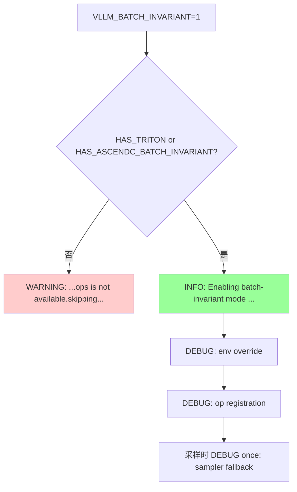
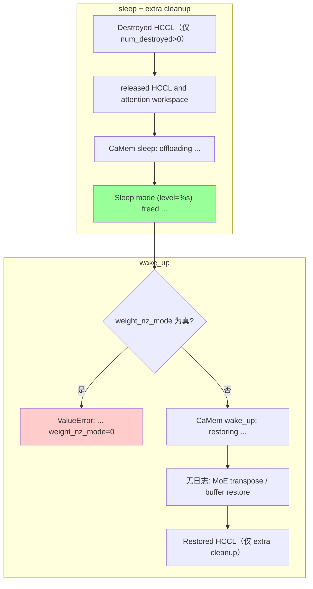
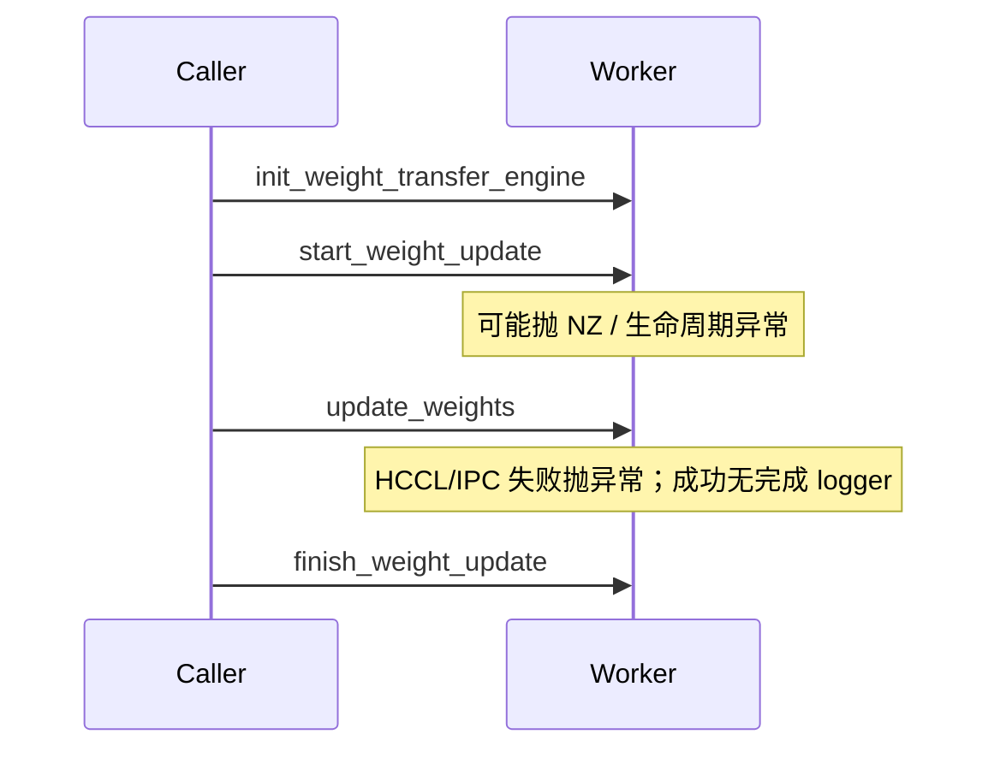
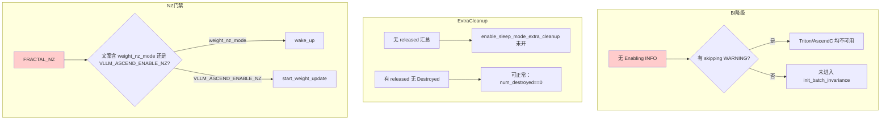

# vLLM Ascend RL 场景 — 日志定位指南

> **这是什么**：vllm-ascend 中与 RL 相关的三类能力——Batch Invariance、Sleep Mode、Weight Transfer——的**库内日志 / 异常原文**索引。仅收录已在源码中核对的条目；**不含** `examples/`、`tests/` 的 `print`。
>
> **涉及组件**：`worker`、`batch_invariant.py`、`sample/sampler.py`、`device_allocator`、`distributed/weight_transfer`、`patch_weight_transfer_engine.py`（详见 [附录 A](#a-涉及仓库与组件)）
>
> **与功能文档关系**
>
> | # | 能力 | 功能说明 | 本文定位重点 |
> | --- | --- | --- | --- |
> | **①** | **Batch Invariance** | [batch_invariance](../../user_guide/feature_guide/batch_invariance.md) | 是否真正开启 / 降级 |
> | **②** | **Sleep Mode** | [sleep_mode](../../user_guide/feature_guide/sleep_mode.md) | sleep/wake 与 optional extra cleanup 的日志出现顺序 |
> | **③** | **Weight Transfer** | `vllm_ascend/distributed/weight_transfer/` | **库内无成功路径 logger**；失败看异常原文 |
>
> **开启方式**
>
> | 能力 | 方式 |
> | --- | --- |
> | Batch Invariance | `export VLLM_BATCH_INVARIANT=1`（worker 分布式初始化时调用 `init_batch_invariance()`） |
> | Sleep Mode | `--enable-sleep-mode`（或 `enable_sleep_mode=True`） |
> | Extra Cleanup | `--additional-config '{"enable_sleep_mode_extra_cleanup": true}'`（默认 `false`） |
> | Weight Transfer | `--weight-transfer-config '{"backend":"nccl"}'` → Ascend 上为 HCCL；`'{"backend":"ipc"}'` → NPU IPC。经 HTTP 调控制面时还需 `VLLM_SERVER_DEV_MODE=1` |
>
> **功能的约束条件**
>
> | 条件 | 说明 | 违反后果 |
> | --- | --- | --- |
> | `weight_nz_mode=0` | `wake_up()` 检查 `get_ascend_config().weight_nz_mode`（非 0 即拒绝） | `ValueError`（见 §2.2） |
> | `VLLM_ASCEND_ENABLE_NZ=0` | `start_weight_update()` 检查环境变量 `VLLM_ASCEND_ENABLE_NZ`（非 0 即拒绝）；与 `weight_nz_mode` **不是同一检查点** | `ValueError`（见 §2.3） |
> | 含 `ipc_handles_pickled` 的更新载荷 | 需 `VLLM_ALLOW_INSECURE_SERIALIZATION=1` | `ValueError`（见 §2.3） |
> | Ascend backend 别名 | 配置写 `"nccl"` / `"ipc"`，由 factory patch 映射到 HCCL / NPU IPC | 预期行为，不是错误 |
>
> **你需要准备**：
>
> - 确认上表「开启方式」与「约束条件」中**你实际启用的能力**已满足
> - 日志文件：vLLM 服务 / worker stdout
> - 快速过滤：
>     - Batch：`grep -E "batch-invariant|BATCH_INVARIANT" 日志文件`
>     - Sleep/Wake：`grep -E "Sleep mode|CaMem |Destroyed .* HCCL|Restored .* HCCL|FRACTAL_NZ" 日志文件`
>     - Weight Transfer 失败：`grep -E "Weight transfer not configured|start_weight_update|HCCL weight transfer not initialized|ipc_handles_pickled|IPC handle not found|VLLM_ASCEND_ENABLE_NZ" 日志文件`
>
> **能力关系（可独立启用，非固定先后依赖）**：

---

## 一、快速定位（先看这里）

> **用法**：只对**已开启**的能力查对应行。三类能力彼此无强制先后依赖，不能用「最后一条」跨能力推断卡点。  
> Weight Transfer **没有**库内成功标志日志；失败直接查 §2.3。

| 步骤 | 大阶段 | 标志日志 | 正常含义 | 没走到 → | 备查（表 → 图） |
| --- | --- | --- | --- | --- | --- |
| 1 | Batch Invariance | `Enabling batch-invariant mode for vLLM on Ascend NPU.` | BI 开启成功 | §二.1 / §三 | [C.1](#c1) → [D.1](#d1) |
| 2 | Sleep | `Sleep mode (level=%s) freed %.2f GiB memory` | `worker.sleep()` 结束 | §二.2 / §三 | [C.2](#c2) → [D.2](#d2) |
| 3 | Wake | `CaMem wake_up: restoring %s/%s allocations` | `CaMemAllocator.wake_up()` 已开始 | §二.2 / §三 | [C.2](#c2) → [D.2](#d2) |
| 4 | Weight Transfer | （无库内成功标志） | `weight_transfer/` 内无 `logger` 调用 | §二.3 / §三 | [C.3](#c3) → [D.3](#d3) |

---

## 二、分阶段详细定位

### 2.1 阶段 1：Batch Invariance

**在干什么**：`VLLM_BATCH_INVARIANT=1` 时，`NPUWorker._init_worker_distributed_environment()` 调用 `init_batch_invariance()`：若 Triton 或 AscendC batch-invariant ops 可用，则覆盖确定性环境并注册算子；否则打 WARNING 并跳过。采样时若仍开启该 env，`AscendSampler.forward_native` 会回退到 vLLM native top-k/top-p。

| 子环节 | 关键日志 | 正常含义 | 异常时 / 分支 |
| --- | --- | --- | --- |
| 开启成功 | `Enabling batch-invariant mode for vLLM on Ascend NPU.` (INFO) | Triton 或 AscendC 至少其一可用 | 无此日志 → 查降级 WARNING，或未进入 worker 分布式初始化 |
| 环境覆盖 | `Batch-invariant env override: weight_nz_mode=0, HCCL_DETERMINISTIC=strict, LCCL_DETERMINISTIC=1, use_deterministic_algorithms=True` (DEBUG) | 成功路径内写入；其中会把 `ascend_config.weight_nz_mode` 设为 `0`（不改 `VLLM_ASCEND_ENABLE_NZ` 环境变量） | 默认 INFO 级别不可见 |
| 算子注册 | `Batch-invariant op registration: Triton=%s, AscendC=%s` (DEBUG) | 算子注册开始 | 默认 INFO 级别不可见 |
| 降级 | `Batch-invariant mode requested but Triton or AscendC batch-invariant ops is not available.skipping batch-invariant initialization.` (WARNING) | 后端均不可用（`available.` 与 `skipping` 之间无空格） | 此时不会出现 INFO 成功日志 |
| 采样回退 | `[sample/sampler] BATCH_INVARIANT mode enabled, falling back to vLLM native top-k/top-p implementation.` (DEBUG once) | `forward_native` 首次命中 BI 分支 | 仅采样路径；需 DEBUG |

→ 全量表：[C.1](#c1)
→ 全量流程图：[D.1](#d1)

### 2.2 阶段 2：Sleep / Wake

**在干什么**：`worker.sleep()` / `wake_up()` 通过 `CaMemAllocator` offload/恢复带 tag 的分配。若 `enable_sleep_mode_extra_cleanup=True`，还会经 `SleepWakeupManager`：sleep 时清理 ACL graph workspace（仅 `use_aclgraph`）并销毁 HCCL；wake 时恢复 HCCL，并在 tags 允许时 recapture ACL graph（无独立成功日志）。

**关键日志出现顺序（extra cleanup 开启时的 sleep）**：

1. `Destroyed %d HCCL...`（仅当 `num_destroyed > 0`）
2. `Sleep mode released HCCL and attention workspace memory...`（extra cleanup 的 sleep 汇总；ACL graph 清理仅在 `use_aclgraph` 时执行，但本行总会打）
3. `CaMem sleep: offloading...`
4. `Sleep mode (level=%s) freed...`

**关键日志出现顺序（wake）**：

1. 若 `weight_nz_mode != 0` → 直接 `ValueError`（无后续 CaMem/HCCL 日志）
2. `CaMem wake_up: restoring...`
3. （无日志）unquant MoE 的 `w13`/`w2` transpose、level-2 buffer 恢复
4. 若 extra cleanup → `Restored %d HCCL...`（`num_restored` 为 0 也会打）

| 子环节 | 关键日志 | 正常含义 | 异常时 / 分支 |
| --- | --- | --- | --- |
| HCCL 销毁 | `Destroyed %d HCCL process groups for sleep mode.` (INFO) | 至少销毁了 1 个 HCCL 组 | 未开 extra cleanup，或 `num_destroyed == 0`，或 distributed 未初始化 → **不出现**（仍可能有下一行汇总） |
| Extra cleanup 汇总 | `Sleep mode released HCCL and attention workspace memory: %.3f GiB.` (INFO) | `SleepWakeupManager.sleep()` 结束 | 未开 extra cleanup → 不出现 |
| CaMem offload | `CaMem sleep: offloading %s/%s allocations (tags=%s)` (INFO) | level=1 时 `tags=("weights",)`；level=2 时 `tags=()` | - |
| sleep 汇总 | `Sleep mode (level=%s) freed %.2f GiB memory, %.2f GiB memory is still in use.` (INFO) | `worker.sleep()` 结束 | 若断言 `Memory usage increased after sleeping` 失败则不会打到这里 |
| wake NZ 门禁 | `FRACTAL_NZ mode is enabled. This may cause model parameter precision issues in the RL scenarios. Please set weight_nz_mode=0 via --additional-config.` (ValueError) | `weight_nz_mode` 为真值 | 设 `weight_nz_mode=0` |
| CaMem 恢复 | `CaMem wake_up: restoring %s/%s allocations (tags=%s)` (INFO) | `tags` 为 `None` 时日志里打印为 `all` | - |
| HCCL 恢复 | `Restored %d HCCL process groups after sleep mode.` (INFO) | extra cleanup 的 wake | 未开 extra cleanup → 不出现 |

→ 全量表：[C.2](#c2)
→ 全量流程图：[D.2](#d2)

### 2.3 阶段 3：Weight Transfer

**在干什么**：worker API 顺序为 `init_weight_transfer_engine` → `start_weight_update` → `update_weights`（可多次）→ `finish_weight_update`。HTTP 暴露这些接口需要 `VLLM_SERVER_DEV_MODE=1`。数据面：HCCL broadcast 或 NPU IPC。`vllm_ascend/distributed/weight_transfer/` 内**没有任何** `logger` 调用。

**下表均为异常原文（成功路径无库内完成日志）。**

| 子环节 | 关键日志 / 异常 | 正常含义 | 异常时 / 分支 |
| --- | --- | --- | --- |
| 未配置 | `Weight transfer not configured. Please set weight_transfer_config to enable weight transfer.` (RuntimeError) | - | `weight_transfer_engine is None` |
| NZ 门禁 | `FRACTAL_NZ mode is enabled. This may cause model parameter precision issues in the RL scenarios. Please set VLLM_ASCEND_ENABLE_NZ=0.` (ValueError) | - | `start_weight_update` → `_check_nz_disabled()` |
| 生命周期 | `start_weight_update called while a weight update is already active. Call finish_weight_update first.` (RuntimeError) | - | 重复 start |
| 生命周期 | `start_weight_update must be called before update_weights.` (RuntimeError) | - | 未 start 就 update |
| 生命周期 | `start_weight_update must be called before finish_weight_update.` (RuntimeError) | - | 未 start 就 finish |
| HCCL 未初始化 | `HCCL weight transfer not initialized. Call init_transfer_engine() first.` (RuntimeError) | - | HCCL `receive_weights` 时 `model_update_group is None` |
| IPC 反序列化 | `` Refusing to deserialize `ipc_handles_pickled` without VLLM_ALLOW_INSECURE_SERIALIZATION=1 `` (ValueError) | - | 更新 dict 含 `ipc_handles_pickled` 且未开 insecure serialization |
| IPC 同卡 | `IPC handle not found for NPU UUID ...` (ValueError) | - | 当前进程 UUID 不在 handle map 中 |

→ 全量表：[C.3](#c3)
→ 全量流程图：[D.3](#d3)

---

## 三、卡点速查（卡在 X → 查 Y）

| 你卡在这里 | 落在哪个大阶段 | 优先查什么 | 常见原因（源码对应） |
| --- | --- | --- | --- |
| 开了 `VLLM_BATCH_INVARIANT` 但无 INFO 成功日志 | §二.1 | 是否有降级 WARNING | `HAS_TRITON` 与 `HAS_ASCENDC_BATCH_INVARIANT` 均为假；或未跑到 `_init_worker_distributed_environment` |
| sleep 后无 `Sleep mode (level=` | §二.2 | 是否调用了 `sleep()`；是否在 CaMem/extra cleanup 中抛错 | 未调用或中途失败（含 `freed_bytes >= 0` 断言） |
| 无 `Sleep mode released HCCL...` | §二.2 | `enable_sleep_mode_extra_cleanup` | 默认 `false` |
| 有 released 汇总但无 `Destroyed %d HCCL` | §二.2 | 是否 `num_destroyed > 0` | **可正常**：销毁数为 0 时不打 Destroyed |
| wake 报 `weight_nz_mode=0` | §二.2 | `ascend_config.weight_nz_mode` | wake 检查的是 config，不是 `VLLM_ASCEND_ENABLE_NZ` 环境变量 |
| 热更新报 `VLLM_ASCEND_ENABLE_NZ=0` | §二.3 | 环境变量 `VLLM_ASCEND_ENABLE_NZ` | start 检查的是 env；BI 只改 `weight_nz_mode`，**不会**自动清该 env |
| 热更新报 start/update/finish 顺序错误 | §二.3 | `_weight_update_active` 状态机 | 未按 start → update* → finish |
| IPC 拒绝反序列化 | §二.3 | 载荷是否含 `ipc_handles_pickled` | 未设 `VLLM_ALLOW_INSECURE_SERIALIZATION=1` |
| IPC UUID 不匹配 | §二.3 | `npu_generate_uuid()` / `ASCEND_RT_VISIBLE_DEVICES` | trainer 与 worker 物理 NPU UUID 不一致 |

**排查顺序**：

1. 按已开启能力分别查 §二 对应标志 / 异常
2. extra cleanup：有 `released` 即可证明 manager.sleep 跑完；`Destroyed` 不是必需成对出现
3. NZ：看报错文案区分 wake（`weight_nz_mode`）与 start（`VLLM_ASCEND_ENABLE_NZ`）
4. 热更新成功无法用库内完成日志证明；只能确认未出现 §2.3 异常，并结合业务侧输出验证

---

## 四、附录

### A. 涉及仓库与组件

| 仓库/模块 | 组件 | 说明 |
| --- | --- | --- |
| `vllm_ascend/batch_invariant.py` | `init_batch_invariance` | BI 初始化 |
| `vllm_ascend/sample/sampler.py` | `AscendSampler.forward_native` | BI 下 top-k/top-p 回退 |
| `vllm_ascend/worker/worker.py` | `sleep` / `wake_up` / weight update API | RL 主控制面；调用 `init_batch_invariance()` |
| `vllm_ascend/device_allocator/camem.py` | `CaMemAllocator` | sleep/wake 内存转存 |
| `vllm_ascend/device_allocator/sleep_mem_optimized.py` | `SleepWakeupManager` | extra cleanup |
| `vllm_ascend/distributed/weight_transfer/hccl_engine.py` | `HCCLWeightTransferEngine` | HCCL 数据面（无 logger） |
| `vllm_ascend/distributed/weight_transfer/npu_ipc_engine.py` | `NPUIPCWeightTransferEngine` | NPU IPC 数据面（无 logger） |
| `vllm_ascend/patch/platform/patch_weight_transfer_engine.py` | factory patch | `"nccl"`→HCCL，`"ipc"`→NPU IPC |

### B. 关键配置

| 配置项 | 日志体现 | 说明 |
| --- | --- | --- |
| `VLLM_BATCH_INVARIANT=1` | Enabling INFO / 降级 WARNING | 开启 BI |
| `enable_sleep_mode` | `Sleep mode (level=...) freed ...` | 开启 sleep/wake |
| `enable_sleep_mode_extra_cleanup=true` | `released HCCL...`；可选 `Destroyed`；wake 时 `Restored` | 默认 `false` |
| `weight_nz_mode=0` | 避免 wake `FRACTAL_NZ`（文案含 `weight_nz_mode=0`） | `wake_up` 门禁 |
| `VLLM_ASCEND_ENABLE_NZ=0` | 避免 start `FRACTAL_NZ`（文案含 `VLLM_ASCEND_ENABLE_NZ=0`） | `start_weight_update` 门禁 |
| `weight_transfer_config={"backend":"nccl"}` | 无成功日志；失败见 HCCL 异常 | Ascend patch 映射 HCCL |
| `weight_transfer_config={"backend":"ipc"}` | 无成功日志；失败见 IPC 异常 | Ascend patch 映射 NPU IPC |
| `VLLM_ALLOW_INSECURE_SERIALIZATION=1` | 反序列化 ValueError 的反例 | 仅当载荷含 `ipc_handles_pickled` |
| `VLLM_SERVER_DEV_MODE=1` | （本索引无对应成功日志） | HTTP 注册 weight-transfer / sleep 等 dev 端点 |

### C. 全量日志逐步明细

阅读顺序：**§一/§二 → 附录 C → 附录 D**

#### C.1 阶段 1：Batch Invariance

← §一步骤 1 · §2.1 · 流程图 → [#d1](#d1)

| # | 子模块 | 日志原文 | 等级 | 说明 |
| --- | --- | --- | --- | --- |
| 1 | `batch_invariant.py` | `Enabling batch-invariant mode for vLLM on Ascend NPU.` | INFO | 开启成功 |
| 2 | `batch_invariant.py` | `Batch-invariant env override: weight_nz_mode=0, HCCL_DETERMINISTIC=strict, LCCL_DETERMINISTIC=1, use_deterministic_algorithms=True` | DEBUG | 环境覆盖 |
| 3 | `batch_invariant.py` | `Batch-invariant op registration: Triton=%s, AscendC=%s` | DEBUG | 算子注册 |
| 4 | `batch_invariant.py` | `Batch-invariant mode requested but Triton or AscendC batch-invariant ops is not available.skipping batch-invariant initialization.` | WARNING | 降级 |
| 5 | `sample/sampler.py` | `[sample/sampler] BATCH_INVARIANT mode enabled, falling back to vLLM native top-k/top-p implementation.` | DEBUG once | 采样回退 |

→ 全量流程图：[#d1](#d1)

#### C.2 阶段 2：Sleep / Wake

← §一步骤 2/3 · §2.2 · 流程图 → [#d2](#d2)

| # | 子模块 | 日志原文 | 等级 | 说明 |
| --- | --- | --- | --- | --- |
| 1 | `sleep_mem_optimized.py` | `Destroyed %d HCCL process groups for sleep mode.` | INFO | extra cleanup；仅 `num_destroyed > 0` |
| 2 | `sleep_mem_optimized.py` | `Sleep mode released HCCL and attention workspace memory: %.3f GiB.` | INFO | extra cleanup sleep 汇总 |
| 3 | `camem.py` | `CaMem sleep: offloading %s/%s allocations (tags=%s)` | INFO | offload |
| 4 | `worker.py` | `Sleep mode (level=%s) freed %.2f GiB memory, %.2f GiB memory is still in use.` | INFO | sleep 汇总 |
| 5 | `worker.py` | `FRACTAL_NZ mode is enabled. This may cause model parameter precision issues in the RL scenarios. Please set weight_nz_mode=0 via --additional-config.` | ValueError | wake NZ 门禁 |
| 6 | `camem.py` | `CaMem wake_up: restoring %s/%s allocations (tags=%s)` | INFO | wake；`tags is None` 时第三段为 `all` |
| 7 | `sleep_mem_optimized.py` | `Restored %d HCCL process groups after sleep mode.` | INFO | extra cleanup wake |

→ 全量流程图：[#d2](#d2)

#### C.3 阶段 3：Weight Transfer（仅异常）

← §一步骤 4 · §2.3 · 流程图 → [#d3](#d3)

| # | 子模块 | 日志原文 | 等级 | 说明 |
| --- | --- | --- | --- | --- |
| 1 | `worker.py` | `Weight transfer not configured. Please set weight_transfer_config to enable weight transfer.` | RuntimeError | 未配置 |
| 2 | `worker.py` | `FRACTAL_NZ mode is enabled. This may cause model parameter precision issues in the RL scenarios. Please set VLLM_ASCEND_ENABLE_NZ=0.` | ValueError | start NZ 门禁 |
| 3 | `worker.py` | `start_weight_update called while a weight update is already active. Call finish_weight_update first.` | RuntimeError | 重复 start |
| 4 | `worker.py` | `start_weight_update must be called before update_weights.` | RuntimeError | 顺序错误 |
| 5 | `worker.py` | `start_weight_update must be called before finish_weight_update.` | RuntimeError | 顺序错误 |
| 6 | `hccl_engine.py` | `HCCL weight transfer not initialized. Call init_transfer_engine() first.` | RuntimeError | HCCL 未 init |
| 7 | `npu_ipc_engine.py` | `` Refusing to deserialize `ipc_handles_pickled` without VLLM_ALLOW_INSECURE_SERIALIZATION=1 `` | ValueError | pickled 载荷门禁 |
| 8 | `npu_ipc_engine.py` / `packed_tensor.py` | `IPC handle not found for NPU UUID ...` | ValueError | UUID 不匹配 |

→ 全量流程图：[#d3](#d3)

### D. 全量流程图（Mermaid）

#### D.1 阶段 1：Batch Invariance 流程

← 全量表 [#c1](#c1)

#### D.2 阶段 2：Sleep / Wake 流程

← 全量表 [#c2](#c2)

> 未开 extra cleanup：无 S1/S2/W4，仍有 S3/S4/W3。

#### D.3 阶段 3：Weight Transfer 控制面（无库内成功完成日志）

← 全量表 [#c3](#c3)

### E. 关键节点索引

| 阶段 | 关键日志 | 说明 |
| --- | --- | --- |
| Batch | `Enabling batch-invariant mode ...` | BI 开启成功 |
| Batch | `...ops is not available.skipping...` | BI 降级 |
| Sleep | `CaMem sleep: offloading ...` | offload 开始 |
| Sleep | `Sleep mode (level=%s) freed ...` | sleep 完成 |
| Wake | `CaMem wake_up: restoring ...` | 恢复开始 |
| Wake | `Restored %d HCCL process groups ...` | extra cleanup 恢复 |
| Transfer | （无成功标志） | 失败见 §2.3 / [C.3](#c3) |

### F. 故障场景流程

