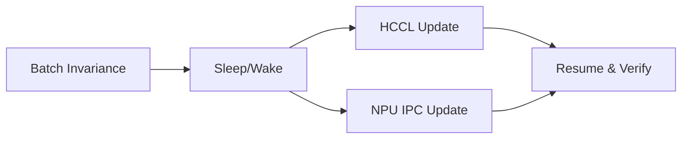
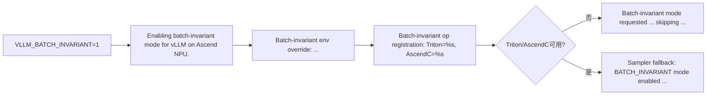
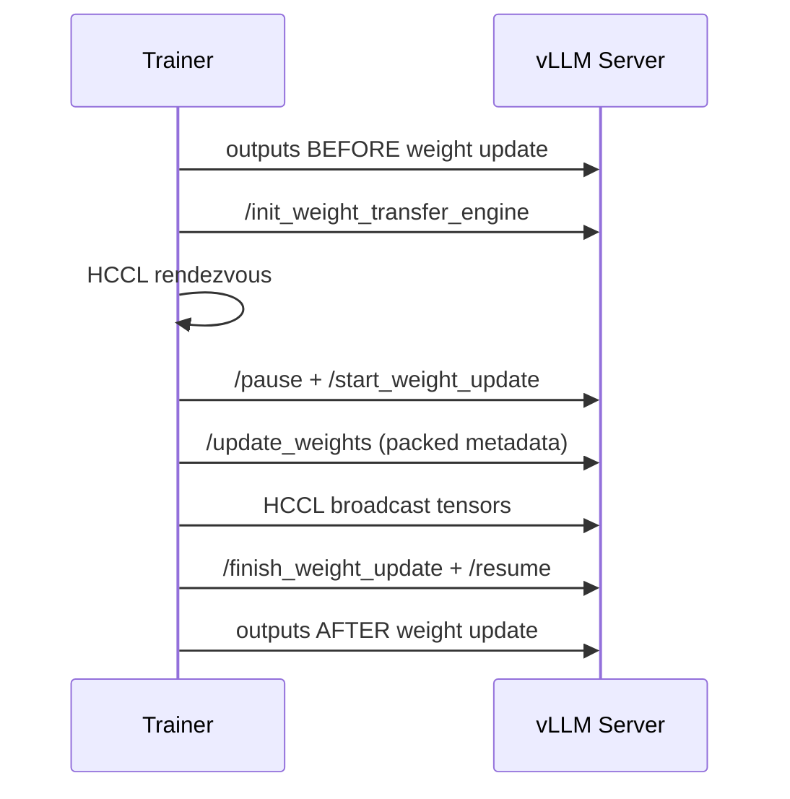
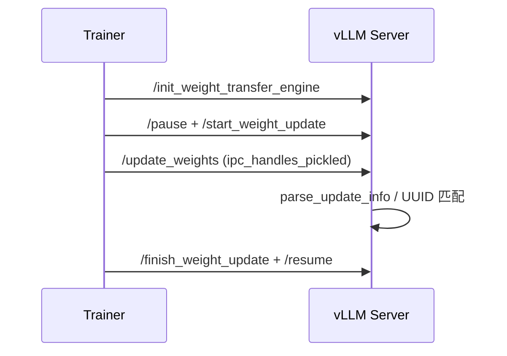
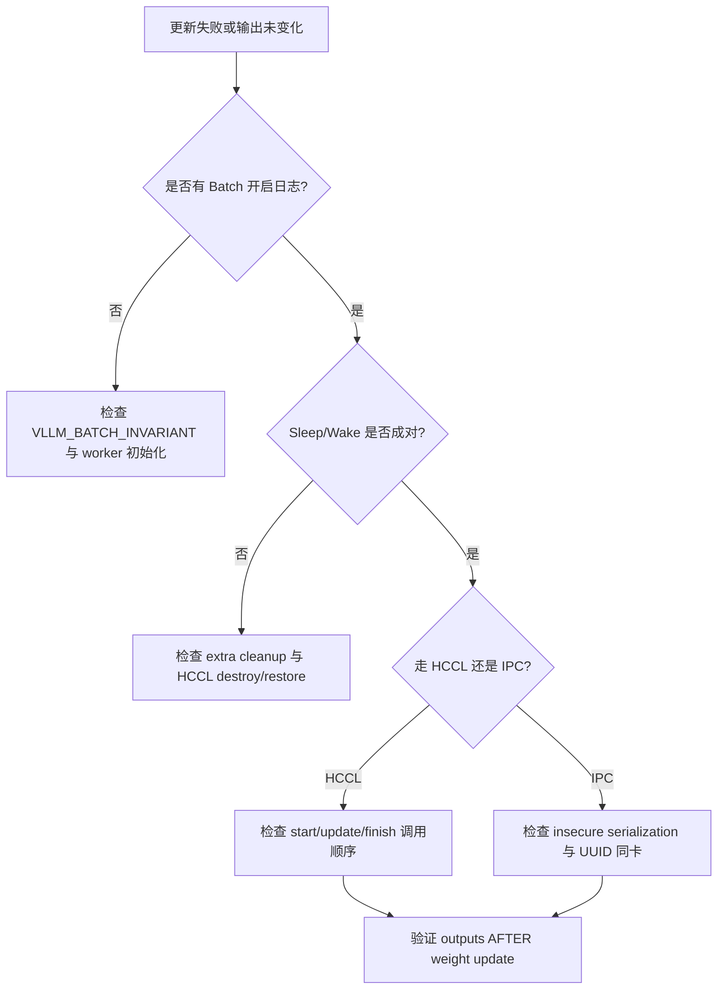

# vLLM Ascend RL 场景 — 日志定位指南

> **这是什么**：vllm-ascend 中 RL 相关能力（sleep mode、batch 一致性、权重热更新等）的代码与日志总索引。  
> **覆盖范围**：从 `VLLM_BATCH_INVARIANT=1` 初始化，到 sleep/wake，再到 HCCL/NPU IPC 权重更新完成。  
> **涉及组件**：`worker`、`batch_invariant.py`、`device_allocator`、`distributed/weight_transfer`、`examples/rl`（详见 [附录 A](#a-涉及仓库与组件)）。
>
> | 术语 | 含义 |
> |------|------|
> | Batch Invariance | batch 大小/顺序变化时输出保持一致 |
> | Sleep Mode | 将权重/KV 从 NPU 释放，给训练侧让资源 |
> | Weight Transfer | 训练侧权重同步到推理侧（HCCL 或 NPU IPC） |
> | Extra Cleanup | sleep 时额外清理 HCCL + ACL graph 资源 |
>
> **快速过滤**：  
> `rg "batch-invariant|Sleep mode|CaMem|HCCL|weight update|IPC handle|training-inference consistency" <logfile>`

## 目录
- [一、快速定位（先看这里）](#一快速定位先看这里)
- [二、分阶段详细定位](#二分阶段详细定位)
- [三、卡点速查（卡在 X → 查 Y）](#三卡点速查卡在-x--查-y)
- [四、附录](#四附录)

## 一、快速定位（先看这里）

| 步骤 | 标志日志 | 正常含义 | 异常时去哪里 | 全量（表→图） |
|---|---|---|---|---|
| 1 | `Enabling batch-invariant mode for vLLM on Ascend NPU.` | 一致性模式已开启 | [§2.1](#21-阶段-1训练-推理一致性入口batch-invariance) | [C.1](#c1) → [D.1](#d1) |
| 2 | `Sleep mode (level=%s) freed %.2f GiB memory` | sleep 成功且释放显存 | [§2.2](#22-阶段-2sleepwake-让显存给训练) | [C.2](#c2) → [D.2](#d2) |
| 3 | `HCCL process group established`（trainer） | HCCL 建链成功 | [§2.3](#23-阶段-3hccl-权重热更新链路) | [C.3](#c3) → [D.3](#d3) |
| 4 | `outputs AFTER weight update` | 权重更新后输出已变化 | [§2.3](#23-阶段-3hccl-权重热更新链路) | [C.3](#c3) → [D.3](#d3) |
| 5 | `Broadcasting weights via NPU IPC (HTTP)...` | IPC 更新路径生效 | [§2.4](#24-阶段-4npu-ipc-权重热更新链路) | [C.4](#c4) → [D.4](#d4) |

**判断口诀**：先看 batch 一致性 → 再看 sleep 让资源 → 最后看 HCCL/IPC 热更新是否闭环。

## 二、分阶段详细定位

### 2.1 阶段 1：训练-推理一致性入口（Batch Invariance）

| 子环节 | 关键日志 | 正常含义 | 异常时/分支 |
|---|---|---|---|
| 环境覆盖 | `Batch-invariant env override: weight_nz_mode=0, enable_matmul_allreduce=False, HCCL_DETERMINISTIC=strict, LCCL_DETERMINISTIC=1` | 确定性环境变量与开关生效 | 多见于未启用 `VLLM_BATCH_INVARIANT` |
| 算子注册 | `Batch-invariant op registration: Triton=%s, AscendC=%s` | `aten::mm/matmul/sum` 等被接管 | 后端都不可用会降级 |
| 成功标志 | `Enabling batch-invariant mode for vLLM on Ascend NPU.` | 入口完成 | - |
| 降级告警 | `Batch-invariant mode requested but Triton or AscendC ... skipping ...` | 请求开启但环境不满足 | 查编译安装 |
| 采样回退 | `[sample/sampler] BATCH_INVARIANT mode enabled, falling back to vLLM native top-k/top-p implementation.` | 为一致性回退采样路径 | 若输出仍漂移，继续核查 e2e deterministic case |

→ 全量表：[C.1](#c1)  
→ 全量流程图：[D.1](#d1)

### 2.2 阶段 2：Sleep/Wake 让显存给训练

| 子环节 | 关键日志 | 正常含义 | 异常时/分支 |
|---|---|---|---|
| CaMem offload | `CaMem sleep: offloading %s/%s allocations (tags=%s)` | 内存块按 tag 转存/释放 | offload 为 0 多为 tag 错配 |
| Extra cleanup 收益 | `Sleep mode released HCCL and attention workspace memory: %.3f GiB.` | HCCL/ACL graph 清理完成 | 未启用 extra cleanup 不会出现 |
| HCCL 销毁 | `Destroyed %d HCCL process groups for sleep mode.` | 通信资源已释放 | 唤醒异常常与此不完整有关 |
| sleep 汇总 | `Sleep mode (level=%s) freed %.2f GiB memory...` | sleep 主流程成功 | - |
| CaMem 恢复 | `CaMem wake_up: restoring %s/%s allocations (tags=%s)` | 开始恢复权重/KV | tags 不对会恢复不完整 |
| HCCL 恢复 | `Restored %d HCCL process groups after sleep mode.` | 分布式通信恢复 | - |
| RL 安全门禁 | `FRACTAL_NZ mode is enabled... in the RL scenarios...` | 检测到 RL 风险配置 | 需 `weight_nz_mode=0` / `VLLM_ASCEND_ENABLE_NZ=0` |

→ 全量表：[C.2](#c2)  
→ 全量流程图：[D.2](#d2)

### 2.3 阶段 3：HCCL 权重热更新链路

| 子环节 | 关键日志 | 正常含义 | 异常时/分支 |
|---|---|---|---|
| 基线输出 | `[trainer] outputs BEFORE weight update: ...` | 拿到更新前输出 | - |
| 建链 | `[trainer] HCCL rendezvous at ...` + `HCCL process group established` | 控制面建链完成 | rank/world_size 错会卡住 |
| 生命周期约束 | `start_weight_update must be called before update_weights.`（异常） | 必须先 start 后 update | 调用顺序问题 |
| 广播中 | `Broadcasting weights via HCCL...` | 数据面开始同步 | packed 参数不当会失败 |
| 广播完成 | `[trainer] weight broadcast complete` | server 已接收完成 | - |
| 更新后输出 | `[trainer] outputs AFTER weight update: ...` | 权重变更生效 | 若无变化，查 finish/resume/加载回调 |

→ 全量表：[C.3](#c3)  
→ 全量流程图：[D.3](#d3)

### 2.4 阶段 4：NPU IPC 权重热更新链路

| 子环节 | 关键日志 | 正常含义 | 异常时/分支 |
|---|---|---|---|
| 初始化 | `Initializing weight transfer (NPU IPC backend)...` | IPC 初始化完成（逻辑 no-op） | - |
| 发送 | `Broadcasting weights via NPU IPC (HTTP)...` | IPC handles 已发送 | - |
| 反序列化门禁 | `Refusing to deserialize ipc_handles_pickled ...`（异常） | 安全开关未开启 | 设 `VLLM_ALLOW_INSECURE_SERIALIZATION=1` |
| 同卡校验 | `IPC handle not found for NPU UUID ...`（异常） | trainer/worker 不在同一物理卡 | 查 `ASCEND_RT_VISIBLE_DEVICES` |

→ 全量表：[C.4](#c4)  
→ 全量流程图：[D.4](#d4)

## 三、卡点速查（卡在 X → 查 Y）

| 你卡在这里 | 落在哪个阶段 | 优先查什么 | 常见原因 |
|---|---|---|---|
| 开了 `VLLM_BATCH_INVARIANT` 但没日志 | 阶段 1 | `init_batch_invariance()` 调用 | worker 初始化路径未到 |
| batch 一致性开了但结果漂移 | 阶段 1 | sampler fallback / op 注册 | 仍走非确定性分支 |
| sleep 后显存没降多少 | 阶段 2 | `CaMem sleep: offloading ...` | offload tag 不匹配 |
| wake 后通信异常 | 阶段 2 | destroy/restore 日志是否成对 | extra cleanup 清理后未恢复完整 |
| wake 报 RL 精度错误 | 阶段 2 | `weight_nz_mode` 与 `VLLM_ASCEND_ENABLE_NZ` | NZ 未关闭 |
| HCCL 更新卡住 | 阶段 3 | rendezvous 参数 | 端口/rank/world_size 错误 |
| HCCL 报顺序错误 | 阶段 3 | start/update/finish 调用顺序 | 生命周期不闭环 |
| HCCL 完成但输出不变 | 阶段 3 | finish + resume + load 路径 | 参数未真正加载 |
| IPC 拒绝反序列化 | 阶段 4 | `VLLM_ALLOW_INSECURE_SERIALIZATION` | 未设为 1 |
| IPC 报 UUID 不匹配 | 阶段 4 | 物理卡映射 | server/trainer 不同物理 NPU |

## 四、附录

### A. 涉及仓库与组件

| 仓库/模块 | 组件 | 作用 |
|---|---|---|
| `vllm_ascend/worker/worker.py` | `sleep/wake_up/start_weight_update/update_weights/finish_weight_update` | RL 主控制面 |
| `vllm_ascend/batch_invariant.py` | `init_batch_invariance` | 一致性初始化 |
| `vllm_ascend/device_allocator/camem.py` | `CaMemAllocator` | sleep/wake 内存转存 |
| `vllm_ascend/device_allocator/sleep_mem_optimized.py` | `SleepWakeupManager` | extra cleanup |
| `vllm_ascend/distributed/weight_transfer/hccl_engine.py` | `HCCLWeightTransferEngine` | HCCL 热更新 |
| `vllm_ascend/distributed/weight_transfer/npu_ipc_engine.py` | `NPUIPCWeightTransferEngine` | IPC 热更新 |
| `examples/rl/rlhf_http_hccl.py` | RLHF 示例 | trainer 侧 HCCL 脚本 |
| `examples/rl/rlhf_http_npu_ipc.py` | RLHF 示例 | trainer 侧 IPC 脚本 |

### B. 关键配置

| 配置项 | 日志体现 | 说明 |
|---|---|---|
| `VLLM_BATCH_INVARIANT=1` | `Enabling batch-invariant mode ...` | 开启 batch 一致性 |
| `HCCL_DETERMINISTIC`/`LCCL_DETERMINISTIC` | `Batch-invariant env override ...` | 代码自动设定 |
| `enable_sleep_mode=True` | `Sleep mode (level=...) freed ...` | 开启 sleep/wake |
| `enable_sleep_mode_extra_cleanup=True` | `Sleep mode released HCCL ...` | 更彻底清理 |
| `weight_nz_mode=0` / `VLLM_ASCEND_ENABLE_NZ=0` | RL 场景 ValueError 避免触发 | 避免 RL 精度风险 |
| `weight_transfer_config={"backend":"nccl"}` | HCCL 建链/广播日志 | HCCL 数据面 |
| `weight_transfer_config={"backend":"ipc"}` | NPU IPC 广播日志 | IPC 数据面 |
| `VLLM_ALLOW_INSECURE_SERIALIZATION=1` | 反序列化错误反例 | IPC over HTTP 必需 |

### C. 全量日志逐步明细

> **阅读链**：§一/§二 → 附录 C → 附录 D。

#### C.1 Batch Invariance
`← 对应 §一步骤 1 · §2.1 · 流程图 → [#d1](#d1)`

| 序号 | 子模块 | 日志原文 | 说明 |
|---|---|---|---|
| 1 | `batch_invariant.py` | `Enabling batch-invariant mode for vLLM on Ascend NPU.` | 开启标志 |
| 2 | `batch_invariant.py` | `Batch-invariant env override: weight_nz_mode=0, enable_matmul_allreduce=False, HCCL_DETERMINISTIC=strict, LCCL_DETERMINISTIC=1` | 覆盖环境 |
| 3 | `batch_invariant.py` | `Batch-invariant op registration: Triton=%s, AscendC=%s` | 算子注册 |
| 4 | `batch_invariant.py` | `Batch-invariant mode requested but Triton or AscendC ... skipping ...` | 失败/降级 |
| 5 | `sample/sampler.py` | `[sample/sampler] BATCH_INVARIANT mode enabled, falling back to vLLM native top-k/top-p implementation.` | 采样路径回退 |

→ 全量流程图：[#d1](#d1)

#### C.2 Sleep/Wake
`← 对应 §一步骤 2 · §2.2 · 流程图 → [#d2](#d2)`

| 序号 | 子模块 | 日志原文 | 说明 |
|---|---|---|---|
| 1 | `camem.py` | `CaMem sleep: offloading %s/%s allocations (tags=%s)` | offload 开始 |
| 2 | `sleep_mem_optimized.py` | `Sleep mode released HCCL and attention workspace memory: %.3f GiB.` | extra cleanup 收益 |
| 3 | `sleep_mem_optimized.py` | `Destroyed %d HCCL process groups for sleep mode.` | HCCL 销毁 |
| 4 | `worker.py` | `Sleep mode (level=%s) freed %.2f GiB memory, %.2f GiB memory is still in use.` | sleep 汇总 |
| 5 | `camem.py` | `CaMem wake_up: restoring %s/%s allocations (tags=%s)` | wake 恢复 |
| 6 | `sleep_mem_optimized.py` | `Restored %d HCCL process groups after sleep mode.` | HCCL 恢复 |
| 7 | `worker.py` | `FRACTAL_NZ mode is enabled... in the RL scenarios...` | RL 风险拦截 |

→ 全量流程图：[#d2](#d2)

#### C.3 HCCL 权重热更新
`← 对应 §一步骤 3/4 · §2.3 · 流程图 → [#d3](#d3)`

| 序号 | 子模块 | 日志原文 | 说明 |
|---|---|---|---|
| 1 | `tests/e2e/test_hccl_weight_transfer.py` | `[trainer] outputs BEFORE weight update: ...` | 更新前基线 |
| 2 | `tests/e2e/test_hccl_weight_transfer.py` | `[trainer] HCCL rendezvous at ...` | 建链开始 |
| 3 | `tests/e2e/test_hccl_weight_transfer.py` | `[trainer] HCCL process group established` | 建链完成 |
| 4 | `worker.py` | `start_weight_update must be called before update_weights.` | 生命周期校验 |
| 5 | `examples/rl/rlhf_http_hccl.py` | `Broadcasting weights via HCCL...` | 广播开始 |
| 6 | `tests/e2e/test_hccl_weight_transfer.py` | `[trainer] weight broadcast complete` | 广播完成 |
| 7 | `tests/e2e/test_hccl_weight_transfer.py` | `[trainer] outputs AFTER weight update: ...` | 更新生效验证 |

→ 全量流程图：[#d3](#d3)

#### C.4 NPU IPC 权重热更新
`← 对应 §一步骤 5 · §2.4 · 流程图 → [#d4](#d4)`

| 序号 | 子模块 | 日志原文 | 说明 |
|---|---|---|---|
| 1 | `examples/rl/rlhf_http_npu_ipc.py` | `Initializing weight transfer (NPU IPC backend)...` | 初始化 |
| 2 | `examples/rl/rlhf_http_npu_ipc.py` | `Broadcasting weights via NPU IPC (HTTP)...` | 广播开始 |
| 3 | `npu_ipc_engine.py` | `Refusing to deserialize ipc_handles_pickled without VLLM_ALLOW_INSECURE_SERIALIZATION=1` | 序列化门禁 |
| 4 | `npu_ipc_engine.py` | `IPC handle not found for NPU UUID ...` | 同卡校验失败 |

→ 全量流程图：[#d4](#d4)

### D. 全量流程图（Mermaid）

#### D.1 Batch Invariance 流程
`← 全量表 [#c1](#c1)`

#### D.2 Sleep/Wake 流程
`← 全量表 [#c2](#c2)`

#### D.3 HCCL 热更新时序
`← 全量表 [#c3](#c3)`

#### D.4 NPU IPC 热更新时序
`← 全量表 [#c4](#c4)`

### E. 关键节点索引

| 阶段 | 关键日志 | 说明 |
|---|---|---|
| Batch | `Enabling batch-invariant mode ...` | 一致性入口 |
| Batch | `Batch-invariant op registration ...` | 算子接管 |
| Sleep | `CaMem sleep: offloading ...` | offload 启动 |
| Sleep | `Sleep mode (level=%s) freed ...` | sleep 完成 |
| Wake | `CaMem wake_up: restoring ...` | 恢复启动 |
| Wake | `Restored %d HCCL process groups ...` | 分布式恢复 |
| HCCL | `HCCL process group established` | 建链成功 |
| HCCL | `outputs AFTER weight update` | 更新生效 |
| IPC | `Broadcasting weights via NPU IPC (HTTP)...` | IPC 广播 |
| IPC | `IPC handle not found for NPU UUID ...` | 同卡失败定位 |

### F. 故障场景流程

