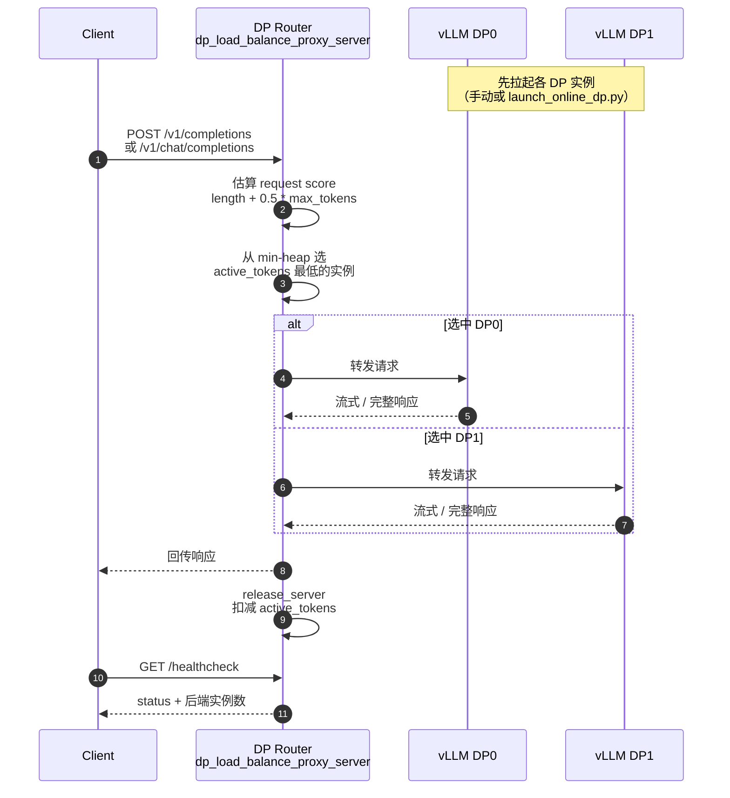

# DP 感知 Router

!!! note

    DP 感知 Router 指 External DP 场景下、按实时负载**感知并选择哪一个 DP
    实例**的外部请求路由器（示例：
    `examples/external_online_dp/dp_load_balance_proxy_server.py`）。

    它与 MoE expert 路由采集（[Routing Replay](routing_replay.md) /
    routed-experts）不是同一特性；部署背景也可参考 [External DP](external_dp.md)
    与 [DP Router](dp_router.md)。

把每个 DP rank 当作独立 vLLM 服务端点，由代理根据请求长度与
`active_tokens` 把 HTTP 请求分发到当前最空闲的实例，而不是依赖 vLLM 内部
DP 调度，也不是固定轮询。

## 1. 原理

标准 Internal DP 由 vLLM 进程组统一调度；External DP 则把每个 DP rank 暴露为
独立 endpoint。此时需要一层外部 Router，并**感知**各 DP 的实时负载：

| 局限 | 表现 | 后果 |
| --- | --- | --- |
| 无中心入口 | 客户端需自己选 DP 实例 | 部署复杂，易出现热点 |
| 负载不均 | 长请求与短请求混打同一实例 | 部分 rank 排队过长，吞吐下降 |
| 缺乏实时感知 | 固定轮询 / 随机分发 | 无法按 `active_tokens` 等指标选 DP |

DP 感知 Router 的核心做法是：

1. 对外提供统一的 OpenAI 兼容入口（`/v1/completions`、`/v1/chat/completions`）。
2. 按请求长度（及 `max_tokens`）估算负载分数。
3. 选择当前 `active_tokens` 最低的后端 DP 实例转发。
4. 流式回传响应，请求结束后释放该实例上的负载计数。

**没有 DP 感知：**

```text
Client → 自行选择 / 固定轮询 DP0 / DP1 / ...
       → 易出现长请求堆积在同一 rank
```

**启用 DP 感知：**

```text
Client → DP Router（统一入口）
       → 按请求长度 + 实时 active_tokens 感知并选 rank
       → 转发到 DP0 / DP1 / ...
```

## 5. 特性工作流

### 5.2 特性工作流图



负载分数（`calculate_request_score`）规则：

| 条件 | 分数 |
| --- | --- |
| `ignore_eos=True` | `request_length + max_tokens` |
| 默认 | `request_length + 0.5 * max_tokens` |

`0.5` 是经验系数：在未知何时遇到 EOS 时，用一半 `max_tokens` 估计生成开销。

## 如何启用

启用步骤、启动命令与联调示例见 [DP Router](dp_router.md)。本页聚焦「感知并选择
哪一个 DP」的原理与工作流；示例入口：

```bash
python examples/external_online_dp/dp_load_balance_proxy_server.py \
  --host 0.0.0.0 --port 8000 \
  --dp-hosts 127.0.0.1 127.0.0.1 \
  --dp-ports 9000 9001
```

## 限制

- **至少 2 个后端才有意义。** 单实例时 Router 只会直转，没有负载均衡效果。
- **Router 本身无模型推理。** 它只做 HTTP 转发与负载估计，后端仍需各自完成
  `vllm serve`。
- **负载估计是启发式的。** 默认用 `length + 0.5 * max_tokens`，真实生成长度受
  EOS 影响，极端长尾请求仍可能造成瞬时不均。
- **与 Internal DP 调度不同。** 把路由放在进程外；不要与“单进程内 DP 自动调度”
  混为一谈。
- **与 MoE routed-experts 采集不同。** 训练侧路由回放见
  [Routing Replay](routing_replay.md)。

## 相关功能

- [DP Router](dp_router.md)：同一能力的完整启用指南与进阶（Dynamic Bucket 等）。
- [External DP](external_dp.md)：External DP 启动与代理的基础教程。
- [Routing Replay](routing_replay.md)：MoE expert 路由采集与回放（不同特性）。
