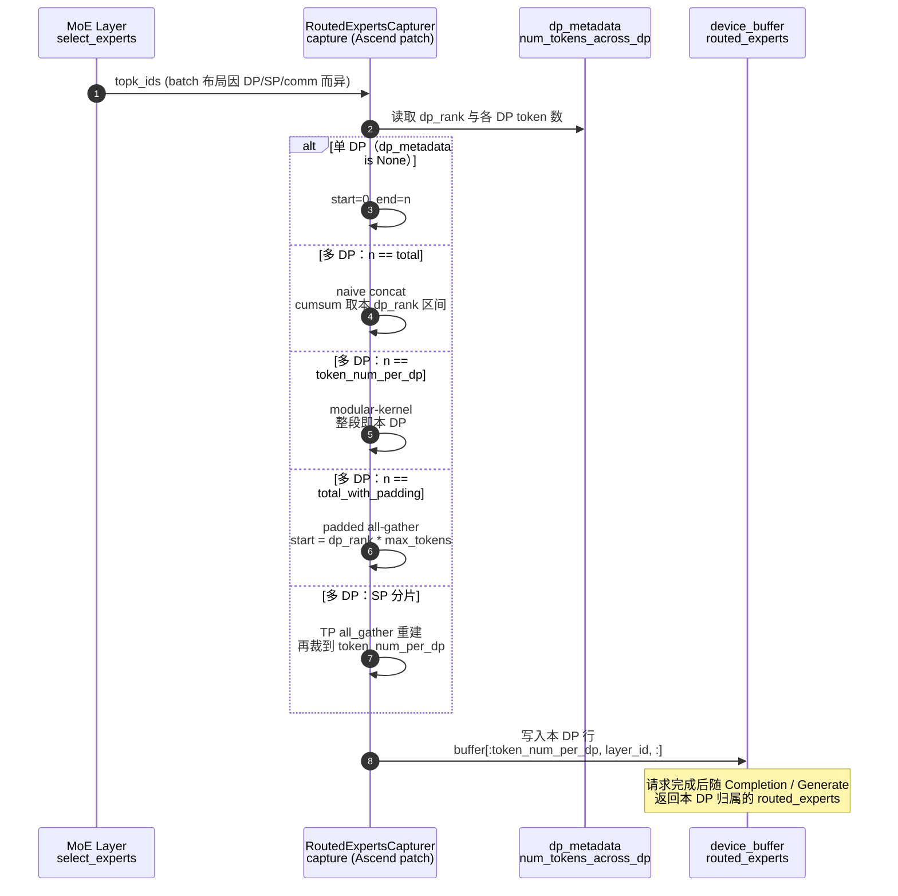

# DP 感知 Router

!!! note

    此处的 **Router** 指 MoE **expert router**（`select_experts` → `topk_ids`），
    **不是** External DP 场景下按请求长度分发 prompt 的 HTTP 负载均衡代理
    （见 [DP Router](dp_router.md)）。

    DP 感知 Router 是 [Routing Replay](routing_replay.md) 在 Ascend 多 DP
    布局下的关键适配：采集路由结果时，按 `dp_rank` 只保留**当前 DP** 对应
    token 的 expert 选择。

开启 `--enable-return-routed-experts` 后，每一层 MoE 会把 `topk_ids` 写入
采集缓冲。多 DP 时，`topk_ids` 的 batch 维可能混有其它 DP 的 token（或
padding / SP 分片）。若不做 DP 感知切片，返回的 `routed_experts` 会串位，
训练侧回放会错。

实现位置：`vllm_ascend/patch/worker/patch_routed_experts_capture.py`。

## 1. 原理

多 DP 下，MoE 通信与 combine 发生的位置不同，`select_experts` 看到的
`topk_ids` 布局也不同。DP 感知 Router 的核心是：

1. 读取 `self.dp_rank` 与 `forward_context.dp_metadata.num_tokens_across_dp_cpu`。
2. 根据 `topk_ids.shape[0]` 判断当前布局属于哪一种。
3. 算出本 rank 的 `[start_loc, end_loc)`，只把该切片写入
   `device_buffer`。

**没有 DP 感知：**

```text
topk_ids 含 DP0+DP1（或 padding）
→ 整段写入 buffer
→ routed_experts 归属错误
```

**启用 DP 感知：**

```text
识别布局 + dp_rank
→ 只取本 DP 的 [start_loc, end_loc)
→ routed_experts 与本请求 token 对齐
```

## 5. 特性工作流

### 5.2 特性工作流图



## 多 DP 布局

| 条件 | 布局含义 | 切片方式 |
| --- | --- | --- |
| `dp_metadata is None` | 单 DP | 整段 `topk_ids` |
| `n == total` | naive dispatch：各 DP token 先拼接再路由 | `cumsum` 取本 `dp_rank` 区间 |
| `n == token_num_per_dp` | modular-kernel：DP combine 在 apply 内，本 rank 只见自己的 token | 整段写入 |
| `n == total_with_padding` | padded all-gather：每 DP 占 `max_tokens` 块 | `start = dp_rank * max_tokens`，长度 `token_num_per_dp` |
| `n ≈ ceil(token_num_per_dp / tp_size)` | SP + modular-kernel：TP 维分片 | TP `all_gather` 后取前 `token_num_per_dp` 行 |

其中：

- `token_num_per_dp = num_tokens_across_dp[dp_rank]`
- `total = sum(num_tokens_across_dp)`
- `total_with_padding = max(num_tokens_across_dp) * dp_size`

当各 DP token 数相等时，`total == total_with_padding`，会先命中 naive
分支；与 padded 分支结果等价。

无法识别的 `n` 会抛出 `AssertionError`，避免静默写错路由。

## 如何启用

DP 感知切片随 Routing Replay 一并生效，无需单独开关：

```bash
vllm serve Qwen/Qwen3-30B-A3B \
  --tensor-parallel-size 2 \
  --data-parallel-size 2 \
  --enable-expert-parallel \
  --enable-return-routed-experts \
  --async-scheduling false
```

启用后，每个已完成请求的 `routed_experts` 只包含**该请求所在 DP** 的
token 路由。

### 在线服务（Completions）

功能开启后，已完成请求的每个 choice 会携带 base64 编码的 NumPy
`routed_experts`：

```python
import io
import base64

import numpy as np
from openai import OpenAI

client = OpenAI(base_url="http://localhost:8000/v1", api_key="EMPTY")
resp = client.completions.create(
    model="Qwen/Qwen3-30B-A3B",
    prompt="Hello, please introduce yourself.",
    max_tokens=32,
    temperature=0.0,
    extra_body={"return_token_ids": True},
)

payload = resp.model_dump()["choices"][0]["routed_experts"]
routed_experts = np.load(io.BytesIO(base64.b64decode(payload)))
# routed_experts.shape == [num_tokens, num_moe_layers, top_k]
print(routed_experts.shape, routed_experts.dtype)
```

### 离线 / 进程内 API

```python
from vllm import LLM, SamplingParams

llm = LLM(
    model="Qwen/Qwen3-30B-A3B",
    tensor_parallel_size=2,
    data_parallel_size=2,
    enable_expert_parallel=True,
    enable_return_routed_experts=True,
    async_scheduling=False,
)

outputs = llm.generate(
    ["Hello, please introduce yourself."],
    SamplingParams(max_tokens=32, temperature=0.0),
)

routed = outputs[0].outputs[0].routed_experts
assert routed is not None and routed.size > 0
print(routed.shape)  # [seq_len, num_moe_layers, top_k]
```

## 返回约定

| 字段 | 位置 | 含义 |
| --- | --- | --- |
| `routed_experts` | `CompletionOutput` / `choices[].routed_experts` | 请求 token 使用的 expert ID；多 DP 下仅为**本 DP** 归属的切片 |

张量约定：

| 属性 | 值 |
| --- | --- |
| Shape | `[num_tokens, num_moe_layers, top_k]` |
| 典型长度 | `prompt_len + generated_len - 1`（按 next-token 对齐） |
| Dtype（引擎缓冲） | worker 传输缓冲使用 `int32` |
| HTTP 编码 | base64 编码的 `.npy` 字节 |
| 合法 ID | `[0, num_experts)`（prefix cache 场景可能使用 `-1` 哨兵值） |

`num_tokens` 与本请求（本 DP）的 token 对齐；不要把其它 DP rank 的路由拼进
同一缓冲。

## 训练侧接入

仅拿到 `routed_experts` 不够，训练栈必须在 MoE forward 中**强制使用**这些
expert ID（Routing Replay / R3）。

若训练框架期望单个 Megatron 侧缓冲（`rollout_routed_experts`），请先解码
响应张量，再校验 shape 后赋值：

```text
rollout_routed_experts.shape == (len(tokens) - 1, num_layers, moe_router_topk)
```

以 Qwen3-30B-A3B 为例：`(seq_len - 1, 48, 8)`。

典型步骤：

1. 推理侧开启 `--enable-return-routed-experts`，完成 rollout。
2. 从 Completions / 离线 API 取出 `routed_experts`（HTTP 需 base64 → `.npy`
   解码）。
3. 校验 dtype / shape，与训练侧 `tokens`、层数、`top_k` 对齐。
4. 写入训练框架约定字段（如 `rollout_routed_experts`），并打开训练侧
   replay 开关（例如支持 R3 的框架中的 `--use-rollout-routing-replay`）。
5. 训练 forward 不再重新 `select_experts`，而是回放推理捕获的 expert ID，
   使 train/infer 路由一致。

多 DP 时：每个 DP 实例各自返回本 rank 的 `routed_experts`；训练侧应按
rollout 时的 DP 归属拼接或分片消费，避免跨 DP 错位。

上游参考：

- [Stabilizing MoE Reinforcement Learning by Aligning Training and Inference Routers](https://arxiv.org/abs/2510.11370)
- 上游示例：[`examples/rl/routed_experts_e2e.py`](https://github.com/vllm-project/vllm/blob/main/examples/rl/routed_experts_e2e.py)

更完整的 Routing Replay 产品说明见 [Routing Replay](routing_replay.md)。

## 测试

| 类型 | 路径 | 覆盖内容 |
| --- | --- | --- |
| UT | `tests/ut/patch/worker/test_patch_routed_experts_capture.py` | 单 DP；多 DP naive concat / modular-kernel / padded all-gather；SP + AlltoAll / MC2 分片重建 |
| E2E | `tests/e2e/pull_request/two_card/test_moe_routing_replay.py` | 开启 `--enable-return-routed-experts` 的 MoE Routing Replay 端到端 |

本地可跑：

```bash
# DP 感知切片单测
pytest -sv tests/ut/patch/worker/test_patch_routed_experts_capture.py

# Routing Replay e2e（需 NPU / 两卡环境）
pytest -sv tests/e2e/pull_request/two_card/test_moe_routing_replay.py
```

## 限制

- **依赖 Routing Replay 总开关。** 未开 `--enable-return-routed-experts` 时
  不会走采集路径。
- **布局必须可识别。** 未知 `topk_ids` batch 维会直接报错，而不是猜测切片。
- **与 HTTP DP Router 无关。** 不负责在多个 External DP endpoint 之间分发
  prompt；那是 [DP Router](dp_router.md)。
- **建议关闭 async scheduling。** 与 Routing Replay 相同，部分版本不兼容。

## 相关功能

- [Routing Replay](routing_replay.md)：采集与返回 `routed_experts`、训练侧回放。
- [DP Router](dp_router.md)：External DP 的 prompt 负载均衡代理（不同特性）。
