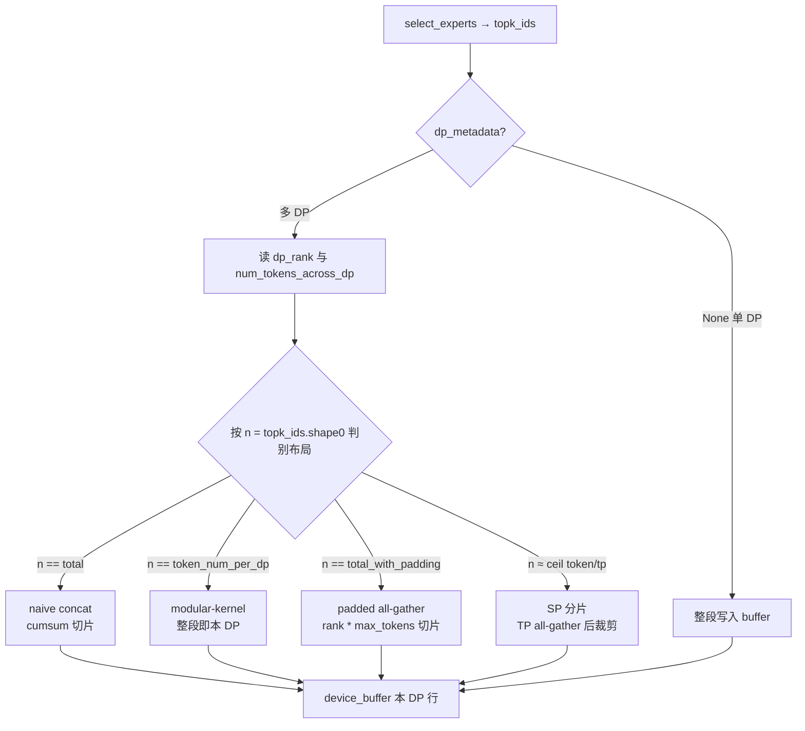

# DP 感知 Router

!!! note

    此处的 **Router** 指 MoE **expert router**（`select_experts` → `topk_ids`），
    **不是** External DP 场景下按请求长度分发 prompt 的 HTTP 负载均衡代理
    （见 [DP Router](dp_router.md)）。

    DP 感知 Router 是 [Routing Replay](routing_replay.md) 在 Ascend 多 DP
    布局下的关键适配：采集路由结果时，按 `dp_rank` 只保留**当前 DP** 对应
    token 的 expert 选择。

开启 `--enable-return-routed-experts` 后，每一层 MoE 会把 `topk_ids` 写入
采集缓冲。多 DP 时，`topk_ids` 的 batch 维可能混有其它 DP 的 token（或
padding / SP 分片）。若不做 DP 感知切片，返回的 `routed_experts` 会串位，
训练侧回放会错。

实现位置：`vllm_ascend/patch/worker/patch_routed_experts_capture.py`。

## 原理

多 DP 下，MoE 通信与 combine 发生的位置不同，`select_experts` 看到的
`topk_ids` 布局也不同。DP 感知 Router 的核心是：

1. 读取 `self.dp_rank` 与 `forward_context.dp_metadata.num_tokens_across_dp_cpu`。
2. 根据 `topk_ids.shape[0]` 判断当前布局属于哪一种。
3. 算出本 rank 的 `[start_loc, end_loc)`，只把该切片写入
   `device_buffer`。

**没有 DP 感知：**

```text
topk_ids 含 DP0+DP1（或 padding）
→ 整段写入 buffer
→ routed_experts 归属错误
```

**启用 DP 感知：**

```text
识别布局 + dp_rank
→ 只取本 DP 的 [start_loc, end_loc)
→ routed_experts 与本请求 token 对齐
```

## 工作流程



## 多 DP 布局

| 条件 | 布局含义 | 切片方式 |
| --- | --- | --- |
| `dp_metadata is None` | 单 DP | 整段 `topk_ids` |
| `n == total` | naive dispatch：各 DP token 先拼接再路由 | `cumsum` 取本 `dp_rank` 区间 |
| `n == token_num_per_dp` | modular-kernel：DP combine 在 apply 内，本 rank 只见自己的 token | 整段写入 |
| `n == total_with_padding` | padded all-gather：每 DP 占 `max_tokens` 块 | `start = dp_rank * max_tokens`，长度 `token_num_per_dp` |
| `n ≈ ceil(token_num_per_dp / tp_size)` | SP + modular-kernel：TP 维分片 | TP `all_gather` 后取前 `token_num_per_dp` 行 |

其中：

- `token_num_per_dp = num_tokens_across_dp[dp_rank]`
- `total = sum(num_tokens_across_dp)`
- `total_with_padding = max(num_tokens_across_dp) * dp_size`

当各 DP token 数相等时，`total == total_with_padding`，会先命中 naive
分支；与 padded 分支结果等价。

无法识别的 `n` 会抛出 `AssertionError`，避免静默写错路由。

## 如何启用

DP 感知切片随 Routing Replay 一并生效，无需单独开关：

```bash
vllm serve Qwen/Qwen3-30B-A3B \
  --tensor-parallel-size 2 \
  --data-parallel-size 2 \
  --enable-expert-parallel \
  --enable-return-routed-experts \
  --async-scheduling false
```

启用后，每个已完成请求的 `routed_experts` 只包含**该请求所在 DP** 的
token 路由。完整返回字段与训练侧接入见 [Routing Replay](routing_replay.md)。

## 限制

- **依赖 Routing Replay 总开关。** 未开 `--enable-return-routed-experts` 时
  不会走采集路径。
- **布局必须可识别。** 未知 `topk_ids` batch 维会直接报错，而不是猜测切片。
- **与 HTTP DP Router 无关。** 不负责在多个 External DP endpoint 之间分发
  prompt；那是 [DP Router](dp_router.md)。
- **建议关闭 async scheduling。** 与 Routing Replay 相同，部分版本不兼容。

## 相关功能

- [Routing Replay](routing_replay.md)：采集与返回 `routed_experts`、训练侧回放。
- [DP Router](dp_router.md)：External DP 的 prompt 负载均衡代理（不同特性）。
- 单测：`tests/ut/patch/worker/test_patch_routed_experts_capture.py`
- e2e：`tests/e2e/pull_request/two_card/test_moe_routing_replay.py`
