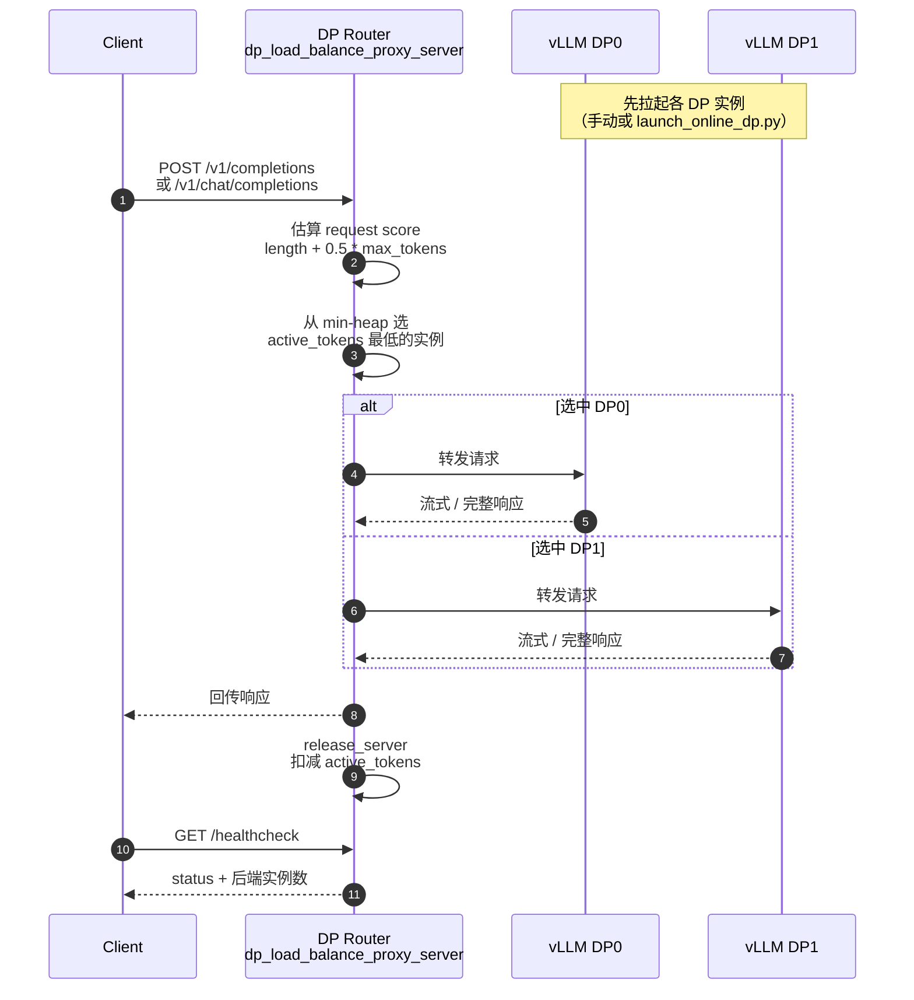

# DP Router（数据并行路由）

!!! note

    External DP 能力已由上游 vLLM 原生支持，见
    [External Load Balancing](https://docs.vllm.ai/en/latest/serving/data_parallel_deployment/#external-load-balancing)。
    vLLM Ascend 额外提供多实例一键拉起脚本，以及基于请求长度的
    DP Router（负载均衡代理）。部署细节也可参考 [External DP](external_dp.md)。

DP Router 是 External DP 场景下的**外部请求路由器**：把每个 DP rank 当作独立
vLLM 服务端点，由代理根据实时负载把 HTTP 请求分发到合适的实例，而不是依赖
vLLM 内部 DP 调度。

适用于大规模 DP 部署：跨节点实例多、希望用外部编排/可观测性做路由决策，或
需要按请求长度做负载均衡时。

示例代码：

- `examples/external_online_dp/launch_online_dp.py`：多 DP 实例拉起
- `examples/external_online_dp/dp_load_balance_proxy_server.py`：请求长度感知的 DP Router
- `examples/dynamic_bucket_load_balancer/`：短/长请求分桶的进阶负载均衡

## 原理

标准 Internal DP 由 vLLM 进程组统一调度；External DP 则把每个 DP rank 暴露为
独立 endpoint。此时需要一层外部 Router：

| 局限 | 表现 | 后果 |
| --- | --- | --- |
| 无中心入口 | 客户端需自己选 DP 实例 | 部署复杂，易出现热点 |
| 负载不均 | 长请求与短请求混打同一实例 | 部分 rank 排队过长，吞吐下降 |
| 缺乏实时感知 | 固定轮询 / 随机分发 | 无法按 `active_tokens` 等指标调度 |

DP Router 的核心做法是：

1. 对外提供统一的 OpenAI 兼容入口（`/v1/completions`、`/v1/chat/completions`）。
2. 按请求长度（及 `max_tokens`）估算负载分数。
3. 选择当前 `active_tokens` 最低的后端 DP 实例转发。
4. 流式回传响应，请求结束后释放该实例上的负载计数。

**没有 DP Router：**

```text
Client → 自行选择 DP0 / DP1 / ...
       → 易出现长请求堆积在同一 rank
```

**启用 DP Router：**

```text
Client → DP Router（统一入口）
       → 按请求长度 + 实时负载选 rank
       → 转发到 DP0 / DP1 / ...
```

## 工作流程



负载分数（`calculate_request_score`）规则：

| 条件 | 分数 |
| --- | --- |
| `ignore_eos=True` | `request_length + max_tokens` |
| 默认 | `request_length + 0.5 * max_tokens` |

`0.5` 是经验系数：在未知何时遇到 EOS 时，用一半 `max_tokens` 估计生成开销。

## 如何启用

### 依赖

```bash
pip install "fastapi<0.124.0" httpx uvicorn
```

### 1. 拉起 External DP 后端

手动方式：

```bash
vllm serve --host 0.0.0.0 --port 9000 \
  --data-parallel-size 2 --data-parallel-rank 0 ...

vllm serve --host 0.0.0.0 --port 9001 \
  --data-parallel-size 2 --data-parallel-rank 1 ...
```

或使用一键拉起脚本（推荐多节点大 DP）：

```bash
cd examples/external_online_dp

# 单节点 DP4 TP4 示例
python launch_online_dp.py \
  --dp-size 4 --tp-size 4 \
  --dp-size-local 4 --dp-rank-start 0 \
  --dp-address x.x.x.x --dp-rpc-port 12342
```

默认从端口 `9000` 起依次分配各 DP 实例。

多节点示例：

```bash
# Node 0: DP0 / DP1
python launch_online_dp.py \
  --dp-size 4 --tp-size 4 \
  --dp-size-local 2 --dp-rank-start 0 \
  --dp-address x.x.x.x --dp-rpc-port 12342

# Node 1: DP2 / DP3
python launch_online_dp.py \
  --dp-size 4 --tp-size 4 \
  --dp-size-local 2 --dp-rank-start 2 \
  --dp-address x.x.x.x --dp-rpc-port 12342
```

修改 `run_dp_template.sh` 中的本机 IP、`socket_ifname`、模型路径等参数后再启动。

### 2. 启动 DP Router

```bash
cd examples/external_online_dp
python dp_load_balance_proxy_server.py \
  --host 0.0.0.0 --port 8000 \
  --dp-hosts 127.0.0.1 127.0.0.1 \
  --dp-ports 9000 9001
```

常用参数：

| 参数 | 默认值 | 含义 |
| --- | --- | --- |
| `--host` | `localhost` | Router 监听地址 |
| `--port` | `8000` | Router 监听端口 |
| `--dp-hosts` | 无 | 各 DP 实例 host 列表 |
| `--dp-ports` | 无 | 各 DP 实例 port 列表（与 hosts 一一对应） |
| `--max-retries` | `3` | 转发 HTTP 请求的最大重试次数 |

### 3. 向 Router 发请求

```bash
curl -X POST http://localhost:8000/v1/completions \
  -H "Content-Type: application/json" \
  -d '{
        "model": "your-model",
        "prompt": "The quick brown fox jumps over the lazy dog",
        "max_tokens": 16
      }'
```

健康检查：

```bash
curl http://localhost:8000/healthcheck
```

## 进阶：Dynamic Bucket Load Balancer

若短请求与长请求混部、希望按长度分池，可使用
`examples/dynamic_bucket_load_balancer/`：

1. **静态分桶**：按请求长度落入 short / long bucket。
2. **实例分组**：后端列表按顺序切成对应组（例如前一半服务短请求，后一半服务长请求）。
3. **动态重平衡**：结合负载差与长度亲和度，把请求重定向到相邻更轻的桶。
4. **组内选择**：仍用 `active_tokens` 最小堆挑最空闲实例。

```bash
cd examples/dynamic_bucket_load_balancer
python hybrid_proxy_server.py \
  --host 0.0.0.0 --port 8000 \
  --server-hosts 127.0.0.1 127.0.0.1 127.0.0.1 127.0.0.1 \
  --server-ports 8100 8101 8102 8103 \
  --enable-dynamic-bucket \
  --server-group-threshold 32768
```

建议：短序列组可配更小的 `max-model-len` / KV cache，长序列组配更大资源，以提升整体吞吐。

## 限制

- **至少 2 个后端才有意义。** 单实例时 Router 只会直转，没有负载均衡效果。
- **Router 本身无模型推理。** 它只做 HTTP 转发与负载估计，后端仍需各自完成
  `vllm serve`。
- **负载估计是启发式的。** 默认用 `length + 0.5 * max_tokens`，真实生成长度受
  EOS 影响，极端长尾请求仍可能造成瞬时不均。
- **与 Internal DP 调度不同。** External DP + DP Router 把路由放在进程外；
  不要与“单进程内 DP 自动调度”混为一谈。

## 相关功能

- [External DP](external_dp.md)：External DP 启动与代理的基础教程。
- [Large Scale EP](large_scale_ep.md)：大规模专家并行部署中可与 External DP 组合。
- [Short Request First](short_request_first.md)：调度侧对短请求的优先策略，可与
  外部长度感知路由互补。
