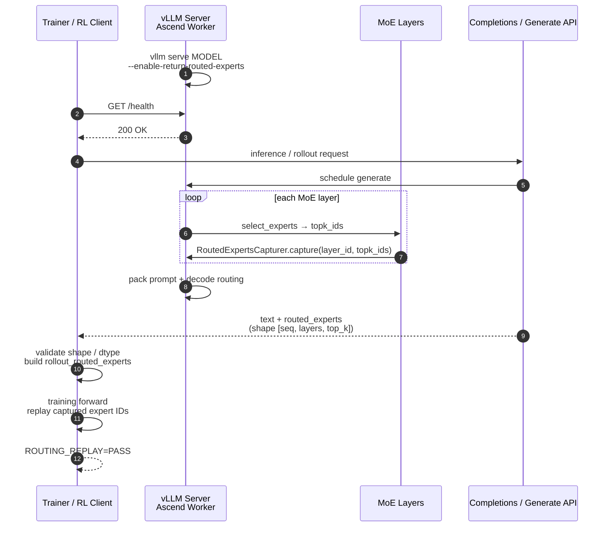

# Routing Replay

!!! note

    Routing Replay builds on the upstream vLLM routed-experts capture path
    (`--enable-return-routed-experts`). vLLM Ascend adapts the capture path for
    Ascend MoE communication layouts (DP / EP / SP / AlltoAll / MC2).

Routing Replay (also called **Routed Experts Replay** or **R3**) records which
MoE experts process each token during inference rollout, and returns those
expert IDs with the generated text. Training frameworks can then **replay** the
same routing decisions in the training forward pass so that train-time expert
selection matches inference-time routing.

This is essential for MoE RL pipelines such as GRPO and RLHF, where
training-inference router mismatch can amplify policy KL divergence and
destabilize training.

Upstream background:

- [Stabilizing MoE Reinforcement Learning by Aligning Training and Inference Routers](https://arxiv.org/abs/2510.11370)
- Upstream example: [`examples/rl/routed_experts_e2e.py`](https://github.com/vllm-project/vllm/blob/main/examples/rl/routed_experts_e2e.py)

## Motivation

In a typical MoE RL loop, rollout and training often use different engines
(for example, vLLM for generation and Megatron / FSDP for training). Even with
aligned weights, MoE routers can select different experts for the same token
across the two engines. That routing gap shows up as larger train/infer
probability mismatch than on dense models.

| Limitation | Symptom | Consequence |
| --- | --- | --- |
| Train/infer router mismatch | Same token activates different experts | Larger policy KL, unstable RL updates |
| Router non-determinism | Repeated forwards disagree on top-k experts | Hard-to-reproduce rollouts and gradients |
| Off-policy amplification | Importance ratios become extreme | Training collapse on MoE RL workloads |

Routing Replay addresses the root cause: **reuse inference routing during training**.

**Without Routing Replay:**

```text
Rollout (vLLM)  →  expert set A
Train forward   →  expert set B  (may differ)
                →  train/infer logits diverge
```

**With Routing Replay:**

```text
Rollout (vLLM)  →  expert set A  + return routed_experts
Train forward   →  force expert set A
                →  train/infer routing aligned
```

## How it works

1. Start the inference engine with `--enable-return-routed-experts`.
2. During each MoE layer forward, Ascend captures per-token `topk_ids`.
3. When the request finishes, vLLM returns a 3-D expert-ID tensor with the
   completion output.
4. The trainer concatenates / reshapes that tensor to the contract expected by
   the training stack (for example Megatron
   `rollout_routed_experts`), then forces those expert indices during the
   training forward.



On Ascend, capture is hooked from the Ascend fused-MoE path and patched into
upstream `RoutedExpertsCapturer.capture` so DP/EP/SP token layouts are sliced
correctly before writing the device buffer.

## Enabling Routing Replay

### Online serving

```bash
vllm serve Qwen/Qwen3-30B-A3B \
  --tensor-parallel-size 2 \
  --enable-expert-parallel \
  --enable-return-routed-experts \
  --async-scheduling false
```

Then call the OpenAI-compatible Completions API. When the feature is enabled,
each finished choice includes `routed_experts` as base64-encoded NumPy bytes:

```python
import io
import base64

import numpy as np
from openai import OpenAI

client = OpenAI(base_url="http://localhost:8000/v1", api_key="EMPTY")
resp = client.completions.create(
    model="Qwen/Qwen3-30B-A3B",
    prompt="Hello, please introduce yourself.",
    max_tokens=32,
    temperature=0.0,
    extra_body={"return_token_ids": True},
)

payload = resp.model_dump()["choices"][0]["routed_experts"]
routed_experts = np.load(io.BytesIO(base64.b64decode(payload)))
# routed_experts.shape == [num_tokens, num_moe_layers, top_k]
print(routed_experts.shape, routed_experts.dtype)
```

### Offline / in-process API

```python
from vllm import LLM, SamplingParams

llm = LLM(
    model="Qwen/Qwen3-30B-A3B",
    tensor_parallel_size=2,
    enable_expert_parallel=True,
    enable_return_routed_experts=True,
    async_scheduling=False,
)

outputs = llm.generate(
    ["Hello, please introduce yourself."],
    SamplingParams(max_tokens=32, temperature=0.0),
)

routed = outputs[0].outputs[0].routed_experts
assert routed is not None and routed.size > 0
print(routed.shape)  # [seq_len, num_moe_layers, top_k]
```

## Response contract

| Field | Where | Meaning |
| --- | --- | --- |
| `routed_experts` | `CompletionOutput` / `choices[].routed_experts` | Expert IDs used for the request tokens |

Tensor contract:

| Property | Value |
| --- | --- |
| Shape | `[num_tokens, num_moe_layers, top_k]` |
| Typical length | `prompt_len + generated_len - 1` (next-token aligned) |
| Dtype (engine buffer) | `int32` on worker transit buffers |
| HTTP encoding | base64-encoded `.npy` bytes |
| Valid IDs | `[0, num_experts)` (prefix-cache sentinel may use `-1` when applicable) |

For RL trainers that expect a single Megatron-facing buffer
(`rollout_routed_experts`), decode the response tensor and assign it after
shape validation:

```text
rollout_routed_experts.shape == (len(tokens) - 1, num_layers, moe_router_topk)
```

Example for Qwen3-30B-A3B: `(seq_len - 1, 48, 8)`.

## Ascend implementation notes

vLLM Ascend does **not** reimplement the full RL trainer replay kernel. It
implements the inference-side capture path required by upstream vLLM:

| Component | Role |
| --- | --- |
| `vllm_ascend/ops/fused_moe/fused_moe.py` | After `select_experts`, call capturer with `topk_ids` |
| `vllm_ascend/patch/worker/patch_routed_experts_capture.py` | Patch `RoutedExpertsCapturer.capture` for Ascend DP/SP/AlltoAll/MC2 layouts |
| `NPUModelRunner.init_routed_experts_capturer` | Allocate buffers and bind capturer onto Ascend MoE runners |

Supported parallel paths covered by the Ascend capturer patch include:

- single-DP and multi-DP token ownership slicing
- padded all-gather layouts
- sequence-parallel shards with TP all-gather reconstruction
- AlltoAll and MC2 MoE communication types

## Limitations

- **MoE only.** Dense models have no routed experts to capture.
- **Prefer `async_scheduling=False`** for routing-replay validation. Some
  vLLM versions treat routed-experts capture as incompatible with async
  scheduling.
- **Finished requests only.** `routed_experts` is assembled when the request
  completes; streaming chunks do not each carry a full routing tensor.
- **Trainer integration required.** Returning expert IDs is necessary but not
  sufficient: the training stack must force those IDs during its MoE forward
  (for example via `--use-rollout-routing-replay` in frameworks that support R3).

## Tested models

CI coverage currently includes:

- `Qwen/Qwen3-30B-A3B`
- `Qwen/Qwen3.5-35B-A3B`

See `tests/e2e/pull_request/two_card/test_moe_routing_replay.py`.

## Related features

- [Batch Invariance](batch_invariance.md): reduces non-determinism in kernels;
  complementary to routing replay for RL stability.
- [Sleep Mode](sleep_mode.md): memory offload between rollout and training
  phases in colocated RL setups.
- Weight transfer examples under `examples/rl/` (`rlhf_http_npu_ipc.py`,
  `rlhf_http_hccl.py`) for synchronizing updated policy weights into the
  inference engine.
