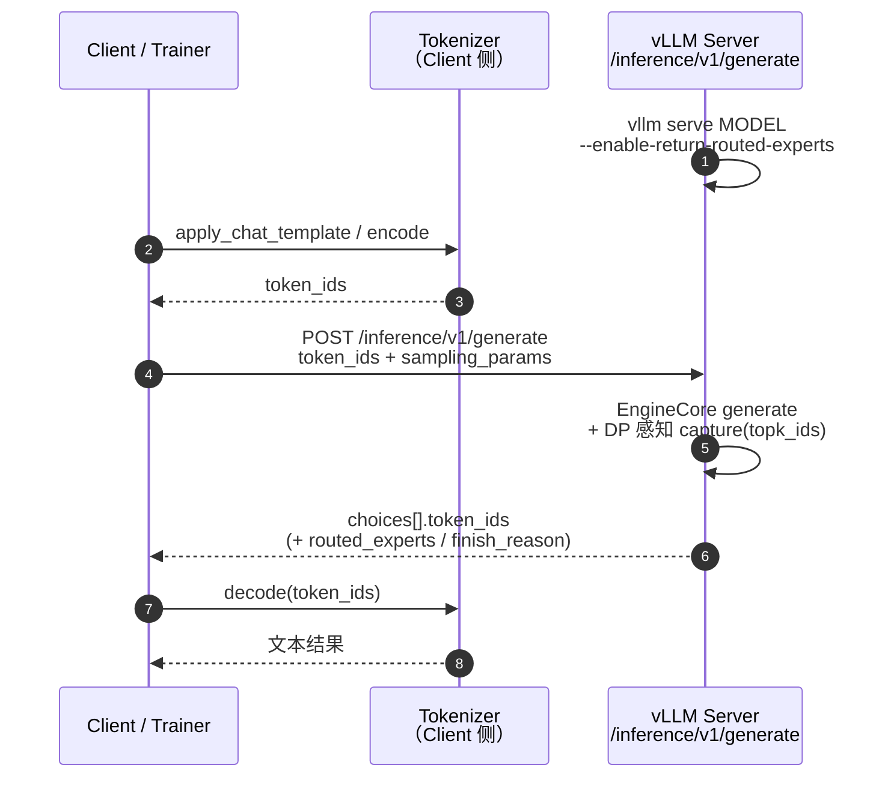
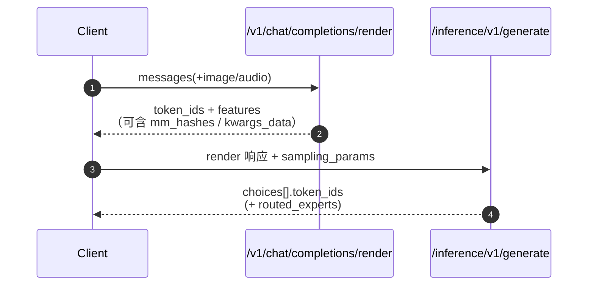

# Routing Replay（路由回放）

!!! note

    Routing Replay 基于上游 vLLM 的 routed-experts 采集能力
    （`--enable-return-routed-experts`）。vLLM Ascend 针对 Ascend MoE
    通信布局（DP / EP / SP / AlltoAll / MC2）适配了采集路径。

Routing Replay（也称 **Routed Experts Replay** 或 **R3**）会在推理
rollout 阶段记录每个 token 实际命中的 MoE expert，并将这些 expert ID
随生成结果一并返回。训练框架可以在训练 forward 中**回放**同一套路由决策，
使训练侧 expert 选择与推理侧保持一致。

这对 GRPO、RLHF 等 MoE RL 流程非常关键：训练/推理 router 不一致会放大
policy KL，甚至导致训练不稳定或崩溃。

上游参考：

- [Stabilizing MoE Reinforcement Learning by Aligning Training and Inference Routers](https://arxiv.org/abs/2510.11370)
- 上游示例：[`examples/rl/routed_experts_e2e.py`](https://github.com/vllm-project/vllm/blob/main/examples/rl/routed_experts_e2e.py)

## 1. 原理

在典型 MoE RL 循环中，rollout 和训练常常使用不同引擎（例如 vLLM 负责生成，
Megatron / FSDP 负责训练）。即便权重已经对齐，两侧 router 仍可能对同一
token 选出不同 expert，从而使 train/infer 概率偏差显著大于 Dense 模型。

| 局限 | 表现 | 后果 |
| --- | --- | --- |
| 训练/推理路由不一致 | 同一 token 激活不同 expert | policy KL 变大，RL 更新不稳定 |
| Router 非确定性 | 多次 forward 的 top-k expert 不一致 | rollout 与梯度难以复现 |
| Off-policy 放大 | importance ratio 出现极端值 | MoE RL 训练崩溃风险升高 |

Routing Replay 直接对准根因：**训练阶段复用推理阶段的路由结果**。

**没有 Routing Replay：**

```text
Rollout（vLLM） → expert 集合 A
训练 forward    → expert 集合 B（可能不同）
                → train/infer logits 发散
```

**启用 Routing Replay：**

```text
Rollout（vLLM） → expert 集合 A，并返回 routed_experts
训练 forward    → 强制使用 expert 集合 A
                → train/infer 路由对齐
```

## 2. 工作流程

1. 推理引擎启动时打开 `--enable-return-routed-experts`。
2. 每一层 MoE forward 中，Ascend 捕获该层每个 token 的 `topk_ids`。
3. 请求完成后，vLLM 在 completion 结果中返回三维 expert ID 张量。
4. 训练侧按约定拼接/重塑张量（例如 Megatron 的
   `rollout_routed_experts`），并在训练 forward 中强制使用这些 expert 索引。


在 Ascend 上，采集挂接在 Ascend fused-MoE 路径中，并通过 patch 上游
`RoutedExpertsCapturer.capture`，在写入 device buffer 前正确处理
DP/EP/SP 下的 token 布局切片。

## 3. 如何启用

### 在线服务

```bash
vllm serve Qwen/Qwen3-30B-A3B \
  --tensor-parallel-size 2 \
  --enable-expert-parallel \
  --enable-return-routed-experts \
  --async-scheduling false
```

然后调用 OpenAI 兼容的 Completions API。功能开启后，已完成请求的每个
choice 会携带 base64 编码的 NumPy `routed_experts`：

```python
import io
import base64

import numpy as np
from openai import OpenAI

client = OpenAI(base_url="http://localhost:8000/v1", api_key="EMPTY")
resp = client.completions.create(
    model="Qwen/Qwen3-30B-A3B",
    prompt="Hello, please introduce yourself.",
    max_tokens=32,
    temperature=0.0,
    extra_body={"return_token_ids": True},
)

payload = resp.model_dump()["choices"][0]["routed_experts"]
routed_experts = np.load(io.BytesIO(base64.b64decode(payload)))
# routed_experts.shape == [num_tokens, num_moe_layers, top_k]
print(routed_experts.shape, routed_experts.dtype)
```

### 离线 / 进程内 API

```python
from vllm import LLM, SamplingParams

llm = LLM(
    model="Qwen/Qwen3-30B-A3B",
    tensor_parallel_size=2,
    enable_expert_parallel=True,
    enable_return_routed_experts=True,
    async_scheduling=False,
)

outputs = llm.generate(
    ["Hello, please introduce yourself."],
    SamplingParams(max_tokens=32, temperature=0.0),
)

routed = outputs[0].outputs[0].routed_experts
assert routed is not None and routed.size > 0
print(routed.shape)  # [seq_len, num_moe_layers, top_k]
```

## 4. 返回约定

| 字段 | 位置 | 含义 |
| --- | --- | --- |
| `routed_experts` | `CompletionOutput` / `choices[].routed_experts` | 请求 token 使用的 expert ID |

张量约定：

| 属性 | 值 |
| --- | --- |
| Shape | `[num_tokens, num_moe_layers, top_k]` |
| 典型长度 | `prompt_len + generated_len - 1`（按 next-token 对齐） |
| Dtype（引擎缓冲） | worker 传输缓冲使用 `int32` |
| HTTP 编码 | base64 编码的 `.npy` 字节 |
| 合法 ID | `[0, num_experts)`（prefix cache 场景可能使用 `-1` 哨兵值） |

若训练框架期望单个 Megatron 侧缓冲（`rollout_routed_experts`），请先解码响应
张量，再校验 shape 后赋值：

```text
rollout_routed_experts.shape == (len(tokens) - 1, num_layers, moe_router_topk)
```

以 Qwen3-30B-A3B 为例：`(seq_len - 1, 48, 8)`。

## 5. Ascend 实现说明（DP 感知 Router）

此处的 **Router** 指 MoE **expert router**（`select_experts` → `topk_ids`），
**不是** External DP 场景下按请求长度分发 prompt 的 HTTP 负载均衡代理。

vLLM Ascend **不会**重写完整的训练侧 replay kernel，而是实现上游 vLLM 所需的
推理侧采集路径，并在多 DP 下**感知当前是哪一个 DP rank**，只保留本 rank
对应 token 的路由结果：

| 组件 | 作用 |
| --- | --- |
| `vllm_ascend/ops/fused_moe/fused_moe.py` | 在 `select_experts` 后调用 capturer，传入 `topk_ids` |
| `vllm_ascend/patch/worker/patch_routed_experts_capture.py` | patch `RoutedExpertsCapturer.capture`：按 `self.dp_rank` 与 `num_tokens_across_dp` 切片，适配 Ascend DP/SP/AlltoAll/MC2 布局 |
| `NPUModelRunner.init_routed_experts_capturer` | 分配缓冲，并把 capturer 绑定到 Ascend MoE runner |

多 DP 时，`topk_ids` 的 batch 布局可能是 naive concat、modular-kernel、
padded all-gather 或 SP 分片之一；capturer 用 `dp_rank` 算出
`start_loc` / `end_loc`，避免把其它 DP 的路由写进本请求的
`routed_experts`。

Ascend capturer patch 覆盖的并行路径包括：

- 单 DP / 多 DP 的 token 归属切片（按 `dp_rank` 感知）
- padded all-gather 布局
- sequence parallel 分片后的 TP all-gather 重建
- AlltoAll 与 MC2 MoE 通信类型

## 6. Token In / Token Out

完整接口约定见 [Token In / Token Out](token_in_token_out.md)。本节说明其原理，
以及与 **DP 感知 Routing Replay** 组合时的用法：在
`POST /inference/v1/generate` 上同时拿 `token_ids` 与 `routed_experts`。

### 6.1 原理

Token In / Token Out 以**原始 token ID** 作为输入，并返回**原始 token ID**
作为输出。它绕过 OpenAI Chat/Completions 接口中的 chat template 渲染与默认
文本编解码，适合做分离式 Serving、RL rollout，以及对 token 级控制有要求的
基础设施链路。

OpenAI 兼容接口面向“文本进 / 文本出”：服务端负责 tokenize、套 chat template、
detokenize。Token In / Token Out 则把这些职责外置，让引擎更接近 `EngineCore`
的原始输入输出。

典型分工：

| 角色 | 职责 |
| --- | --- |
| Renderer / Coordinator | chat template、多模态预处理，产出 `token_ids`（以及可选 `features`） |
| Generate 实例 | 只做推理，吃 token、吐 token；开启 Routing Replay 时一并返回本 DP 归属的 `routed_experts` |
| 下游 | 自行 detokenize，或把 token + 路由交给训练 / 下一跳服务 |

### 6.2 特性工作流图

#### 6.2.1 纯文本：Client 本地 tokenize



#### 6.2.2 分离式：Render → Generate

多模态或希望服务端统一预处理时，可先走 render，再把结果原样交给 generate：



上游 [`example_mm_serve.py`](https://github.com/vllm-project/vllm/blob/main/examples/scale_out/example_mm_serve.py)
展示了“零客户端变换”组合：render 的 JSON 直接作为 generate 请求体，仅追加
`sampling_params`。

### 6.3 版本区别

Token In / Token Out 在 Model Runner V1 与 V2 下是**等价的**，不需要单独适配：
HTTP 契约均为 `POST /inference/v1/generate`。Routing Replay 的返回字段
（`choices[].routed_experts`）也相同；后端 capturer 的 DP 切片逻辑随 runner
实现，上线前建议用目标 runner 做一次 shape 校验。

### 6.4 使用说明

#### 6.4.1 推理端

**开关**

`--tokens-only`

普通 `vllm serve` 即可暴露 `/inference/v1/generate`。若同时做 Routing Replay，
请一并打开 `--enable-return-routed-experts`。Generate 实例若只做 token 推理，
可加 `--tokens-only`（tokenizer-free / 便于 Disaggregated Everything）；也可
显式使用 `--skip-tokenizer-init`。

**注意**

- **Client 需保证 token 合法。** 负值 `token_ids` 会被拒绝；词表越界会导致
  未定义行为或运行错误。
- **默认不返回自然语言文本。** 需 Client 自行 decode，或在
  `sampling_params` 中按上游版本能力打开 detokenize（若可用）。
- **流式 chunk 是增量 token。** 不要假设每个 chunk 都带完整序列；需自行拼接。
  `routed_experts` 通常在请求完成后整包返回，不要依赖流式分片携带完整路由。
- **与文本 API 的默认行为不完全相同。** 例如历史版本中省略 `max_tokens`
  可能落到 dataclass 默认值 16；当前服务端会按
  `max_model_len - prompt_len` 做默认填充，建议仍显式设置 `max_tokens`。

## 7. 限制

- **仅支持 MoE。** Dense 模型没有可采集的 routed experts。
- **建议关闭 async scheduling（`async_scheduling=False`）。**
  部分 vLLM 版本将 routed-experts 采集与 async scheduling 视为不兼容。
- **仅在请求完成后返回完整张量。** `routed_experts` 在请求 finish 时组装；
  流式分片不会各自携带完整路由张量。
- **需要训练侧接入。** 仅返回 expert ID 不够，训练栈必须在 MoE forward 中
  强制使用这些 ID（例如支持 R3 的框架中的 `--use-rollout-routing-replay`）。

## 8. 已验证模型

当前 CI 覆盖：

- `Qwen/Qwen3-30B-A3B`
- `Qwen/Qwen3.5-35B-A3B`

参见 `tests/e2e/pull_request/two_card/test_moe_routing_replay.py`。

## 9. 相关功能

- [Token In / Token Out](token_in_token_out.md)：RL / 分离式 Serving 的 token 级
  API；可与本节 Routing Replay 同响应返回 `routed_experts`。
- [Batch Invariance](batch_invariance.md)：降低算子非确定性，可与 routing replay
  互补，提升 RL 稳定性。
- [Sleep Mode](sleep_mode.md)：同卡 RL 场景下，在 rollout 与训练阶段之间做显存卸载。
- 权重同步示例见 `examples/rl/`（`rlhf_http_npu_ipc.py`、`rlhf_http_hccl.py`），
  用于把更新后的策略权重同步到推理引擎。
- 说明：External DP 的 HTTP 负载均衡代理见 [DP Router](dp_router.md)，那是
  **分发 prompt** 的特性，与本节 **DP 感知 MoE Router 采集** 不是同一能力。
