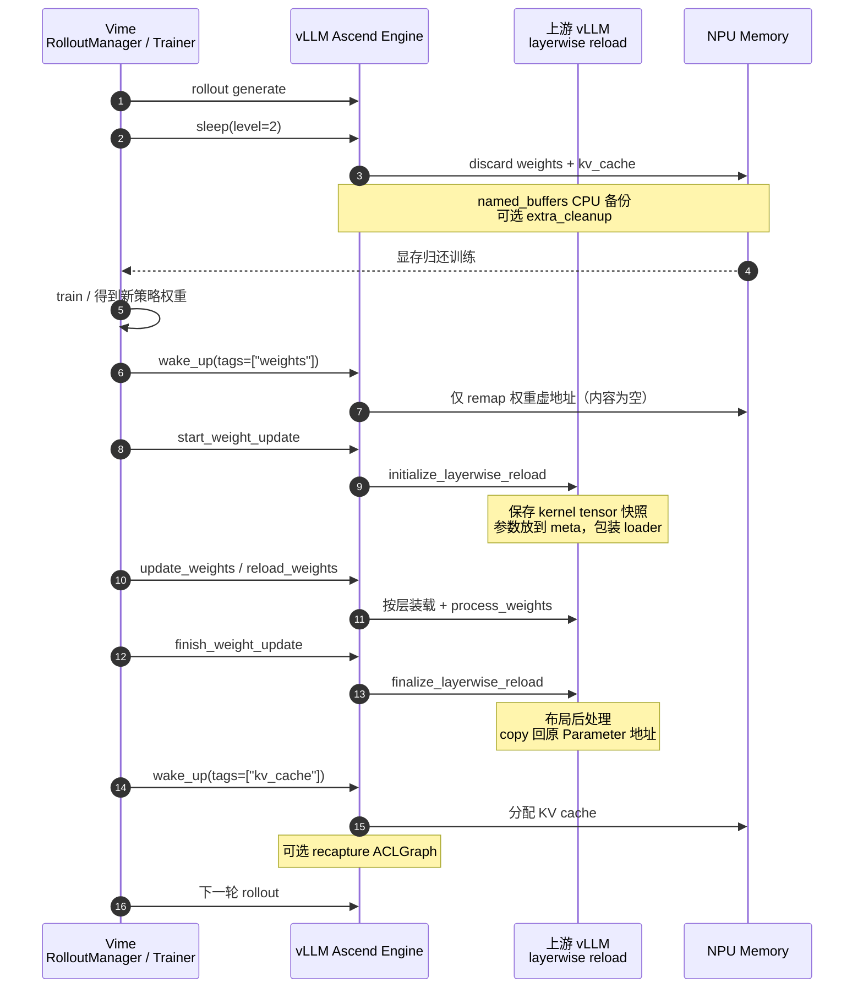

# Sleep Mode 分享：Vime × vLLM × vLLM Ascend

!!! note

    本文讲 RL / 同卡训推场景下 Sleep Mode 的**原理与编排**：Vime 如何复用上游
    vLLM 的 sleep / wake / layerwise reload，Ascend 如何承接。
    基础 API 与样例见 [Sleep Mode Guide](sleep_mode.md)。

    上游参考：

    - [Sleep Mode](https://docs.vllm.ai/en/latest/features/sleep_mode/)
    - [Layerwise (Re)loading](https://docs.vllm.ai/en/latest/training/layerwise/)
    - Ascend 权重同步示例：`examples/rl/rlhf_http_hccl.py`、`examples/rl/rlhf_http_npu_ipc.py`

## 1. 原理

同卡 RL（PPO / GRPO / RLHF 等）里，rollout 与训练轮流占用同一批 NPU：

- 推理引擎持有**模型权重**和 **KV cache**；
- 训练步需要把这些显存腾出来做 forward / backward；
- 训练结束后，**新策略权重**还要灌回推理引擎，再开下一轮 rollout。

如果每次都「杀进程 → 重建 Engine → 全量 load」，进程上下文、图捕获、通信组都要重来，切换贵、首包慢，峰值也难控。Sleep Mode 的思路是：

> **进程不退出**；把推理侧显存放进带 tag 的内存池；按需 sleep / wake；
> 需要换权重时，用上游 layerwise 生命周期**原地更新**，而不是换掉被图钉住的 Parameter。

三层分工：

| 组件 | 职责 |
| --- | --- |
| **Vime** | 编排：何时 sleep、分几次 wake、何时灌权重 |
| **vLLM（上游）** | Sleep 语义、内存 tag、`initialize → reload → finalize` |
| **vLLM Ascend** | NPU `CaMemAllocator`、HCCL/IPC 传输、可选 HCCL/ACLGraph 清理、MoE 布局 |

启用 `enable_sleep_mode` 后，权重与 KV 的分配打上 `weights` / `kv_cache`。
之后所有「让出 / 要回」显存，本质都是对这两类分配做 **unmap / remap**；
Vime 只调用上游控制面，不另起一套休眠语义。

## 2. 整体流程

以同卡、**Level 2 + 分 tag 唤醒 + 在线灌权重**为例（RL 最常见）：



读图时抓住三条因果链即可（下一节展开）：

1. **sleep 先把显存让干净** → 训练才有空间；
2. **先 wake weights、再灌权重、最后 wake kv_cache** → 压峰值，且图建在最终权重上；
3. **灌权重走 initialize / reload / finalize** → 数值更新了，Parameter 地址仍不变。

## 3. 原理展开

### 3.1 内存池与 tag：sleep / wake 的共同底座

`CaMemAllocator`（Ascend；上游 GPU 侧为 CuMem）把可休眠分配记在池里，并打 tag。
`sleep` / `wake_up` 并不「删模型对象」，而是对池内 handle 做：

- **unmap**：物理页还给系统（内容或丢弃，或先拷到 CPU）；
- **remap**：按原 handle 再 map 回，**虚地址尽量保持稳定**。

因此 Python 侧的 `nn.Parameter` 仍在，图捕获记住的 `data_ptr` 也还能对上——
这是后面「地址不变灌权重」能成立的前提。少量跨 sleep 必须存活的张量可用
`sleep_persistent`；RoPE 等 `named_buffers` 则在 sleep 前 CPU clone、wake 后写回。

### 3.2 Sleep 级别：同一套池，两种让出策略

| | Level 1 | Level 2 |
| --- | --- | --- |
| **权重** | 拷到 Host 再 unmap（内容可恢复） | 直接丢弃（不备份大权重） |
| **KV cache** | 丢弃 | 丢弃 |
| **醒来后权重从哪来** | CPU backup 自动还原 | 必须 reload / update |
| **Host 压力** | 需放下整模权重 | 几乎不备份大权重 |
| **适用** | 同权重短暂让卡 | **RL 换权重**、Host 紧张 |

Ascend Worker：L1 调 `sleep(offload_tags=("weights",))`；L2 调 `sleep(offload_tags=())`。
RL 同卡更新策略时优先 L2——训练侧本身也吃 Host/Device，L1 双份权重更容易把 Host 打满。

可选 `enable_sleep_mode_extra_cleanup`：sleep 时再拆 HCCL、清 ACLGraph workspace，
换更低的 sleep 态占用、更长的 wakeup（重建通信，并在合适时机 recapture）。

### 3.3 分两次 wake：先有「可写的权重槽」，再开 KV

`wake_up(tags=...)` 只 remap 指定 tag；`tags=None` 表示全部。`is_sleeping` 在全部 tag
醒完之前仍为 `true`。

Level 2 推荐：

1. **`wake_up(tags=["weights"])`**  
   只把权重 handle remap 回来。L2 没有 CPU backup，得到的是**同虚地址、内容为空**的块——
   正好作为 reload 的写入目标，此时**还不占 KV**。
2. **中间灌入新权重**（下一小节）。
3. **`wake_up(tags=["kv_cache"])`**  
   再开 KV；触发 `post_kv_cache_wake_up`。若开了 extra cleanup，**这时才 recapture ACLGraph**，
   避免在半成品权重上构图。

拆开的原因很具体：

- **峰值**：weights + kv + 训练残留同时顶上来，大模型同卡极易 OOM；
- **正确性**：KV / Graph 应建立在 finalize 之后的最终布局上；
- **编排**：Vime 可在「仅权重就绪」窗口做同步与校验，再进入可服务态。

Level 1 若权重不变，一次 `wake_up()`（或先 weights 再 kv）即可，不必走 reload。

### 3.4 灌权重：为何必须 layerwise，而不是再 `load_model`

Level 2 丢掉的是**权重内容**，不是 Parameter 对象。若醒来后再跑一遍普通
`load_model`，常见后果是 `process_weights_after_loading` **换掉** `nn.Parameter`——
ACLGraph / CUDA Graph 仍钉着旧 `data_ptr`，轻则数值错，重则踩非法地址。

上游因此提供 **layerwise reload**：在**不换锚点对象**的前提下更新数值与布局。

```text
（首次 load 时）record_metadata_for_reloading
        │
initialize_layerwise_reload   ← start_weight_update
        │
reload / load_weights         ← update_weights / reload_weights
        │
finalize_layerwise_reload     ← finish_weight_update
```

Ascend HCCL 等后端直接对接这三段；Vime 看到的是
`start_weight_update` → `update_weights` → `finish_weight_update`
（或 `collective_rpc("reload_weights")` 走检查点路径）。

**initialize：钉住锚点，进入可加载态**

1. 把当前每层的 Parameter / buffer 记入 `kernel_tensors` 快照——这些就是图绑定的地址；
2. 按首次 load 的 metadata 把层恢复到 meta 占位，便于重新装权重；
3. 包装 `weight_loader`：先缓冲，层内齐套后再 materialize + process。

可以把它理解成：**冻结旧对象当锚点**，逻辑层切到「准备收新权重」。

**reload：把新字节写进已 remap 的权重槽**

- 在线：Trainer 经 HCCL / NPU IPC 推送；
- 离线：从 `weights_path` 再 load。

层内会 materialize → 原始 loader 写入 → `process_weights_after_loading`
（量化打包、Ascend MoE transpose / scale reshape 等）。
process 过程中可能出现临时 Parameter；**还不能交给图用**，必须 finalize。

**finalize：做完布局，再 copy 回原地址**

1. 补处理未 online 完的层（deferred attention、padding 等）；
2. `param.data.copy_(processed)` 写回 initialize 保存的原 Parameter / buffer；
3. 把这些原对象重新挂回 module → **属性仍指向旧对象，`data_ptr` 不变**。

```text
锚点 Parameter(A)  ←── finalize: A.data.copy_(processed)
临时权重 (B) ────────┘
推理图 / ACLGraph 始终引用 A
```

一句话：finalize 保证的是**对象与地址稳定**；数值来自 Trainer，布局来自
`process_weights_after_loading`。

## 4. 具体调用方案

### 4.1 Vime 编排（推荐）

```python
# 1) Rollout 结束，让出 NPU
engine.sleep(level=2)

# 2) 训练
trainer.step()

# 3) 只唤醒权重槽
engine.wake_up(tags=["weights"])

# 4) 上游 layerwise：initialize → reload → finalize
engine.start_weight_update()
engine.update_weights(update_info)   # 或 collective_rpc("reload_weights", ...)
engine.finish_weight_update()

# 5) 再开 KV，恢复可推理
engine.wake_up(tags=["kv_cache"])
```

同卡建议：同步前后 `pause_generation` / `resume_generation`；Level 2 后按需
`reset_prefix_cache`；关闭 FRACTAL_NZ（`VLLM_ASCEND_ENABLE_NZ=0`，`weight_nz_mode=0`）。

### 4.2 Online HTTP（dev mode）

```bash
export VLLM_SERVER_DEV_MODE=1
vllm serve Qwen/Qwen2.5-0.5B-Instruct \
  --enable-sleep-mode \
  --additional-config '{"enable_sleep_mode_extra_cleanup": true}' \
  --weight-transfer-config '{"backend": "hccl"}'

curl -X POST 'http://127.0.0.1:8000/sleep?level=2'
curl -X POST 'http://127.0.0.1:8000/wake_up?tags=weights'

# 路径 A：检查点
curl -X POST 'http://127.0.0.1:8000/collective_rpc' \
  -H 'Content-Type: application/json' \
  -d '{"method":"reload_weights","kwargs":{"weights_path":"Qwen/Qwen2.5-0.5B-Instruct"}}'

# 路径 B：在线同步（见 examples/rl/rlhf_http_hccl.py）
# POST /start_weight_update → /update_weights → /finish_weight_update

curl -X POST 'http://127.0.0.1:8000/wake_up?tags=kv_cache'
curl -X GET  'http://127.0.0.1:8000/is_sleeping'
```

### 4.3 离线 Python API

```python
from vllm import LLM

llm = LLM(
    "Qwen/Qwen2.5-0.5B-Instruct",
    enable_sleep_mode=True,
    additional_config={"enable_sleep_mode_extra_cleanup": True},
)

llm.sleep(level=2)
llm.wake_up(tags=["weights"])
llm.collective_rpc("reload_weights", kwargs={"weights_path": "Qwen/Qwen2.5-0.5B-Instruct"})
llm.wake_up(tags=["kv_cache"])
```

### 4.4 Level 1：同权重快速让卡

```python
llm.sleep(level=1)   # weights → CPU，kv 丢弃
# ... 其它任务占用 NPU ...
llm.wake_up()        # 无需 reload
```

## 5. 实践补充

1. **Sleep ≠ Weight Transfer ≠ Pause**  
   显存让渡、权重字节、在飞请求窗口是三件事，组合用，不要互相替代。

2. **Level 2 下「先 weights 后 kv」是硬顺序**  
   一次 wake 全部或颠倒顺序，峰值与构图时机都不对。

3. **MoE / 量化务必走 layerwise**  
   Ascend 的 transpose 等应发生在 process + finalize 回写路径上，避免 wake 后手换 Parameter。

4. **extra cleanup 是显存 ↔ 时延的权衡**  
   同卡极紧可开；更看重唤醒时延则保持默认关闭。

5. **管理接口仅限 dev mode**  
   `/sleep`、`/wake_up`、`/collective_rpc`、权重更新勿对公网暴露。

6. **与 DP Router 的边界**  
   Sleep / 权重同步直连 Engine；请求落 DP 仍走 Router。不要把 weight update 打到 Router。

## 6. 相关链接

- [Sleep Mode Guide](sleep_mode.md)
- 上游 [Sleep Mode](https://docs.vllm.ai/en/latest/features/sleep_mode/)
- 上游 [Layerwise (Re)loading](https://docs.vllm.ai/en/latest/training/layerwise/)
- 代码锚点：
  - `vllm_ascend/worker/worker.py` — `sleep` / `wake_up` / weight update
  - `vllm_ascend/device_allocator/camem.py` — tag offload / discard / remap
  - `vllm_ascend/distributed/weight_transfer/hccl_engine.py` — initialize / finalize
  - `vllm_ascend/device_allocator/sleep_mem_optimized.py` — extra cleanup
- E2E：`tests/e2e/pull_request/one_card/rlhf/state_transitions/test_sleep_wake.py`
