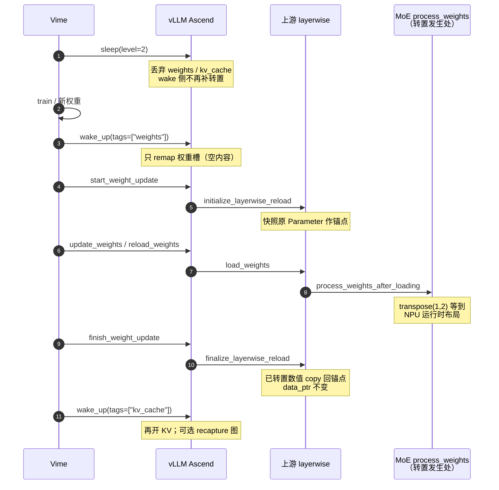

# Sleep Mode 分享：Vime × vLLM × vLLM Ascend

!!! note

    本文聚焦一件事：Vime / Ascend 的 Sleep Mode **新流程复用上游**
    `initialize → reload → finalize` 后，**MoE 权重转置不再塞在 `wake_up` 里**，
    而是回到正常的加载后处理路径。基础 API 见 [Sleep Mode Guide](sleep_mode.md)。

    上游参考：

    - [Sleep Mode](https://docs.vllm.ai/en/latest/features/sleep_mode/)
    - [Layerwise (Re)loading](https://docs.vllm.ai/en/latest/training/layerwise/)
    - 相关修复：[Fix Level-2 MoE weight reload layout](https://github.com/vllm-project/vllm-ascend/pull/13012)

## 1. 原理

### 1.1 问题从哪来

Ascend 上未量化 MoE 的 expert 权重，不能按 checkpoint 的原始布局直接算。
加载后必须在 `process_weights_after_loading` 里对 `w13_weight` / `w2_weight` 做
`transpose(1, 2)`（以及必要的 pad / NZ），才能喂给 `npu_grouped_matmul`。

同卡 RL 常用 **Level 2 sleep**：权重内容直接丢弃，醒来后要重新装权重。
这时有两件必须同时成立的事：

1. **布局要对**：装进来的权重仍要变成 NPU 运行时转置布局；
2. **地址要稳**：ACLGraph / 已捕获图钉住的是原 `Parameter` 的 `data_ptr`，
   不能在 reload 时换成新对象。

### 1.2 旧做法：在 `wake_up` 里补转置

早期 Ascend 在 `wake_up(tags=["weights"])` 里扫一遍 `w13_weight` / `w2_weight`，
按 `hidden_size` 判断后再 `transpose` + `replace_parameter`。这是补丁，不是主路径：

- 转置逻辑与真正的 `process_weights_after_loading` **分叉**，易漏 MTP drafter 等；
- `replace_parameter` 与「保地址 / 保 `weight_loader`」目标冲突，后续在线更新易断；
- Sleep 只负责显存让渡，却承担了**权重布局**职责，边界不清。

### 1.3 新做法：复用上游 layerwise，转置回到加载路径

Vime 侧新流程对齐上游控制面：Level 2 醒来后走

```text
wake_up(weights)
  → initialize_layerwise_reload
  → reload / update_weights      # 内含 process_weights_after_loading（转置在这里）
  → finalize_layerwise_reload    # 把处理后的布局 copy 回原 Parameter 地址
  → wake_up(kv_cache)
```

因此：

- **转置只发生在** `process_weights_after_loading`（与首次 load、在线更新同一条路）；
- **`wake_up` 不再做 MoE 转置**，只 remap 内存、恢复 buffer / 通信 / 图；
- Ascend 侧配合把 MoE 转置改成**原地写回**（保留原 Parameter 与 `weight_loader`），
  这样 finalize 才能把「已转置布局」安全写回锚点地址。

角色不变，但职责更干净：

| 组件 | 做什么 |
| --- | --- |
| **Vime** | 编排 sleep、两次 wake、以及 start/update/finish（或 `reload_weights`） |
| **上游 vLLM** | tag 化 sleep/wake；layerwise 保证「更新数值、不换地址」 |
| **vLLM Ascend** | CaMem；HCCL/IPC；MoE 转置落在 process 路径；去掉 wake 侧转置兜底 |

## 2. 整体流程



## 3. 原理展开

### 3.1 为什么转置必须跟 layerwise 绑在一起

Layerwise 三段各自解决一层问题，合起来才替得掉 `wake_up` 转置：

| 阶段 | 接口 | 在转置故事里的作用 |
| --- | --- | --- |
| **initialize** | `start_weight_update` → `initialize_layerwise_reload` | 保存当前 kernel tensors 快照；层切到可加载态并包装 loader。锚点 = 图仍要引用的原 Parameter。 |
| **reload** | `update_weights` / `reload_weights` | 写入新权重后走 **`process_weights_after_loading`** → Ascend MoE 在这里 `transpose(1, 2)`。转置发生在「加载后处理」，不是 wake。 |
| **finalize** | `finish_weight_update` → `finalize_layerwise_reload` | 把处理后的（已转置）tensor **`data.copy_` 回锚点**，再挂回 module。布局对了，地址也没变。 |

没有 initialize 的锚点，finalize 无处可写；没有 reload 里的 process，就没有正确布局；
没有 finalize 的回写，process 里哪怕做了转置，图仍可能钉着旧内容或旧对象。
三者缺一，就又会退回「在 wake 里补一刀」的旧路。

```text
checkpoint / Trainer 权重（未转置）
        │  reload + process_weights_after_loading
        ▼
临时运行时布局（已 transpose，可能曾换过对象）
        │  finalize: 锚点.data.copy_(processed)
        ▼
原 Parameter(A)（地址不变，内容已是 NPU 布局）
        │
        ▼
ACLGraph / 后续 forward 继续引用 A
```

### 3.2 Sleep / 分 tag wake：给这条灌权路径腾窗口

转置路径依赖「先有空的权重槽，再 load，最后再开 KV」：

1. **`sleep(level=2)`**  
   丢弃 weights + kv_cache（buffers CPU 备份）。旧权重内容不要了，避免 Host 双份。
2. **`wake_up(tags=["weights"])`**  
   只 remap 权重虚地址（L2 下内容为空）。**此处不再转置**——槽位留给 reload。
3. **initialize → reload → finalize**  
   完成数值 + 转置布局 + 地址回写。
4. **`wake_up(tags=["kv_cache"])`**  
   再开 KV；extra cleanup 场景下此时才 recapture 图，避免半成品权重构图。

Level 1 权重会 offload 到 CPU 再还原，**一般不换权重、也不走这套转置 reload**；
RL 换策略权重用 Level 2。

`is_sleeping` 在全部 tag 醒完前仍为 `true`。

### 3.3 Ascend 为实现这条路径做了什么

相对「wake 里转置」的旧实现，当前路径要求：

1. **`wake_up` 删除 MoE transpose / `replace_parameter` 兜底**  
   Sleep 只管内存与 buffer 恢复。
2. **MoE `process_weights_after_loading` 原地更新**  
   转置结果写回原 Parameter（保留 `weight_loader`），供 layerwise 反复 reload。
3. **与上游生命周期对齐**  
   HCCL 等：`start_weight_update` / `finish_weight_update` 直接调
   `initialize_layerwise_reload` / `finalize_layerwise_reload`。
4. **（相关）EPLB 运行时态升为 named buffer**  
   避免 Level 2 丢弃非 buffer 的 NPU 状态导致后续挂死——与转置同属「Level 2 可恢复」问题。

## 4. 具体调用方案

### 4.1 Vime 编排（与转置路径一致）

```python
engine.sleep(level=2)
trainer.step()

engine.wake_up(tags=["weights"])          # 只开权重槽，不转置

engine.start_weight_update()              # initialize：钉锚点
engine.update_weights(update_info)        # reload：load + process（转置）
engine.finish_weight_update()             # finalize：布局写回原地址

engine.wake_up(tags=["kv_cache"])         # 再开 KV / 可选构图
```

检查点路径把中间三段换成：

```python
engine.collective_rpc(
    "reload_weights",
    kwargs={"weights_path": model_path},
)
```

同卡建议：同步前后 `pause_generation` / `resume_generation`；按需 `reset_prefix_cache`；
关闭 FRACTAL_NZ（`VLLM_ASCEND_ENABLE_NZ=0`，`weight_nz_mode=0`）。

### 4.2 Online HTTP（dev mode）

```bash
export VLLM_SERVER_DEV_MODE=1
vllm serve <model> --enable-sleep-mode \
  --weight-transfer-config '{"backend": "hccl"}'

curl -X POST 'http://127.0.0.1:8000/sleep?level=2'
curl -X POST 'http://127.0.0.1:8000/wake_up?tags=weights'

# 在线：/start_weight_update → /update_weights → /finish_weight_update
# 或检查点：
curl -X POST 'http://127.0.0.1:8000/collective_rpc' \
  -H 'Content-Type: application/json' \
  -d '{"method":"reload_weights","kwargs":{"weights_path":"<model>"}}'

curl -X POST 'http://127.0.0.1:8000/wake_up?tags=kv_cache'
```

### 4.3 离线 Python

```python
from vllm import LLM

llm = LLM("<model>", enable_sleep_mode=True)
llm.sleep(level=2)
llm.wake_up(tags=["weights"])
llm.collective_rpc("reload_weights", kwargs={"weights_path": "<model>"})
llm.wake_up(tags=["kv_cache"])
```

## 5. 实践补充

1. **不要在 `wake_up` 后再手写 MoE transpose**  
   布局应以 `process_weights_after_loading` + finalize 为准；再补一刀容易和锚点回写打架。

2. **Dense / 已量化路径**  
   无 expert 转置或由 quant method 自己处理；同样走 layerwise，只是 process 内容不同。

3. **Sleep ≠ Transfer ≠ Pause**  
   显存让渡、权重字节、在飞请求窗口分开编排。

4. **extra cleanup**  
   更低 sleep 显存 ↔ 更长 wakeup；图捕获仍应落在 finalize 之后的 `kv_cache` wake。

5. **管理接口仅限 `VLLM_SERVER_DEV_MODE=1`**，内网使用。

## 6. 相关链接

- [Sleep Mode Guide](sleep_mode.md)
- 上游 [Layerwise (Re)loading](https://docs.vllm.ai/en/latest/training/layerwise/)
- 代码锚点：
  - `vllm_ascend/ops/fused_moe/routed_experts.py` — MoE `transpose` 在 process 路径
  - `vllm_ascend/worker/worker.py` — `sleep` / `wake_up`（无转置兜底）
  - `vllm_ascend/distributed/weight_transfer/hccl_engine.py` — initialize / finalize
- E2E：`tests/e2e/pull_request/one_card/rlhf/state_transitions/test_sleep_wake.py`
