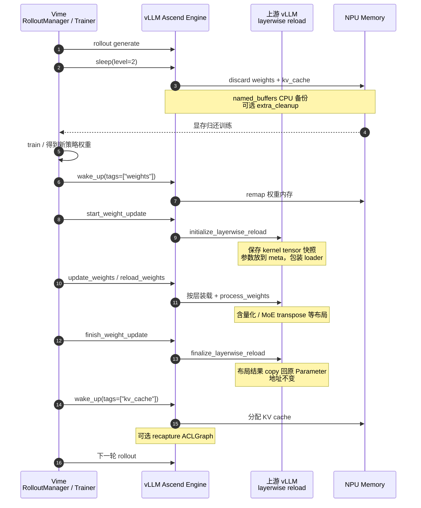

# 同卡训推的 Sleep Mode：让出显存，原地换权

!!! note

    本文讲 RL / 同卡训推下的 **Sleep Mode 流程与原理**。Vime 复用上游 vLLM
    的 sleep / wake，Level 2 灌权重时走 `initialize → reload → finalize`；
    Ascend 承接 NPU 内存与权重传输。基础 API 见 [Sleep Mode Guide](sleep_mode.md)。

    上游参考：

    - [Sleep Mode](https://docs.vllm.ai/en/latest/features/sleep_mode/)
    - [Layerwise (Re)loading](https://docs.vllm.ai/en/latest/training/layerwise/)
    - Ascend 示例：`examples/rl/rlhf_http_hccl.py`、`examples/rl/rlhf_http_npu_ipc.py`

## 1. 原理

同卡 RL（PPO / GRPO / RLHF 等）里，rollout 与训练轮流占用同一批 NPU：
推理侧占着**权重 + KV cache**，训练步要腾显存，训完还要把**新策略权重**灌回引擎。

Sleep Mode 的解法是：**进程不退出**，把可释放分配放进带 tag 的内存池
（`weights` / `kv_cache`），按级别 sleep / wake；需要换权重时，
再用上游 layerwise 生命周期原地更新，而不是杀进程重建 Engine。

| 组件 | 职责 |
| --- | --- |
| **Vime** | 编排：何时 sleep / wake、何时灌权重 |
| **vLLM（上游）** | Sleep 语义、内存 tag、`initialize → reload → finalize` |
| **vLLM Ascend** | `CaMemAllocator`、HCCL/IPC、可选 HCCL/ACLGraph 清理、MoE 布局处理 |

启用 `enable_sleep_mode` 后，权重与 KV 的分配进入 sleep 池。之后「让出 / 要回」
显存，本质是对池内 handle 做 **unmap / remap**；Vime 只调上游控制面。

### 1.1 Level 1 与 Level 2

引擎提供两级 sleep，差别主要在**权重怎么处理**：

| | Level 1 | Level 2 |
| --- | --- | --- |
| **权重** | 拷到 Host 再 unmap（内容可还原） | 直接丢弃内容 |
| **KV cache** | 丢弃 | 丢弃 |
| **醒来后权重** | CPU backup 自动还原 | 必须 reload / update |
| **Host 压力** | 需放下整模权重 | 几乎不备份大权重 |
| **适用** | 同权重短暂让卡 | **RL 换权重**、Host 紧张 |
| **唤醒后是否走 layerwise** | 一般不需要 | 需要 `initialize → reload → finalize` |

Ascend：L1 为 `sleep(offload_tags=("weights",))`；L2 为 `sleep(offload_tags=())`。
Level 1 权重不变时，`wake_up()` 后即可继续推理。

同卡 RL 更新策略时优先 **Level 2**：训练侧本身也吃 Host/Device，L1 再备份一份
整模权重容易把 Host 打满；且训完本来就要灌**新**权重，旧内容没必要 offload。

因此下文流程图与 layerwise 展开都只画 **Level 2**——这是 Vime 换权路径；
Level 1 调用见文末示例。

可选 `enable_sleep_mode_extra_cleanup`：sleep 时再拆 HCCL、清 ACLGraph workspace；
wakeup 更慢（重建通信，并在合适时机 recapture）。

## 2. 整体流程（Level 2）

RL 同卡换权的完整路径：



一条因果链：

```text
sleep(level=2) 让出显存 → train → wake / 灌权重
  （initialize → reload → finalize）→ 继续 rollout
```

## 3. 原理展开

### 3.1 内存池与 tag

`CaMemAllocator`（Ascend；上游 GPU 为 CuMem）给分配打 tag。sleep / wake 并不删
Python 侧模型对象，而是：

- **unmap**：物理页归还（内容丢弃，或先拷到 CPU）；
- **remap**：按原 handle 再 map，**虚地址尽量保持稳定**。

因此 `nn.Parameter` 对象仍在，图捕获记住的 `data_ptr` 仍可能对上——这是后面
layerwise「更新数值、不换锚点」的前提。RoPE 等 `named_buffers` 在 sleep 前
CPU clone、wake 后写回；个别必须跨 sleep 存活的分配可用 `sleep_persistent`。

### 3.2 Level 2 灌权重：`initialize → reload → finalize`

Level 2 丢掉的是**权重内容**，不是 Parameter 对象。若醒来后再普通 `load_model`，
`process_weights_after_loading` 常会**换掉** Parameter，ACLGraph 仍钉着旧
`data_ptr`，结果错或踩非法地址。

上游因此提供 layerwise reload——**在不换锚点的前提下**更新数值与布局。
Ascend / Vime 复用同一套生命周期：

```text
start_weight_update  →  initialize_layerwise_reload
update_weights       →  reload / load_weights（含 process_weights_after_loading）
finish_weight_update →  finalize_layerwise_reload
```

也可用 `collective_rpc("reload_weights", ...)` 走检查点，语义仍落在这条链上。

**initialize：保存快照，进入可加载态**

1. 把当前每层 Parameter / buffer 记入 `kernel_tensors`（图绑定的锚点）；
2. 按首次 load 的 metadata 恢复到 meta 占位；
3. 包装 `weight_loader`：先缓冲，层内齐套后再 materialize + process。

直觉：钉住旧对象当锚点，逻辑层切到「准备收新权重」。

**reload：装入新权重并做布局处理**

- 数据来源：Trainer 经 HCCL / NPU IPC，或磁盘 checkpoint；
- 层内：materialize → 原始 loader 写入 → `process_weights_after_loading`。

Ascend 上这里会做量化打包、**MoE `w13`/`w2` 的 `transpose(1, 2)`** 等，
把 checkpoint 布局变成 `npu_grouped_matmul` 需要的运行时布局。
转置属于加载后处理，**不应再塞进 `wake_up`**。

**finalize：布局落稳，地址不变**

1. 补处理未 online 完的层（deferred attention、padding 等）；
2. `param.data.copy_(processed)` 写回 initialize 保存的原 Parameter / buffer（HF 布局转化为 runtime 布局）；
3. 原对象重新挂回 module → **`data_ptr` 不变**（HF 布局转化为 runtime 布局）。

```text
锚点 Parameter(A)  ←── finalize: A.data.copy_(processed)
临时权重 (B) ────────┘
推理图 / ACLGraph 始终引用 A
```

finalize 保证的是**对象与地址稳定**；数值来自 Trainer，运行时布局来自
`process_weights_after_loading`。三段缺一，就又容易退回「在 wake 里补转置」之类的旁路。

## 4. 具体调用方案

### 4.1 Vime 编排（推荐）

```python
engine.sleep(level=2)
trainer.step()

engine.wake_up(tags=["weights"])

engine.start_weight_update()            # initialize
engine.update_weights(update_info)      # reload（含布局 / 转置）
engine.finish_weight_update()           # finalize

engine.wake_up(tags=["kv_cache"])
```

同卡建议：同步前后 `pause_generation` / `resume_generation`；Level 2 后按需
`reset_prefix_cache`；关闭 FRACTAL_NZ（`VLLM_ASCEND_ENABLE_NZ=0`，`weight_nz_mode=0`）。

### 4.2 Online HTTP（dev mode）

```bash
export VLLM_SERVER_DEV_MODE=1
vllm serve Qwen/Qwen2.5-0.5B-Instruct \
  --enable-sleep-mode \
  --additional-config '{"enable_sleep_mode_extra_cleanup": true}' \
  --weight-transfer-config '{"backend": "hccl"}'

curl -X POST 'http://127.0.0.1:8000/sleep?level=2'
curl -X POST 'http://127.0.0.1:8000/wake_up?tags=weights'

# 路径 A：检查点
curl -X POST 'http://127.0.0.1:8000/collective_rpc' \
  -H 'Content-Type: application/json' \
  -d '{"method":"reload_weights","kwargs":{"weights_path":"Qwen/Qwen2.5-0.5B-Instruct"}}'

# 路径 B：在线同步（见 examples/rl/rlhf_http_hccl.py）
# POST /start_weight_update → /update_weights → /finish_weight_update

curl -X POST 'http://127.0.0.1:8000/wake_up?tags=kv_cache'
curl -X GET  'http://127.0.0.1:8000/is_sleeping'
```

### 4.3 离线 Python API

```python
from vllm import LLM

llm = LLM(
    "Qwen/Qwen2.5-0.5B-Instruct",
    enable_sleep_mode=True,
    additional_config={"enable_sleep_mode_extra_cleanup": True},
)

llm.sleep(level=2)
llm.wake_up(tags=["weights"])
llm.collective_rpc("reload_weights", kwargs={"weights_path": "Qwen/Qwen2.5-0.5B-Instruct"})
llm.wake_up(tags=["kv_cache"])
```

### 4.4 Level 1：同权重快速让卡

```python
llm.sleep(level=1)   # weights → CPU，kv 丢弃
# ... 其它任务占用 NPU ...
llm.wake_up()        # 无需 reload / layerwise
```

## 5. 实践补充

1. **Sleep ≠ Weight Transfer ≠ Pause**  
   显存让渡、权重字节、在飞请求窗口是三件事，组合用。

2. **布局处理走 reload/process，不走 wake**  
   MoE transpose 等应在 `process_weights_after_loading` + finalize 完成；
   `wake_up` 只负责 remap / buffer / 通信 / 图。

3. **extra cleanup**  
   更低 sleep 显存 ↔ 更长 wakeup。

4. **管理接口仅限 `VLLM_SERVER_DEV_MODE=1`**，内网使用。

5. **与 DP Router 的边界**  
   Sleep / 权重同步直连 Engine；请求落 DP 仍走 Router。

## 6. 相关链接

- [Sleep Mode Guide](sleep_mode.md)
- 上游 [Sleep Mode](https://docs.vllm.ai/en/latest/features/sleep_mode/)
- 上游 [Layerwise (Re)loading](https://docs.vllm.ai/en/latest/training/layerwise/)
- 代码锚点：
  - `vllm_ascend/worker/worker.py` — `sleep` / `wake_up` / weight update
  - `vllm_ascend/device_allocator/camem.py` — tag offload / discard / remap
  - `vllm_ascend/distributed/weight_transfer/hccl_engine.py` — initialize / finalize
  - `vllm_ascend/ops/fused_moe/routed_experts.py` — MoE 布局在 process 路径
  - `vllm_ascend/device_allocator/sleep_mem_optimized.py` — extra cleanup
- E2E：`tests/e2e/pull_request/one_card/rlhf/state_transitions/test_sleep_wake.py`
