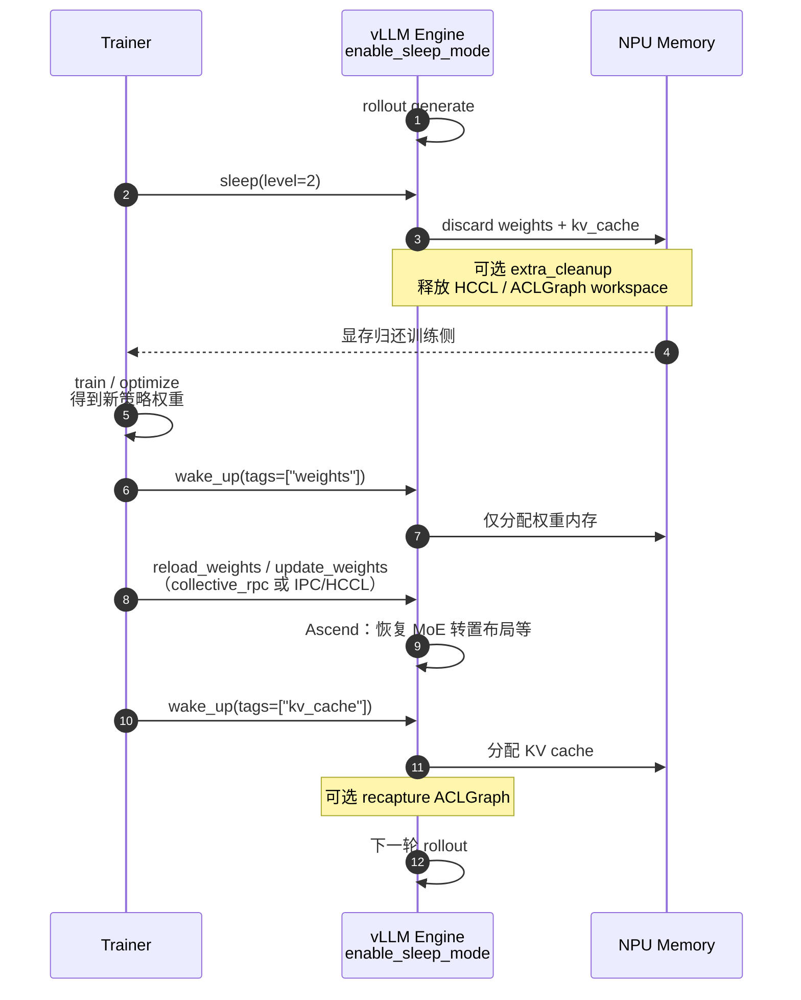
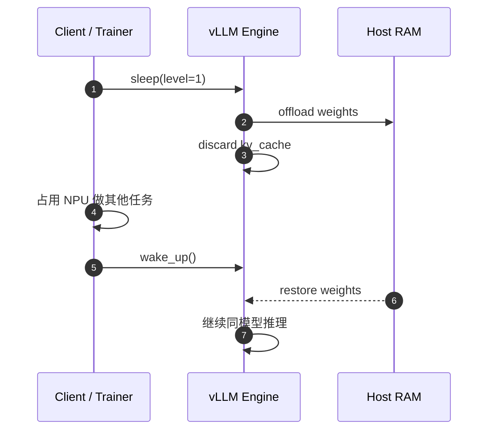

# Sleep / Wakeup（强化学习休眠唤醒新流程）

!!! note

    本流程复用上游 vLLM Sleep Mode 方案（`enable_sleep_mode`、
    `sleep(level)`、`wake_up(tags=...)`、`collective_rpc("reload_weights")`）。
    详见上游文档
    [Sleep Mode](https://docs.vllm.ai/en/latest/features/sleep_mode/)
    与 [Sleep Mode Blog](https://vllm.ai/blog/2025-10-26-sleep-mode)。
    Ascend 侧在此基础上补充 HCCL / ACLGraph 额外清理，以及 MoE 权重布局恢复。
    基础用法示例也可参考 [Sleep Mode Guide](sleep_mode.md)。

## 场景描述

在强化学习（RLHF / GRPO / PPO 等）训练中，推理（rollout）与训练常**同卡共置**：
策略模型先用 vLLM 做自回归生成，再在同一批 NPU 上做训练 forward / backward。
生成与训练的模型并行策略往往不同，若推理侧持续占用权重与 KV cache，训练阶段
容易出现显存争用甚至 OOM。

传统做法是销毁推理进程并重新加载模型，代价包括：

| 局限 | 表现 | 后果 |
| --- | --- | --- |
| 进程冷启动 | 每次切换都重建 allocator / graph / kernel | 切换耗时长，吞吐下降 |
| 峰值显存叠加 | 训练更新权重时 KV cache 仍占位 | 大模型易 OOM |
| 状态丢失 | 进程退出后丢失 warmup 与图捕获 | 恢复后首包延迟高 |

Sleep / Wakeup 提供第三条路径：在**不退出进程**的前提下休眠推理引擎，把 NPU
显存让给训练侧，训练完成后再快速唤醒继续 rollout。

## 方案实现描述

上游 Sleep Mode 将内存按 tag 管理为 `{"weights", "kv_cache"}`，并提供两级休眠
与分 tag 唤醒。强化学习推荐使用 **Level 2 + 分阶段 wake_up** 的新流程：

1. Rollout 结束后执行 `sleep(level=2)`，丢弃权重与 KV cache，尽量归还 NPU 显存。
2. 训练侧完成策略更新，得到新权重。
3. `wake_up(tags=["weights"])`：只恢复权重内存，**暂不分配 KV cache**，降低峰值。
4. 通过 `collective_rpc("reload_weights")`、权重传输（IPC/HCCL）或等价方式
   原地装载新权重。
5. `wake_up(tags=["kv_cache"])`：再恢复 KV cache，继续下一轮生成。

关键点：

1. **复用上游进程内休眠**：保留 Python 进程、设备上下文与 allocator 状态，
   避免完整 reload。
2. **分 tag 唤醒控制峰值**：先 weights 后 kv_cache，配合权重更新，降低 OOM 风险。
3. **Ascend 可选额外清理**：打开 `enable_sleep_mode_extra_cleanup` 时可释放
   HCCL 进程组与 ACLGraph workspace；wakeup 时重建 HCCL 并按需 recapture 图。

### Sleep 级别对比

| 级别 | 行为 | 内存去向 | 适用场景 |
| --- | --- | --- | --- |
| Level 1 | 权重 offload 到 CPU，丢弃 KV cache | 需足够 Host 内存备份权重 | 同模型快速休眠/唤醒，权重不变 |
| Level 2 | 丢弃权重与 KV cache（保留少量 buffer） | Host 几乎不备份大权重 | RL 权重更新、换模型、Host 内存紧张 |

`is_sleeping` 在所有 tag 都唤醒前仍返回 `true`。

## 新流程时序图

### RL 同卡：Level 2 + tagged wake_up



### Level 1：同权重快速休眠



### Online Serving（dev endpoints）

在线服务需 `VLLM_SERVER_DEV_MODE=1`，并启动时加 `--enable-sleep-mode`。
RL Level 2 新流程对应 HTTP：

```bash
export VLLM_SERVER_DEV_MODE=1
vllm serve Qwen/Qwen2.5-0.5B-Instruct --enable-sleep-mode

# 1) 深度休眠
curl -X POST 'http://127.0.0.1:8000/sleep?level=2'

# 2) 只唤醒权重内存
curl -X POST 'http://127.0.0.1:8000/wake_up?tags=weights'

# 3) 原地装载新权重
curl -X POST 'http://127.0.0.1:8000/collective_rpc' \
  -H 'Content-Type: application/json' \
  -d '{"method":"reload_weights"}'

# 4) 再唤醒 KV cache
curl -X POST 'http://127.0.0.1:8000/wake_up?tags=kv_cache'

curl -X GET 'http://127.0.0.1:8000/is_sleeping'
```

!!! warning

    `/sleep`、`/wake_up`、`/collective_rpc`、`/reset_prefix_cache` 为开发态管理接口，
    仅应在受信训练集群或内网暴露。

## 离线 Python API

```python
from vllm import LLM

llm = LLM("Qwen/Qwen2.5-0.5B-Instruct", enable_sleep_mode=True)

# --- rollout ---
# outputs = llm.generate(...)

# 深度休眠，把显存让给训练
llm.sleep(level=2)

# --- train / produce new weights ---

# 先只恢复权重区，避免与 KV cache 叠加造成峰值 OOM
llm.wake_up(tags=["weights"])
llm.collective_rpc("reload_weights")  # 或走 IPC/HCCL update_weights

# 权重就绪后再恢复 KV cache
llm.wake_up(tags=["kv_cache"])

# --- next rollout ---
```

Ascend 上若需要在 sleep 时额外归还 HCCL / ACLGraph 显存：

```python
llm = LLM(
    "Qwen/Qwen2.5-0.5B-Instruct",
    enable_sleep_mode=True,
    additional_config={"enable_sleep_mode_extra_cleanup": True},
)
```

或：

```bash
vllm serve Qwen/Qwen2.5-0.5B-Instruct \
  --enable-sleep-mode \
  --additional-config '{"enable_sleep_mode_extra_cleanup": true}'
```

## Ascend 适配要点

本流程 API 与上游一致；Ascend 增量行为如下：

| 项 | 说明 |
| --- | --- |
| CaMemAllocator | 按 `weights` / `kv_cache` tag 做 sleep / wake_up |
| `enable_sleep_mode_extra_cleanup` | sleep 时清理 ACLGraph workspace、销毁 HCCL；wakeup 时重建 HCCL，并在需要时 `capture_model()` |
| MoE 权重布局 | 非量化 MoE 在恢复 `weights` 后需重新 `transpose` 到 NPU grouped_matmul 布局 |
| Level 2 buffers | sleep 前把 `named_buffers` 备份到 CPU，wakeup 后写回 |
| NZ 限制 | RL 场景需关闭 FRACTAL_NZ（`weight_nz_mode=0` / `VLLM_ASCEND_ENABLE_NZ=0`），避免精度问题 |

!!! note

    Extra cleanup 用更长的 wakeup 延迟换取更低的 sleep 态显存占用。
    若更看重唤醒时延，保持 `enable_sleep_mode_extra_cleanup=false`。
    开启后，ACLGraph 仅在 `tags is None` 或包含 `"kv_cache"` 时 recapture，
    避免在外部权重尚未就绪时过早构图。

## 与权重同步、异步调度的关系

Sleep / Wakeup 解决的是**同卡显存让渡**，不替代权重同步协议，也不替代
引擎内异步调度：

| 能力 | 解决什么 | 典型接口 |
| --- | --- | --- |
| Sleep / Wakeup | rollout ↔ train 之间释放 / 恢复推理显存 | `sleep` / `wake_up` |
| Weight Transfer | 训练权重灌入推理引擎 | `/update_weights`、IPC / HCCL |
| Pause / Resume | 在飞请求安全窗口内做权重更新 | `/pause` / `/resume` |
| Async scheduling | 请求调度与模型执行流水重叠 | 引擎调度配置 |

推荐 RL 组合顺序（概念上）：

```text
rollout → (可选 pause) → sleep(level=2)
       → train
       → wake_up(weights) → update/reload weights
       → wake_up(kv_cache) → (可选 resume) → rollout
```

## 限制

- **Level 1 需要足够 CPU 内存**备份权重；Host 紧张时改用 Level 2。
- **Level 2 会遗忘权重内容**，唤醒后必须 `reload_weights` / `update_weights`。
- **Level 2 后通常需 `reset_prefix_cache`**（按上游 Serving 实践），避免陈旧
  prefix cache。
- **管理接口仅限 dev mode**，勿对公网暴露。
- **构建要求**：依赖 AscendCL 相关能力，需按
  [installation](https://docs.vllm.ai/projects/ascend/en/latest/installation.html)
  从源码构建；较老版本可能需 `COMPILE_CUSTOM_KERNELS=1`。

## 相关功能

- [Sleep Mode Guide](sleep_mode.md)：完整用法与样例代码。
- [Routing Replay](routing_replay.md)：MoE RL 路由回放。
- Weight transfer 示例：`examples/rl/rlhf_http_npu_ipc.py`、
  `examples/rl/rlhf_http_hccl.py`。
