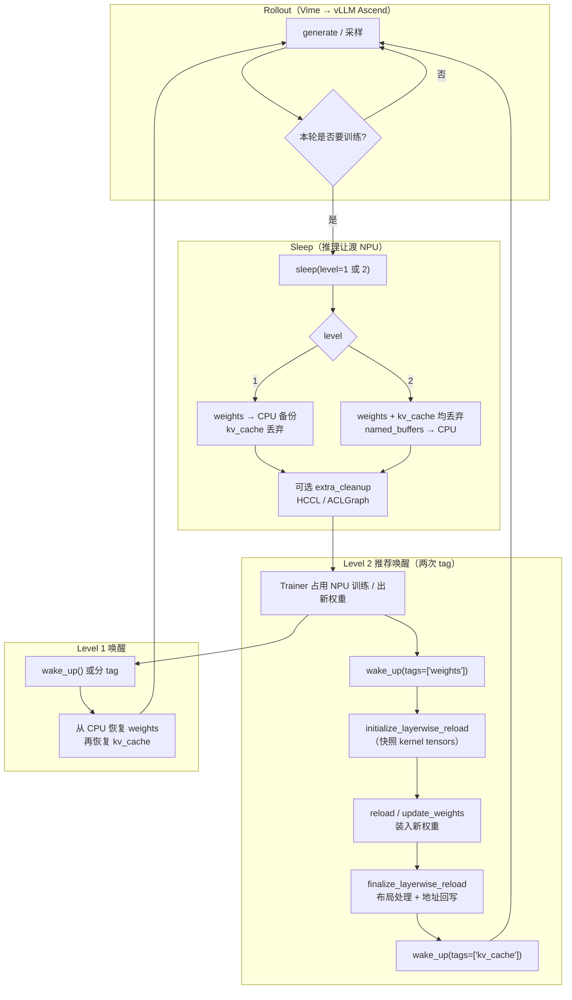
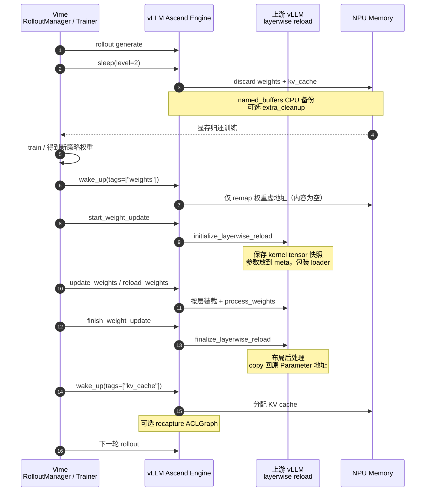

# Sleep Mode 分享：Vime × vLLM × vLLM Ascend

!!! note

    本文是 RL / 同卡训推场景下的 Sleep Mode **流程分享**：说明 Vime 如何
    **复用上游 vLLM** 的 sleep / wake / layerwise reload，以及 Ascend 侧如何承接。
    基础 API 与样例见 [Sleep Mode Guide](sleep_mode.md)。

    上游参考：

    - [Sleep Mode](https://docs.vllm.ai/en/latest/features/sleep_mode/)
    - [Layerwise (Re)loading](https://docs.vllm.ai/en/latest/training/layerwise/)
    - Ascend 权重同步示例：`examples/rl/rlhf_http_hccl.py`、`examples/rl/rlhf_http_npu_ipc.py`

## 1. 为什么要改流程

强化学习（PPO / GRPO / RLHF 等）里，rollout 推理与训练常常**同卡共置**：

1. 推理侧（vLLM Ascend）占用权重 + KV cache；
2. 训练侧（Vime Trainer）需要同一批 NPU 做 forward / backward；
3. 策略更新后，新权重必须灌回推理引擎，继续下一轮 rollout。

旧路径往往是「杀进程 → 重建 Engine → 重新 load」，成本高、首包慢、峰值显存难控。
新流程的核心是：**进程不退出，按 tag 休眠 / 唤醒，权重用上游 layerwise 生命周期原地更新**。

角色分工：

| 组件 | 职责 |
| --- | --- |
| **Vime** | RL 编排：何时 sleep、何时两次 wake、何时 start/update/finish 权重同步 |
| **vLLM（上游）** | Sleep Mode 语义、`CaMem`/`CuMem` tag、layerwise `initialize → reload → finalize` |
| **vLLM Ascend** | NPU `CaMemAllocator`、HCCL/IPC 权重后端、可选 HCCL/ACLGraph extra cleanup、MoE 布局 |

Vime **不再自研一套休眠语义**，而是调用上游已稳定的控制面接口；Ascend 作为硬件插件承接 NPU 内存与权重传输。

## 2. 整体流程图



同卡一轮的推荐时序（Level 2）：

```text
rollout
  → (可选 pause_generation)
  → sleep(level=2)
  → train / optimize
  → wake_up(tags=["weights"])
  → start_weight_update          # → initialize_layerwise_reload
  → update_weights / reload_weights
  → finish_weight_update         # → finalize_layerwise_reload
  → wake_up(tags=["kv_cache"])
  → (可选 resume_generation)
  → 下一轮 rollout
```



## 3. Level 1 与 Level 2

启用前提：启动时 `enable_sleep_mode=True` / `--enable-sleep-mode`。
此后权重与 KV 分配进入 sleep 内存池，并打上 tag：`weights` / `kv_cache`。

| | Level 1 | Level 2 |
| --- | --- | --- |
| **权重** | offload 到 CPU（可恢复原内容） | **丢弃**内容（不备份大权重） |
| **KV cache** | 丢弃 | 丢弃 |
| **named_buffers** | CPU clone，wake 时写回 | 同左（RoPE 等小状态） |
| **Host 内存** | 需能放下整模权重 | 几乎不备份大权重 |
| **唤醒后权重从哪来** | CPU 备份自动还原 | 必须 **reload / update** |
| **典型用途** | 同模型短暂让出 NPU | **RL 权重更新**、换模型 |

Ascend Worker 侧要点（`NPUWorker.sleep` / `wake_up`）：

1. sleep 前对 `named_buffers` 做 CPU clone（L1 / L2 都做）。
2. L1：`CaMemAllocator.sleep(offload_tags=("weights",))` → 权重拷到 Host 再 unmap；其余 tag 直接丢弃。
3. L2：`offload_tags=()` → 所有可释放分配都丢弃（不 offload 大权重）。
4. wake 时按 `tags` remap：有 CPU backup 则 memcpy 回设备；无 backup 则得到**同虚地址、内容为空**的块，供后续 reload 写入。

!!! tip

    RL 同卡更新权重优先 **Level 2**：训练侧往往也要 Host/Device 内存，L1 双份权重容易把 Host 打爆；
    L2 把「旧权重内容」直接丢掉，醒来后灌新权重即可。

## 4. Level 2：复用上游 initialize / reload / finalize

Level 2 丢弃权重后，不能简单「再 `load_model` 一遍」——那样会换 Parameter 对象，
破坏 **ACLGraph / CUDA Graph 对权重地址的绑定**。上游因此提供 **layerwise reload**：

```text
record_metadata_for_reloading   # 首次 load 时记录 meta 信息（引擎内部）
        │
initialize_layerwise_reload     # 更新前：快照 + 切到可加载态
        │
reload / load_weights           # 装入新权重（可按层 defer process）
        │
finalize_layerwise_reload       # 收尾：布局处理 + 地址回写
```

Ascend 权重传输引擎（如 HCCL）直接复用这套 API：

- `start_weight_update()` → `initialize_layerwise_reload(model)`
- `update_weights(...)` → 收包并 `load_weights`（层内触发 process）
- `finish_weight_update()` → `finalize_layerwise_reload(model, model_config)`

### 4.1 `initialize_layerwise_reload`：保存权重引用 / 复用快照

原理（上游 `vllm.model_executor.model_loader.reload`）：

1. **保存当前 kernel tensors 快照**  
   把每层正在被推理图引用的 `Parameter` / `buffer` 记入 `info.kernel_tensors`。
   这些对象的 **storage / data_ptr 就是图捕获时看到的地址**。
2. **按首次 load 记录的 metadata，把层恢复到 meta device**  
   当前参数变成「可重新 load」的占位形态，避免与旧 NPU 内容纠缠。
3. **包装 `weight_loader`**  
   后续加载先缓冲，等该层权重齐了再 materialize + `process_weights_after_loading`。

直观理解：initialize 不是「再分配一套新权重」，而是 **冻结旧 Parameter 对象当锚点（快照）**，
同时把逻辑层切到「准备收新权重」状态。后面 finalize 会把新内容 **拷回这些锚点**。

### 4.2 reload：装入新权重

两条常见路径（Vime 按部署选择）：

| 路径 | 接口 | 数据怎么来 |
| --- | --- | --- |
| 检查点重载 | `collective_rpc("reload_weights", kwargs={"weights_path": ...})` | 从磁盘 / ModelScope 再 load |
| 在线权重同步 | `start_weight_update` → `update_weights` → `finish_weight_update` | Trainer 经 HCCL / NPU IPC 推送 |

reload 阶段每层大致：

1. materialize 到目标 device（wake weights 后已 remap 好的空块）；
2. 用原始 loader 写入缓冲好的权重；
3. 调用 `process_weights_after_loading`（量化打包、Ascend MoE transpose 等）。

若 process 中间临时换了 Parameter，**还不能直接留给图用**——必须走 finalize 的地址回写。

### 4.3 `finalize_layerwise_reload`：权重布局 + 保证地址不变

finalize（上游亦称 `finalize_layerwise_processing`）负责：

1. **补处理**尚未 online process 完的层（含 deferred attention、padding 未满层等）。
2. **`_copy_and_restore_kernel_tensors`**：把处理后的数值  
   `param.data.copy_(new)` **写回 initialize 时保存的原 Parameter / buffer**。
3. **`_place_kernel_tensors`**：把这些原对象重新挂回 module，保证  
   **模块属性仍指向旧对象**（`data_ptr` 不变）。

为什么「地址不变」关键：

- ACLGraph / CUDA Graph 捕获的是 **权重指针**；
- 若 reload 换成新 `nn.Parameter`，图仍指向已释放或错误地址 → 错结果或挂死；
- Ascend MoE 等还会在 `process_weights_after_loading` 里做转置 / 改 layout，必须 **原地写回**，
  不能丢 `weight_loader`、也不能换掉被图钉住的 storage。

```text
initialize 快照的 Parameter(A)  ──┐
                                 │  finalize: A.data.copy_(processed)
reload 得到的临时权重(B) ────────┘
推理图 / ACLGraph 始终引用 A 的地址
```

## 5. 两次 `wake_up`：不同 tag 的原理

`wake_up(tags=...)` 只 remap 指定 tag 的内存池分配；`tags=None` 表示全部。

| 调用 | 恢复什么 | 原理 |
| --- | --- | --- |
| `wake_up(tags=["weights"])` | 仅权重池 | 把 sleep 时 unmap 的 weights handle 再 `create_and_map`；L2 无 CPU backup → **空块、虚地址与 sleep 前一致**，供 reload 写入 |
| `wake_up(tags=["kv_cache"])` | 仅 KV 池 | 再分配 / remap KV；并触发 `post_kv_cache_wake_up`；若开了 extra cleanup，**此时才 recapture ACLGraph** |
| `wake_up()` | 两者一起 | 适合 L1「原权重直接回来、无需中间灌权重」 |

为什么必须拆开（尤其是 Level 2 + 大模型）：

1. **压峰值**：若 weights + kv_cache 同时唤醒，再叠加 Trainer 残留或临时 buffer，极易 OOM。
2. **正确窗口**：KV / Graph 应建立在 **最终权重布局已 finalize** 之后；先构图再改权重会踩脏图。
3. **状态机清晰**：Vime 可在「仅权重就绪」阶段做同步与校验，再打开 KV 进入可服务态。

`is_sleeping`：在 **所有 tag 都唤醒前** 仍为 `true`。

Ascend extra cleanup 与 tag 的配合：

- sleep：可销毁 HCCL、清 ACLGraph workspace；
- wake(`weights`)：恢复通信等，**不**急着 `capture_model`；
- wake(`kv_cache`)：权重已就绪后再 recapture，避免空权重或半成品构图。

## 6. 具体调用方案

### 6.1 Vime 编排（推荐）

伪代码（控制面；数据面按后端选 HCCL 或 IPC）：

```python
# 1) Rollout 结束，让出 NPU
engine.sleep(level=2)

# 2) 训练
trainer.step()

# 3) 只唤醒权重区
engine.wake_up(tags=["weights"])

# 4) 复用上游 layerwise 生命周期（引擎内映射到 initialize/reload/finalize）
engine.start_weight_update()
engine.update_weights(update_info)   # 或 collective_rpc("reload_weights", ...)
engine.finish_weight_update()

# 5) 再唤醒 KV，恢复可推理
engine.wake_up(tags=["kv_cache"])
```

同卡时建议：

1. 权重同步前后用 `pause_generation` / `resume_generation` 卡齐在飞请求；
2. Level 2 后按需 `reset_prefix_cache`，避免陈旧 prefix；
3. 关闭 FRACTAL_NZ：`VLLM_ASCEND_ENABLE_NZ=0` 且 `weight_nz_mode=0`。

### 6.2 Online HTTP（dev mode）

```bash
export VLLM_SERVER_DEV_MODE=1
vllm serve Qwen/Qwen2.5-0.5B-Instruct \
  --enable-sleep-mode \
  --additional-config '{"enable_sleep_mode_extra_cleanup": true}' \
  --weight-transfer-config '{"backend": "hccl"}'

# Level 2 休眠
curl -X POST 'http://127.0.0.1:8000/sleep?level=2'

# 第一次 wake：只 weights
curl -X POST 'http://127.0.0.1:8000/wake_up?tags=weights'

# 路径 A：检查点 reload
curl -X POST 'http://127.0.0.1:8000/collective_rpc' \
  -H 'Content-Type: application/json' \
  -d '{"method":"reload_weights","kwargs":{"weights_path":"Qwen/Qwen2.5-0.5B-Instruct"}}'

# 路径 B：在线同步（与 examples/rl/rlhf_http_hccl.py 一致）
# POST /start_weight_update
# POST /update_weights   # 与 Trainer HCCL broadcast 并行
# POST /finish_weight_update

# 第二次 wake：kv_cache
curl -X POST 'http://127.0.0.1:8000/wake_up?tags=kv_cache'
curl -X GET  'http://127.0.0.1:8000/is_sleeping'
```

### 6.3 离线 Python API

```python
from vllm import LLM

llm = LLM(
    "Qwen/Qwen2.5-0.5B-Instruct",
    enable_sleep_mode=True,
    additional_config={"enable_sleep_mode_extra_cleanup": True},
)

llm.sleep(level=2)
llm.wake_up(tags=["weights"])
llm.collective_rpc("reload_weights", kwargs={"weights_path": "Qwen/Qwen2.5-0.5B-Instruct"})
llm.wake_up(tags=["kv_cache"])
```

### 6.4 Level 1 快速休眠（权重不变）

```python
llm.sleep(level=1)   # weights → CPU，kv 丢弃
# ... 训练或其它任务占用 NPU ...
llm.wake_up()        # 或先 weights 再 kv_cache
```

无需 `reload_weights`；适合「同策略权重、只是短时让卡」。

## 7. 补充要点（实践中容易踩坑）

1. **Sleep ≠ Weight Transfer ≠ Pause**  
   Sleep 管显存让渡；Transfer 管权重字节；Pause/Resume 管在飞请求窗口。三者组合使用，不要互相替代。

2. **先 weights 后 kv_cache 是硬顺序**  
   Level 2 下颠倒顺序或一次 wake 全部，大模型同卡场景峰值风险显著上升。

3. **finalize 保证的是「对象 / 地址」稳定，不是「数值」不变**  
   数值来自 Trainer 新权重；地址必须仍是图捕获时的 Parameter storage。

4. **MoE / 量化依赖 `process_weights_after_loading`**  
   Ascend 侧可能含 expert 转置、scale reshape 等；应走 layerwise 路径，避免 wake 后再手工替换 Parameter。

5. **`enable_sleep_mode_extra_cleanup`**  
   sleep 更「干净」（HCCL + ACLGraph workspace），wakeup 更慢（重建通信 + 可能 recapture）。  
   显存极紧的同卡 RL 可开；更看重唤醒时延则保持默认 `false`。

6. **named_buffers 与 `sleep_persistent`**  
   RoPE 等 buffer 靠 CPU clone 恢复；个别必须跨 sleep 存活的分配可用 `sleep_persistent` tag（例如部分 DSA 辅助张量），不要误丢。

7. **安全面**  
   `/sleep`、`/wake_up`、`/collective_rpc`、权重更新接口仅 `VLLM_SERVER_DEV_MODE=1` 暴露，限内网训练集群。

8. **与 DP Router 的边界**  
   Sleep / 权重同步直连 Engine；请求落 DP 仍走 Router（见其它 RL 文档）。不要把 weight update 打到 Router。

## 8. 相关链接

- [Sleep Mode Guide](sleep_mode.md)：启用方式、L1 样例、extra cleanup。
- 上游 [Sleep Mode](https://docs.vllm.ai/en/latest/features/sleep_mode/)
- 上游 [Layerwise (Re)loading](https://docs.vllm.ai/en/latest/training/layerwise/)
- 代码锚点：
  - `vllm_ascend/worker/worker.py`：`sleep` / `wake_up` / weight update 状态机
  - `vllm_ascend/device_allocator/camem.py`：按 tag offload / discard / remap
  - `vllm_ascend/distributed/weight_transfer/hccl_engine.py`：对接 initialize / finalize
  - `vllm_ascend/device_allocator/sleep_mem_optimized.py`：extra cleanup
- E2E：`tests/e2e/pull_request/one_card/rlhf/state_transitions/test_sleep_wake.py`
