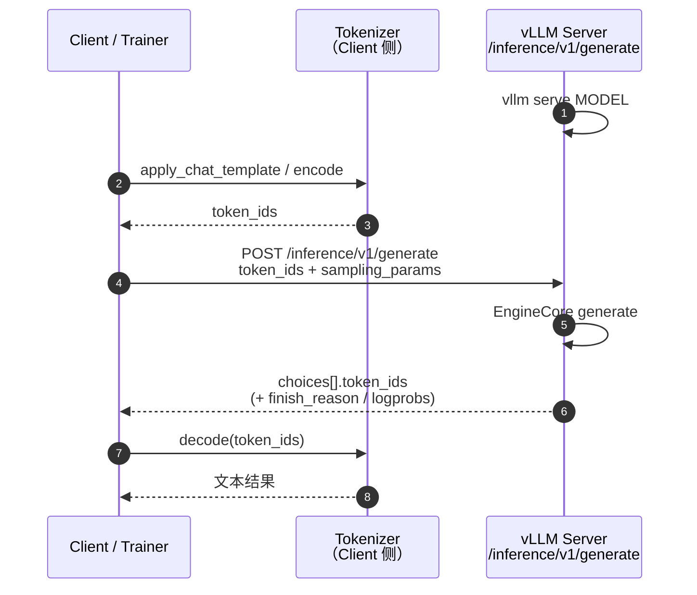
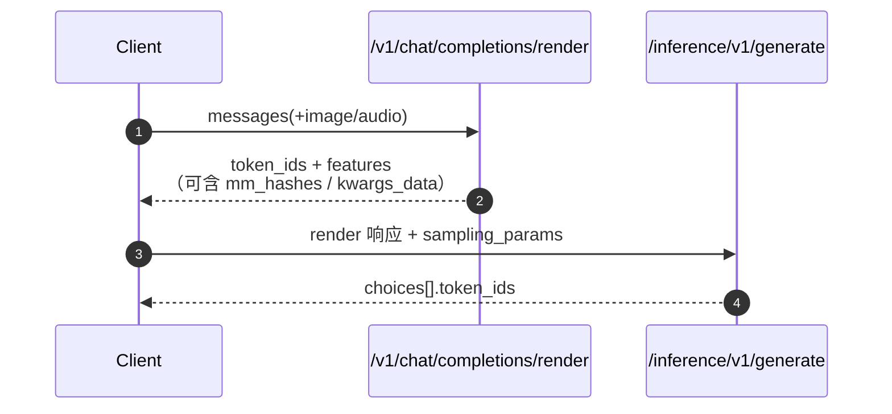

# Token In / Token Out

!!! note

    Token In / Token Out 是上游 vLLM 的低层生成接口
    （`POST /inference/v1/generate`），位于
    `vllm/entrypoints/scale_out/token_in_token_out/`。
    vLLM Ascend 直接复用该上游路径，无需额外开关即可在 Ascend 上使用。

Token In / Token Out（也称 **tokens-in / tokens-out**）以**原始 token ID**
作为输入，并返回**原始 token ID** 作为输出。它绕过 OpenAI Chat/Completions
接口中的 chat template 渲染与默认文本编解码，适合做分离式 Serving、RL
rollout，以及对 token 级控制有要求的基础设施链路。

上游参考：

- RFC：[Disaggregated Everything - Token In <> Token Out API Server](https://github.com/vllm-project/vllm/issues/22817)
- 示例：[`examples/scale_out/token_generation_client.py`](https://github.com/vllm-project/vllm/blob/main/examples/scale_out/token_generation_client.py)
- 多模态组合示例：[`examples/scale_out/example_mm_serve.py`](https://github.com/vllm-project/vllm/blob/main/examples/scale_out/example_mm_serve.py)

## 原理

OpenAI 兼容接口面向“文本进 / 文本出”：服务端负责 tokenize、套 chat template、
detokenize。Token In / Token Out 则把这些职责外置，让引擎更接近
`EngineCore` 的原始输入输出：

| 局限 | 表现 | 后果 |
| --- | --- | --- |
| 文本协议开销 | 每次请求都做 template / tokenize / detokenize | 分离式架构中重复计算，链路难拆分 |
| 格式耦合 | Client 必须走 Chat/Completions schema | RL、Coordinator、PD 分离等场景难直接对接 |
| 中间态不透明 | 外层拿不到稳定的 `token_ids` 契约 | 训练侧 / 下游微服务难以精确复现序列 |

Token In / Token Out 的核心约定：

```text
Client  →  token_ids(+features)  →  vLLM generate
vLLM    →  token_ids(+logprobs/...)  →  Client
```

典型分工：

1. **Renderer / Coordinator**：负责 chat template、多模态预处理，产出
   `token_ids`（以及可选的 `features`）。
2. **Generate 实例**：只做推理，吃 token、吐 token；可再配合
   `kv_transfer_params` 做 PD 分离。
3. **下游**：自行 detokenize，或继续把 token 交给训练 / 下一跳服务。

**没有 Token In / Token Out：**

```text
Client(text) → /v1/chat/completions → text
             → tokenize / template / generate / detokenize 全在一侧
```

**启用 Token In / Token Out：**

```text
Client/Renderer → token_ids → /inference/v1/generate → token_ids
                → 编解码与推理可拆到不同服务
```

## 工作流程

### 纯文本：Client 本地 tokenize



### 分离式：Render → Generate

多模态或希望服务端统一预处理时，可先走 render，再把结果原样交给 generate：



`example_mm_serve.py` 展示了“零客户端变换”组合：render 的 JSON 直接作为
generate 请求体，仅追加 `sampling_params`。

## 如何启用

### 启动服务

普通启动即可暴露该接口（与 OpenAI 兼容入口共存）：

```bash
vllm serve Qwen/Qwen3-0.6B \
  --host 0.0.0.0 --port 8000 \
  --max-model-len 4096
```

**开关：`--tokens-only`**

Generate 实例若只做 token 推理、不需要服务端 tokenizer，可加
`--tokens-only`（便于 Disaggregated Everything）。也可显式使用
`--skip-tokenizer-init`：

```bash
vllm serve /path/to/model \
  --tokens-only \
  --load-format dummy \
  --max-model-len 2048
```

!!! note

    `--tokens-only` / `--skip-tokenizer-init` 时，服务端不再负责文本编解码；
    Client 必须自行提供合法 `token_ids`，并在本地 decode。dummy 权重仅用于
    链路验证，不代表真实生成质量。

### 基本请求

```python
import httpx
from transformers import AutoTokenizer

BASE_URL = "http://localhost:8000"
MODEL_NAME = "Qwen/Qwen3-0.6B"
GEN_ENDPOINT = f"{BASE_URL}/inference/v1/generate"

tokenizer = AutoTokenizer.from_pretrained(MODEL_NAME)
messages = [
    {"role": "system", "content": "You are a helpful assistant."},
    {"role": "user", "content": "How many countries are in the EU?"},
]
token_ids = tokenizer.apply_chat_template(
    messages,
    add_generation_prompt=True,
    return_dict=True,
).input_ids

payload = {
    "model": MODEL_NAME,
    "token_ids": token_ids,
    "sampling_params": {
        "max_tokens": 24,
        "temperature": 0.2,
        "detokenize": False,
    },
    "stream": False,
}

resp = httpx.post(GEN_ENDPOINT, json=payload, timeout=600)
resp.raise_for_status()
data = resp.json()
out_ids = data["choices"][0]["token_ids"]
print(tokenizer.decode(out_ids))
```

### 流式请求

设置 `"stream": true` 后，响应为 SSE：`data: {...}`，结束标记为
`data: [DONE]`。每个 chunk 的 `choices[].token_ids` 携带增量 token；
最后一个 chunk 带 `finish_reason`。

```python
payload["stream"] = True
with httpx.stream("POST", GEN_ENDPOINT, json=payload, timeout=600) as resp:
    resp.raise_for_status()
    for line in resp.iter_lines():
        if not line.startswith("data: "):
            continue
        body = line[len("data: ") :]
        if body == "[DONE]":
            break
        chunk = httpx.Response(200, content=body).json()
        print(chunk["choices"][0]["token_ids"])
```

## 请求 / 响应约定

### 请求（`GenerateRequest`）

| 字段 | 类型 | 含义 |
| --- | --- | --- |
| `token_ids` | `list[int]`（必填，长度 ≥ 1） | 输入 prompt token，不允许负数 |
| `sampling_params` | `SamplingParams` | 采样参数；未显式给 `max_tokens` 时由服务端按 `max_model_len - prompt_len` 填充 |
| `model` | `str` | 可选，模型名 |
| `stream` | `bool` | 是否 SSE 流式 |
| `request_id` | `str` | 可选；未设置时服务端生成 UUID |
| `features` | `MultiModalFeatures` | 多模态哈希、placeholder、序列化 tensor（通常来自 render） |
| `kv_transfer_params` | `dict` | PD 分离等 KV 传输参数 |
| `ec_transfer_params` | `dict` | Encoder-cache 分离参数 |
| `cache_salt` | `str` | prefix cache 加盐，防多租户猜测 |
| `priority` | `int` | 请求优先级（非 0 需服务端启用 priority scheduling） |

### 响应（`GenerateResponse`）

| 字段 | 位置 | 含义 |
| --- | --- | --- |
| `token_ids` | `choices[].token_ids` | 生成出的 token ID 列表 |
| `finish_reason` | `choices[].finish_reason` | 结束原因，默认 `stop` |
| `logprobs` | `choices[].logprobs` | 可选 logprobs |
| `routed_experts` | `choices[].routed_experts` | 可选；开启 Routing Replay 时为 base64 `.npy` |
| `usage` | 顶层 | token 用量统计 |
| `kv_transfer_params` | 顶层 | 分离式 Serving 回传的 KV 参数 |

与 [Routing Replay](routing_replay.md) 组合时：服务端加
`--enable-return-routed-experts`，`/inference/v1/generate` 即可在
`choices[].routed_experts` 返回 MoE 路由信息，供训练侧回放。

## 与 OpenAI 接口对比

| 维度 | `/v1/chat/completions` | `/inference/v1/generate` |
| --- | --- | --- |
| 输入 | `messages` / 文本 | `token_ids`（+ 可选 `features`） |
| 输出 | `text`（可附带 `token_ids`） | `token_ids` 为主 |
| Chat template | 服务端处理 | Client / Render 侧处理 |
| 多模态 | 内嵌在 chat 请求 | 通常先 `/render`，再 generate |
| 典型用途 | 应用层对话 API | 分离式 Serving、RL、基础设施编排 |

## Model Runner V1 / V2 差异

Token In / Token Out 在 Model Runner V1 与 V2 下是**等价的**，不需要单独适配：
**HTTP 契约不变**（仍是 `POST /inference/v1/generate`）。下表仅说明后端
runner 能力边界，便于选型：

| 维度 | Model Runner V1（默认） | Model Runner V2（实验性） |
| --- | --- | --- |
| 启用方式 | 不设 env，或 `VLLM_USE_V2_MODEL_RUNNER=0` | `export VLLM_USE_V2_MODEL_RUNNER=1` |
| 入口实现 | `NPUModelRunner`（`worker/model_runner_v1.py`） | `NPUModelRunner`（`worker/v2/model_runner.py`） |
| HTTP API | 相同 | 相同 |
| 纯文本 token 推理 | 成熟 | 可用（建议验证日志无 V1 fallback） |
| 多模态 `features` / render→generate | 较完整 | 仍在补齐（见 [MRv2 RFC](https://github.com/vllm-project/vllm-ascend/issues/5208)） |
| logprobs / penalties / async scheduling | 支持 | 已支持 |
| PD / `kv_transfer_params` | 更完整 | 仍在推进 |
| 状态 | 默认、生产常用 | Experimental，部分特性未就绪 |

Ascend 上 V2 开关只认环境变量（不再走上游按模型架构的白名单）：

```bash
export VLLM_USE_V2_MODEL_RUNNER=1
vllm serve Qwen/Qwen3-0.6B --host 0.0.0.0 --port 8000
```

启动后请确认日志出现 V2 / `npu model runner v2` 相关提示，且**没有回退到
V1 runner**。Worker 在启用 V2 时会打印：

```text
npu model runner v2 is in developing, some features doesn't work for now.
```

选型建议：

- **RL / 纯文本 token-in-token-out**：V1 最稳；V2 可用于验证与跟进上游演进。
- **多模态 render→generate / PD 分离**：优先 V1，直到 MRv2 对应项闭合。
- **需要 Routing Replay**：两端 API 字段相同；后端 capturer 路径随 runner
  实现而异，上线前用目标 runner 做一次 shape 校验。

## 限制

- **Client 需保证 token 合法。** 负值 `token_ids` 会被拒绝；词表越界会导致
  未定义行为或运行错误。
- **默认不返回自然语言文本。** 需 Client 自行 decode，或在
  `sampling_params` 中按上游版本能力打开 detokenize（若可用）。
- **流式 chunk 是增量 token。** 不要假设每个 chunk 都带完整序列；需自行拼接。
- **与文本 API 的默认行为不完全相同。** 例如历史版本中省略 `max_tokens`
  可能落到 dataclass 默认值 16；当前服务端会按
  `max_model_len - prompt_len` 做默认填充，建议仍显式设置
  `max_tokens`。

## 相关功能

- [Routing Replay](routing_replay.md)：DP 感知 MoE Router 采集；可在同一
  generate 响应中返回本 DP 归属的 `routed_experts`，供 MoE RL 训练回放。
  详见该文档第 6 节与 Token I/O 的组合说明。
- Prefill/Decode 分离相关文档：`kv_transfer_params` 可挂到 generate 请求，
  用于跨实例 KV 传输。
- Model Runner V2 跟踪：[Issue #5208](https://github.com/vllm-project/vllm-ascend/issues/5208)。
