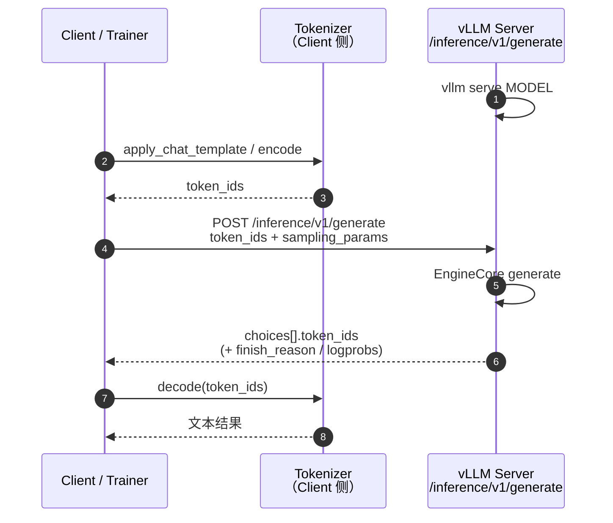
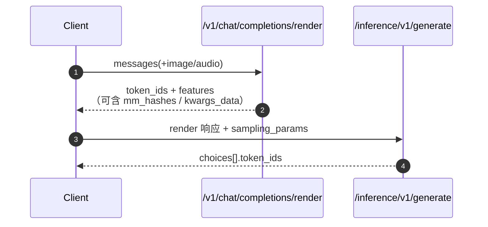

# 6、Token In / Token Out

!!! note

    Token In / Token Out 是上游 vLLM 的低层生成接口
    （`POST /inference/v1/generate`）。vLLM Ascend 直接复用该路径，无需
    Ascend 专用开关。

    上游参考：

    - RFC：[Disaggregated Everything - Token In <> Token Out API Server](https://github.com/vllm-project/vllm/issues/22817)
    - 示例：[`examples/scale_out/token_generation_client.py`](https://github.com/vllm-project/vllm/blob/main/examples/scale_out/token_generation_client.py)
    - 多模态组合：[`examples/scale_out/example_mm_serve.py`](https://github.com/vllm-project/vllm/blob/main/examples/scale_out/example_mm_serve.py)

### 6.1 原理

Token In / Token Out 以**原始 token ID** 作为输入，并返回**原始 token ID**
作为输出。它绕过 OpenAI Chat/Completions 接口中的 chat template 渲染与默认
文本编解码，适合做分离式 Serving、RL rollout，以及对 token 级控制有要求的
基础设施链路。

OpenAI 兼容接口面向“文本进 / 文本出”：服务端负责 tokenize、套 chat template、
detokenize。Token In / Token Out 则把这些职责外置，让引擎更接近
`EngineCore` 的原始输入输出。

典型分工：

1. **Renderer / Coordinator**：负责 chat template、多模态预处理，产出
   `token_ids`（以及可选的 `features`）。
2. **Generate 实例**：只做推理，吃 token、吐 token；可再配合
   `kv_transfer_params` 做 PD 分离。
3. **下游**：自行 detokenize，或继续把 token 交给训练 / 下一跳服务。

### 6.2 特性工作流图

#### 6.2.1 纯文本：Client 本地 tokenize



#### 6.2.2 分离式：Render → Generate

多模态或希望服务端统一预处理时，可先走 render，再把结果原样交给 generate：



`example_mm_serve.py` 展示了“零客户端变换”组合：render 的 JSON 直接作为
generate 请求体，仅追加 `sampling_params`。

### 6.3 版本区别

Token In / Token Out 在 Model Runner V1 与 V2 下是**等价**的，**不需要单独适配**。

HTTP 契约均为 `POST /inference/v1/generate`。后端 runner 在多模态
`features`、PD 等能力上仍有代际差异时，以目标 runner 实测为准；同一集群
不要混部 V1/V2。

### 6.4 使用说明

#### 6.4.1 推理端

**开关**

```text
--tokens-only
```

普通 `vllm serve` 即可暴露 `/inference/v1/generate`（与 OpenAI 入口共存）。
Generate 实例若只做 token 推理、不需要服务端 tokenizer，可加
`--tokens-only`；也可显式使用 `--skip-tokenizer-init`：

```bash
vllm serve Qwen/Qwen3-0.6B \
  --host 0.0.0.0 --port 8000 \
  --max-model-len 4096

# tokenizer-free / Disaggregated Everything 场景
vllm serve /path/to/model \
  --tokens-only \
  --max-model-len 2048
```

**注意**

- **Client 需保证 token 合法。** 负值 `token_ids` 会被拒绝；词表越界会导致
  未定义行为或运行错误。
- **默认不返回自然语言文本。** 需 Client 自行 decode，或在
  `sampling_params` 中按上游版本能力打开 detokenize（若可用）。
- **流式 chunk 是增量 token。** 不要假设每个 chunk 都带完整序列；需自行拼接。
- **与文本 API 的默认行为不完全相同。** 例如历史版本中省略 `max_tokens`
  可能落到 dataclass 默认值 16；当前服务端会按
  `max_model_len - prompt_len` 做默认填充，建议仍显式设置
  `max_tokens`。

**基本请求示例**

```python
import httpx
from transformers import AutoTokenizer

BASE_URL = "http://localhost:8000"
MODEL_NAME = "Qwen/Qwen3-0.6B"
GEN_ENDPOINT = f"{BASE_URL}/inference/v1/generate"

tokenizer = AutoTokenizer.from_pretrained(MODEL_NAME)
messages = [
    {"role": "system", "content": "You are a helpful assistant."},
    {"role": "user", "content": "How many countries are in the EU?"},
]
token_ids = tokenizer.apply_chat_template(
    messages,
    add_generation_prompt=True,
    return_dict=True,
).input_ids

payload = {
    "model": MODEL_NAME,
    "token_ids": token_ids,
    "sampling_params": {
        "max_tokens": 24,
        "temperature": 0.2,
        "detokenize": False,
    },
    "stream": False,
}

resp = httpx.post(GEN_ENDPOINT, json=payload, timeout=600)
resp.raise_for_status()
out_ids = resp.json()["choices"][0]["token_ids"]
print(tokenizer.decode(out_ids))
```

经 [DP Router（数据并行感知路由）](dp_aware_router.md) 时，将
`BASE_URL` 换成 Router 地址即可；请求体不变。

## 相关功能

- [DP Router（数据并行感知路由）](dp_aware_router.md)：RL 场景下经
  vllm-router 访问 `/inference/v1/generate`
- [Routing Replay](routing_replay.md)：可在同一 generate 响应中返回
  `routed_experts`
- Prefill/Decode 分离：`kv_transfer_params` 可挂到 generate 请求
- Model Runner V2 跟踪：[Issue #5208](https://github.com/vllm-project/vllm-ascend/issues/5208)
