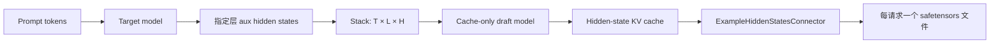
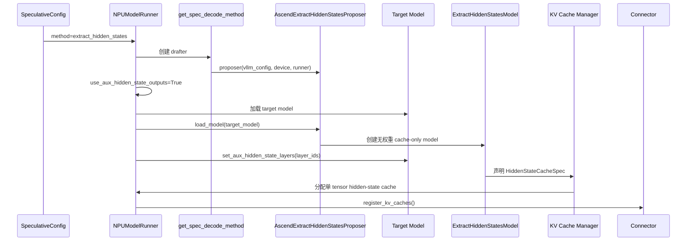
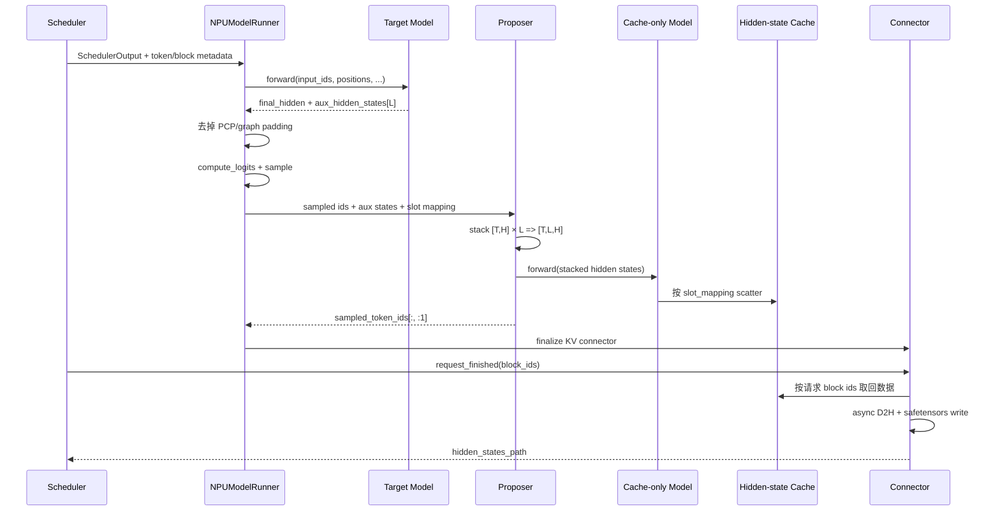
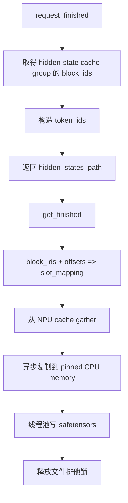

# `extract_hidden_states` 代码分析与讲解指南

## 1. 一句话结论

`extract_hidden_states` 不是“把模型最后一层输出返回给调用方”，也不是真正的 speculative
decoding。它借用了 speculative decoding 和 KV Connector 的基础设施：

1. Target 模型从指定层产出 `aux_hidden_states`；
2. 一个无权重的 cache-only draft model 把它们按 token slot 写入专用 KV cache；
3. `ExampleHiddenStatesConnector` 在请求结束时从 KV cache 取回数据；
4. 最终按请求写成包含 `hidden_states` 和 `token_ids` 的 `.safetensors` 文件。

主要用途是收集 EAGLE 类 draft model 的训练数据。

本文分析基于：

- vLLM Ascend：`ad04efb9`
- 配套 vLLM main：`1f486d96a17303ce8db8e02be39545b2be338446`
- 配套发布版：`v0.23.0`

## 2. 先建立正确的心智模型

可以把整套功能理解成一条“中间层激活导出管线”：



其中：

- `T`：本次参与 forward 的真实 token 数；
- `L`：配置的 hidden-state layer 数；
- `H`：target model 的 hidden size。

最重要的三个理解点：

1. **Target model 负责计算 hidden states**，cache-only model 不做 Transformer 计算；
2. **KV cache 在这里是通用的按 token 分块存储器**，不是传统意义上的 attention K/V；
3. **Speculative token 只是框架接线需要**，proposer 返回 target 已采样 token，因此没有真实
   draft/verify 加速收益。

## 3. 为什么复用 speculative decoding 和 KV cache

如果直接在 model forward 后把所有 hidden states 同步拷到 CPU，会带来三个问题：

- 每步都可能发生 NPU 到 CPU 同步；
- continuous batching 下，不同请求的 token 混在同一扁平 batch 中，需自行维护归属关系；
- 请求可能经历 chunked prefill、多步 decode 和 block 重排，生命周期复杂。

复用现有框架后：

- speculative proposer 已经位于 target forward 和 sampling 之后；
- `slot_mapping` 已经描述“每个 token 应写到哪个物理 block/offset”；
- KV cache manager 已经管理 request 与 block 的生命周期；
- KV Connector 已经知道请求何时结束、何时可以导出并释放 block。

因此，这个设计的本质是：

> 把 `[token, selected_layer, hidden_dim]` 当成一种特殊的 KV 数据，交给 vLLM 已有的
> block manager 和 connector 管理。

## 4. 文件地图

### 4.1 vLLM Ascend 代码

| 文件 | 关键职责 |
|---|---|
| `vllm_ascend/spec_decode/__init__.py` | 根据 method 创建 Ascend proposer |
| `vllm_ascend/spec_decode/extract_hidden_states_proposer.py` | NPU 的 padding、DP 同步、ACL graph dummy run、next-token 处理 |
| `vllm_ascend/worker/model_runner_v1.py` | 初始化、target forward、aux 解包、propose、KV cache 分配和 graph 接线 |
| `vllm_ascend/utils.py` | `HiddenStateCacheSpec` 判断和 MoE drafter 误判规避 |
| `vllm_ascend/patch/platform/patch_mamba_config.py` | Hybrid Mamba 模型的 cache mode 兼容 |
| `vllm_ascend/patch/worker/patch_eagle3_pp_aux.py` | EAGLE3 aux states 的 PP 传播机制 |
| `tests/ut/spec_decode/test_extract_hidden_states_proposer.py` | proposer、DP/SP、padding 单测 |
| `tests/e2e/pull_request/one_card/spec_decode/test_extract_hidden_states.py` | dense/hybrid 端到端导出测试 |

### 4.2 上游 vLLM 代码

| 文件 | 关键职责 |
|---|---|
| `vllm/v1/spec_decode/extract_hidden_states.py` | proposer 通用算法、cache-only model 加载 |
| `vllm/model_executor/models/extract_hidden_states.py` | `ExtractHiddenStatesModel`、`CacheOnlyAttentionLayer`、cache scatter |
| `vllm/v1/kv_cache_interface.py` | `HiddenStateCacheSpec` |
| `vllm/distributed/kv_transfer/kv_connector/v1/example_hidden_states_connector.py` | request 结束、异步 D2H、文件写入和锁 |
| `vllm/config/speculative.py` | `extract_hidden_states` 配置解析和合法性检查 |

## 5. 用户配置及其含义

```python
llm = LLM(
    model="Qwen/Qwen3-8B",
    tensor_parallel_size=1,
    speculative_config={
        "method": "extract_hidden_states",
        "num_speculative_tokens": 1,
        "draft_model_config": {
            "hf_config": {
                "eagle_aux_hidden_state_layer_ids": [2, 18, 34],
            }
        },
    },
    kv_transfer_config={
        "kv_connector": "ExampleHiddenStatesConnector",
        "kv_role": "kv_producer",
        "kv_connector_extra_config": {
            "shared_storage_path": "/tmp/hidden-states",
        },
    },
)
```

| 配置 | 输入 | 作用 |
|---|---|---|
| `method` | `"extract_hidden_states"` | 选择特殊 proposer |
| `num_speculative_tokens` | 必须为 `1` | proposer 只返回 target 的一个 sampled token |
| `eagle_aux_hidden_state_layer_ids` | 如 `[2, 18, 34]` | 指定要采集的逻辑层边界 |
| `kv_connector` | `ExampleHiddenStatesConnector` | 将专用 cache 导出到文件 |
| `kv_role` | `kv_producer` | 该 connector 只写不读 |
| `shared_storage_path` | 目录路径 | 每个请求的输出文件目录 |

两个配置块缺一不可：

- 只有 `speculative_config`：hidden states 会被写入 cache，但没有目标 connector 完成导出；
- 只有 connector：没有 cache-only layer 和 aux hidden states 数据源。

## 6. 初始化流程



### 6.1 创建 proposer

关键代码：`vllm_ascend/spec_decode/__init__.py:34-53`

```python
elif method == "extract_hidden_states":
    return AscendExtractHiddenStatesProposer(
        vllm_config, device, runner
    )
```

输入：

| 参数 | 类型 | 内容 |
|---|---|---|
| `vllm_config` | `VllmConfig` | 模型、调度、并行、spec decode 和 cache 配置 |
| `device` | `torch.device` | NPU device |
| `runner` | `NPUModelRunner` | 提供 SP padding 和 DP metadata 同步 |

输出：

- `AscendExtractHiddenStatesProposer`
- 内部分配
  `[max_num_tokens, num_selected_layers, hidden_size]` 的 NPU buffer。

### 6.2 打开 target model 的 aux 输出

关键代码：`vllm_ascend/worker/model_runner_v1.py:611-644`

```python
elif self.speculative_config.method == "extract_hidden_states":
    assert isinstance(
        self.drafter, AscendExtractHiddenStatesProposer
    )
    self.use_aux_hidden_state_outputs = True
```

输入：

- `speculative_config.method`
- proposer 工厂返回对象

输出：

- `use_aux_hidden_state_outputs=True`
- 后续 target forward 的返回契约从单个 tensor 变为：
  `(final_hidden_states, aux_hidden_states)`。

### 6.3 告诉 target model 采集哪些层

关键代码：`vllm_ascend/worker/model_runner_v1.py:3855-3873`

```python
if should_configure_aux_hidden_states:
    if not supports_eagle3(self.model):
        raise RuntimeError(...)

    aux_layers = self._get_eagle3_aux_layers_from_config()
    if not aux_layers:
        aux_layers = (
            self.model.get_eagle3_default_aux_hidden_state_layers()
        )
    self.model.set_aux_hidden_state_layers(aux_layers)
```

输入：

- `eagle_aux_hidden_state_layer_ids`
- 已加载 target model

输出：

- 模型内部的 `aux_hidden_state_layers`
- forward 时长度为 `L` 的 `list[Tensor]`

约束：

- 模型必须实现 EAGLE3 aux hidden-state 接口；
- layer id 是模型逻辑层索引，不是 Python module list 的任意下标；
- 不同模型的采集 hook 位置可能略有差异，应以其 EAGLE3 接口实现为准。

## 7. 单步运行时完整流程



## 8. Target model 如何产生 aux hidden states

以 DeepSeek patch 为例，关键代码位于
`vllm_ascend/patch/worker/patch_deepseek_v2.py:327-337`：

```python
aux_hidden_states = []
for idx, layer in enumerate(...):
    if idx in self.aux_hidden_state_layers:
        aux_hidden_state = hidden_states + residual
        if aux_hidden_state.shape[0] != positions.shape[0]:
            aux_hidden_state = tensor_model_parallel_all_gather(
                aux_hidden_state, 0
            )
            aux_hidden_state = aux_hidden_state[: positions.shape[0]]
        aux_hidden_states.append(aux_hidden_state)
    hidden_states, residual = layer(...)
```

输入：

| 名称 | 典型 shape | 含义 |
|---|---|---|
| `hidden_states` | `[T_local, H]` | 当前层边界的主分支 |
| `residual` | `[T_local, H]` | residual 分支 |
| `positions` | `[T]` | 本次真实 token 的位置 |
| `aux_hidden_state_layers` | `tuple[int, ...]` | 需要采集的层 |

输出：

```text
aux_hidden_states = [
    Tensor[T, H],  # layer_ids[0]
    Tensor[T, H],  # layer_ids[1]
    ...
]
```

这里采集的通常是 norm 前的 `hidden_states + residual` 表示，不是 logits，也不是最终
LM head 输入。通用 EAGLE3 mixin 和模型 patch 可能在不同的逻辑层边界调用采集函数，因此
讲解某个具体模型时，应额外指出该模型 hook 是“进入 block 前”还是“离开 block 后”。

## 9. Runner 如何接收和裁剪 aux hidden states

关键代码：`vllm_ascend/worker/model_runner_v1.py:2414-2429`

```python
hidden_states = self._model_forward(...)

aux_hidden_states = None
if self.use_aux_hidden_state_outputs:
    hidden_states, aux_hidden_states = hidden_states

if self.pcp_size > 1:
    hidden_states = self.pcp_manager.get_restore_hidden_states(
        hidden_states
    )
    aux_hidden_states = [
        self.pcp_manager.get_restore_hidden_states(h)
        for h in aux_hidden_states
    ]
```

输入：

- Target forward 输出；
- 可能含 ACL graph、SP/PCP padding 的 tensor。

输出：

| 名称 | shape | 后续用途 |
|---|---|---|
| `hidden_states` | `[T_or_T_padded, H]` | logits |
| `aux_hidden_states` | `list[L]`，每项 `[T_or_T_padded, H]` | 导出 |

在 proposer 前还会执行：

```python
target_hidden_states = [
    h[:num_scheduled_tokens] for h in aux_hidden_states
]
```

其中 `num_scheduled_tokens` 是本步所有请求实际调度 token 的总和。该 slice 防止 graph/SP
padding token 被写入请求 cache。

## 10. Proposer 核心算法

上游核心逻辑可简化为：

```python
stacked = torch.stack(target_hidden_states, dim=1)
# [T, H] × L -> [T, L, H]

self.hidden_states[:T] = stacked
attn_metadata = self.attn_metadata_builder.build_for_drafting(
    common_attn_metadata, draft_index=0
)

with set_forward_context(
    ...,
    slot_mapping=self._get_slot_mapping(
        num_input_tokens,
        common_attn_metadata.slot_mapping,
    ),
):
    self.model(
        hidden_states=self.hidden_states[:num_input_tokens]
    )

return sampled_token_ids[:, :1]
```

### 10.1 输入

| 参数 | shape / 类型 | 说明 |
|---|---|---|
| `sampled_token_ids` | `[B, 1]` 或 decode 时 `[B, 2]` | target 采样结果 |
| `target_hidden_states` | `list[L]`，每项 `[T, H]` | 指定层输出 |
| `common_attn_metadata` | `CommonAttentionMetadata` | query 边界、slot mapping 等 |
| `num_speculative_tokens` | `1` | main 分支 API 中显式传入 |

### 10.2 中间结果

| 名称 | shape | dtype | device |
|---|---|---|---|
| `stacked_hidden_states` | `[T, L, H]` | 模型 dtype | NPU |
| proposer buffer | `[max_tokens, L, H]` | 模型 dtype | NPU |
| `slot_mapping` | `[T_padded]` | `int64` | NPU |

### 10.3 输出

```text
draft_token_ids = sampled_token_ids[:, :1]  # [B, 1]
```

它返回 target 自己刚采样的 token，因此形式上的 speculative verification 会通过。这个输出
不是功能的主要产物；主要 side effect 是 hidden states 已被写入 cache。

## 11. Ascend proposer 相比上游做了什么

`AscendExtractHiddenStatesProposer` 主要覆写三个方面。

### 11.1 SP padding 和 DP 同步

关键代码：
`vllm_ascend/spec_decode/extract_hidden_states_proposer.py:43-112`

```python
num_tokens = self.runner._pad_for_sequence_parallelism(num_tokens)
cudagraph_mode, batch_desc = (
    self.cudagraph_dispatcher.dispatch(num_tokens)
)

if data_parallel_size > 1:
    _, num_tokens_across_dp, synced_mode = (
        self.runner._sync_metadata_across_dp(
            num_tokens=batch_desc.num_tokens,
            is_draft_model=True,
            cudagraph_mode=cudagraph_mode,
            allow_dp_padding=True,
        )
    )
```

输入：

- 当前 rank 的真实 token 数；
- SP/TP 对齐要求；
- 各 DP rank 的 token 数。

输出：

- 本 rank 最终执行 token 数 `num_tokens_padded`；
- 所有 DP rank 的 token 数 tensor；
- 一致的 graph mode。

为什么不直接用 upstream `coordinate_batch_across_dp`：

- Ascend main runner 在同一 CPU group 上使用不同形状的同步 metadata；
- 两种 collective 混用会造成 Gloo shape 不匹配或 rank 次序失配；
- 因此 proposer 必须复用 runner 的 `_sync_metadata_across_dp`。

### 11.2 ACL graph dummy run

关键代码：
`vllm_ascend/spec_decode/extract_hidden_states_proposer.py:114-156`

`dummy_run()` 让 graph capture 和 idle DP rank 也执行与真实 proposer 一致的同步顺序，避免
busy rank 和 idle rank 在 collective 次序上分叉。

### 11.3 下一 token 选择

关键代码：
`vllm_ascend/spec_decode/extract_hidden_states_proposer.py:158-198`

```python
sampled = sampled_token_ids[:, 0]
is_valid = (sampled >= 0) & (
    sampled < gpu_input_batch.vocab_size
)
use_sampled = is_valid & ~discard_mask
next_token_ids = torch.where(
    use_sampled,
    sampled.to(torch.int32),
    backup_tokens,
)
```

输入：

| 名称 | shape | 说明 |
|---|---|---|
| `sampled_token_ids` | `[B, 1]` | target sampled token |
| `discard_request_indices` | `[N]` | 本轮应丢弃 sampled token 的请求 |
| `backup_tokens` | `[B]` | request state 中的最后有效 token |

输出：

| 名称 | shape / dtype | 说明 |
|---|---|---|
| `next_token_ids` | `[B]`, `int32` | 下一轮输入 |
| `valid_sampled_tokens_count` | `[B]`, `int32` | token 是否落在 vocab 范围内 |

## 12. Cache-only model 如何把 hidden states 写入 KV cache

上游 `ExtractHiddenStatesModel` 只有一个 `CacheOnlyAttentionLayer`，没有需要加载的权重：

```python
self.cache_only_layers = nn.ModuleDict({
    str(target_num_hidden_layers): CacheOnlyAttentionLayer(
        num_heads=num_hidden_states,
        head_size=hidden_size,
    )
})
```

这里故意做了一个维度映射：

| Hidden-state 语义 | Attention cache 语义 |
|---|---|
| selected layer 数 `L` | `num_kv_heads` |
| hidden size `H` | `head_size` |
| token 数 `T` | token/sequence 维 |

所以不需要 reshape：

```text
to_cache: [T, L, H]
kv_cache: [num_blocks, block_size, L, H]
```

真正写入是：

```python
block_size = kv_cache.shape[1]
slot_mapping = slot_mapping.clamp_min(0)
kv_cache[
    slot_mapping // block_size,
    slot_mapping % block_size,
] = to_cache
```

输入：

- `[T, L, H]` hidden states；
- 每个 token 对应的绝对 slot id。

输出：

- 无业务返回值；
- side effect：对应 block/offset 被写入。

Padding slot 为 `-1`，上游会将其 clamp 到 0，即写入保留的 null block，避免分支和
device/host 同步。

## 13. Ascend 的 hidden-state cache 分配

关键代码：
`vllm_ascend/worker/model_runner_v1.py:5028-5048`

```python
elif isinstance(attn_module, CacheOnlyAttentionLayer):
    kv_cache_spec[layer_name] = HiddenStateCacheSpec(
        block_size=spec.block_size,
        num_kv_heads=spec.num_kv_heads,
        head_size=spec.head_size,
        dtype=spec.dtype,
        cache_dtype_str=spec.cache_dtype_str,
    )
```

`HiddenStateCacheSpec` 的意义不是只保存 shape。它还要求 KV cache manager 将 cache-only
layer 隔离到正确的 cache group，特别是 hybrid attention + Mamba 模型不能把它降级为普通
attention spec。

分配后的最终 view：

```text
[num_blocks, block_size, num_selected_layers, hidden_size]
```

Ascend 使用单 tensor，不拆成 K/V 两份。Hybrid 模型若统一 page size，会通过
`page_size_padded` 和 `torch.as_strided` 跳过每个 block 尾部 padding。

## 14. 为什么 connector finalize 必须在 draft 之后

Target forward 时：

```python
clear_kv_metadata = self.speculative_config is None
self.maybe_get_kv_connector_output(
    scheduler_output,
    defer_finalize=not clear_kv_metadata,
)
```

对应 `vllm_ascend/worker/model_runner_v1.py:2386-2410`。

此时 target 已经 forward，但 cache-only drafter 还没把 hidden states 写入专用 cache。
因此 speculative mode 会延迟 connector finalize。

完成 proposer 后：

```python
if self.speculative_config is not None:
    self.finalize_kv_connector()
```

对应 `model_runner_v1.py:2626-2630`。

顺序必须是：

```text
target forward
-> proposer/cache-only forward
-> connector finalize
```

如果提前 finalize，connector 可能观察到尚未更新的 hidden-state cache。

## 15. 请求结束与文件输出



connector 的核心输入：

| 输入 | 来源 |
|---|---|
| `block_ids` | KV cache manager |
| `token_ids` | request 的 prompt/all token ids |
| hidden-state cache | `register_kv_caches()` |
| 输出路径 | `shared_storage_path` 或受控 custom path |

文件内容：

| Key | shape | dtype | device |
|---|---|---|---|
| `hidden_states` | `[num_tokens, L, H]` | 模型/cache dtype | CPU 文件 |
| `token_ids` | `[num_tokens]` | 整数 | CPU 文件 |

调用方拿到：

```python
path = output.kv_transfer_params["hidden_states_path"]
```

写盘是异步的。配套 loader 会先获取 `.lock` 文件共享锁；writer 持有排他锁，写完后关闭
fd，读端才继续，因此不能仅凭“路径已经返回”判断文件内容已完整。

## 16. Token 与 hidden states 如何对齐

continuous batching 会把多个请求的 token 扁平化：

```text
request A: A0 A1 A2
request B: B0 B1
flat batch: A0 A1 A2 B0 B1
```

Target aux states 也是这个顺序：

```text
[A0_h, A1_h, A2_h, B0_h, B1_h]
```

`slot_mapping` 将每个元素映射到该请求的 block：

```text
A0 -> block 7, offset 0
A1 -> block 7, offset 1
A2 -> block 7, offset 2
B0 -> block 12, offset 0
B1 -> block 12, offset 1
```

请求结束时 connector 只拿该请求的 `block_ids`，再按 block 内 offset 展开，最后按
`num_tokens` 截断。因此输出文件重新成为单请求、按 token 顺序排列的 tensor。

这也是为什么不能只保存当前 batch tensor：batch 顺序是执行时顺序，block mapping 才是
请求生命周期内的稳定索引。

## 17. Prefill、decode 和生成 token

### 17.1 Prefill

- 一次处理 prompt 的多个 token；
- 每个选定层产生 `[prompt_tokens, H]`；
- proposer 一次写入 `[prompt_tokens, L, H]`。

### 17.2 Chunked prefill

理论上每个 chunk 可按 slot 增量写入同一请求 cache，但当前 E2E 显式设置
`enable_chunked_prefill=False`，所以不能把该组合视为已验证能力。

### 17.3 Decode

decode 通常每请求每步只有一个新输入 token。若允许多步生成，hidden-state cache 可以继续
增量写入，但默认 connector 使用 `prompt_token_ids` 导出，文档和 E2E 也使用
`SamplingParams(max_tokens=1)`。

最后一个生成 token 只是本步输出，还没有作为下一步输入执行 forward，因此没有对应 hidden
state。connector 的 `include_output_tokens` 逻辑也会排除这个 final token。

讲解时可以概括为：

> 文件中的 token 必须是“真正进入过 target forward 的 token”，而不是“API 返回过的所有
> token”。

## 18. 并行与 ACL Graph

### 18.1 Data Parallel

- Target 和 proposer 都必须让 busy/idle rank 执行相同顺序的 metadata collective；
- proposer 使用 `is_draft_model=True`；
- cache-only drafter 永远不是 MoE，`utils.py:921-933` 避免从 target 的复制配置误判为
  MoE drafter；
- UT 覆盖 DP metadata shape 和 TP 对齐，但没有多卡 E2E。

### 18.2 Tensor Parallel

- 某些模型 patch 会在 aux state token 维不匹配时 all-gather；
- connector 仅 TP rank 0 写文件；
- 当前 Ascend E2E 都是 `tensor_parallel_size=1`，TP>1 不能只依据代码路径宣称已验证。

### 18.3 Pipeline Parallel

仓库有 `patch_eagle3_pp_aux.py` 用 `IntermediateTensors` 跨 stage 传播 aux states，但当前
`model_runner_v1.py:3855-3860` 在 PP>1 时只依据 `_eagle3_uses_aux_hidden_state()` 决定
是否配置，而该函数只识别 `method=="eagle3"`。

因此在当前基线中，不能宣称 `extract_hidden_states + PP>1` 已支持；它既无 E2E，初始化
条件也没有完整覆盖该 method。

### 18.4 PCP / SP

- PCP：target forward 后用 `get_restore_hidden_states()` 去除重排和 padding；
- SP：proposer 先 `_pad_for_sequence_parallelism()`，再参与 DP 同步；
- 返回的 `num_tokens_padded` 必须满足 TP/SP 对齐。

### 18.5 ACL Graph

- Target 可以使用 ACL graph；
- proposer 初始化独立 graph keys；
- cache-only proposer 通常使用 PIECEWISE 或 eager；
- `dummy_run()` 必须复现真实运行的 DP 同步和 forward context；
- dense ACL graph 已有 E2E。

## 19. Hybrid Mamba 模型的特殊处理

Hybrid 模型同时有 attention 和 Mamba cache，page size 与 cache group 更复杂。

Ascend 做了两项关键适配：

1. 保留 `HiddenStateCacheSpec`，让 hidden-state cache 独立分组；
2. `patch_mamba_config.py:125-136` 在 extract 模式下不强制
   `mamba_cache_mode="align"`。

原因是 `ExampleHiddenStatesConnector` 只管理 hidden-state cache，不迁移 Mamba cache。
强制 align 会进入 Ascend 无法编译的上游 GPU Triton postprocess 路径。

当前测试只覆盖 Qwen3.5 dummy weights + eager 的 shape/token round trip，不验证真实 hidden
state 数值，也不覆盖 hybrid ACL graph。

## 20. 支持范围

| 维度 | 当前基线状态 |
|---|---|
| V1 engine + V1 NPU model runner | 已实现 |
| V2 NPU model runner | 当前 `init_speculator()` 只支持 Eagle/DFlash，extract 会抛 `NotImplementedError` |
| 310P | 类继承 V1 runner，但没有 extract 专项适配或 E2E，不应视为已验证 |
| Dense eager | E2E 覆盖 |
| Dense ACL graph | E2E 覆盖 |
| Hybrid eager | dummy-weight smoke 覆盖 |
| Hybrid ACL graph | 未覆盖 |
| DP/SP | UT 覆盖关键同步；无多卡 E2E |
| TP>1 / PP>1 / EP | 无 extract E2E；PP 当前初始化条件存在缺口 |
| Chunked prefill | E2E 显式关闭 |
| Quantized hidden-state KV cache | cache-only backend 不支持；会回退/要求非量化 cache dtype |
| Cascade / non-causal cache-only attention | 不支持 |

另有独立远端开发分支包含 V2 runner 适配，但不在本文基线和当前 main 中，不能作为当前能力
对外说明。

## 21. 内存与性能估算

Hidden-state cache 的有效数据量近似为：

```text
bytes = token_count × selected_layer_count × hidden_size × dtype_bytes
```

Qwen3-8B 示例：

```text
L = 3
H = 4096
dtype = BF16 = 2 bytes
每 token = 3 × 4096 × 2 = 24 KiB
1024 tokens ≈ 24 MiB
```

实际占用还包括：

- block/page 向上取整；
- hybrid page padding；
- proposer 的常驻 `[max_num_tokens, L, H]` buffer；
- 请求结束时的 pinned CPU 副本；
- 异步写盘期间 NPU cache、CPU buffer、文件可能短暂同时存在。

性能热点不是 cache-only attention 计算，而是：

- `torch.stack` 和 proposer buffer copy；
- cache scatter；
- NPU 到 pinned CPU 的 gather/copy；
- safetensors 写盘带宽；
- 多请求并发时的 writer thread 和共享存储吞吐。

## 22. 测试覆盖

### 22.1 单元测试

`tests/ut/spec_decode/test_extract_hidden_states_proposer.py` 覆盖：

- proposer 初始化；
- ACL graph `dummy_run`；
- idle/busy DP rank 同步；
- sampled/discarded/invalid token 的 next-token 选择；
- DP1 + SP padding；
- DP2 metadata 同步；
- TP 对齐约束。

### 22.2 E2E

`tests/e2e/pull_request/one_card/spec_decode/test_extract_hidden_states.py`：

| Case | 模型 | 模式 | 验证 |
|---|---|---|---|
| `dense_eager` | Qwen3-8B | eager | shape + non-zero |
| `dense_aclgraph` | Qwen3-8B | ACL graph | shape + non-zero |
| `hybrid_dummy_eager` | Qwen3.5-0.8B | eager | shape + token ids |

关键断言：

```python
expected_shape = (
    len(output.prompt_token_ids),
    len(aux_hidden_state_layer_ids),
    hidden_size,
)
assert hidden_states.shape == expected_shape
```

### 22.3 讲解时应主动说明的测试缺口

- V2 runner、310P；
- TP/PP/EP 多卡；
- MoE + DP 的真实多卡 E2E；
- chunked prefill、prefix caching；
- hybrid ACL graph 和真实权重数值；
- proposer `propose()` 的完整 UT；
- connector 写盘失败、磁盘满和高并发压力；
- 在线 serving 的权限、路径和锁行为。

## 23. 常见误解

### 误解 1：这是 embedding API

不是。Embedding/pooling 返回一个请求级向量；本功能返回多个指定层、逐 token 的 hidden
states。

### 误解 2：这是正常 speculative decoding 加速

不是。draft token 等于 target sampled token，主要目的是利用 spec decode 的运行时接线。

### 误解 3：cache-only model 会再次计算 Transformer

不会。它没有权重，只负责把 `[T, L, H]` scatter 到 cache。

### 误解 4：输出路径返回时文件一定写完

不一定。写盘异步进行；应通过配套 loader/锁等待完成。

### 误解 5：输出包含最后一个生成 token 的 hidden state

通常不包含。最后一个 token 尚未作为输入进入下一轮 forward。

### 误解 6：配置三个 layer id 就一定对应三个“层输出”

它对应模型 EAGLE3 接口定义的逻辑层边界。具体是 block 前还是 block 后，要看模型实现。

## 24. 运维与安全注意事项

- 输出目录需要足够的磁盘容量和 inode；
- 文件是一请求一个，短请求高并发时可能产生大量小文件；
- 在线场景应保留 synchronization lock；
- `allow_custom_save_path=True` 会允许 API 客户端指定服务端写入路径，只能对可信客户端启用；
- 共享存储需考虑 writer 并发、吞吐和清理策略；
- 读取后调用 connector cleanup，或建立生命周期清理任务；
- safetensors 版本会影响 writer 是否长时间持有 GIL；
- 训练数据可能包含敏感 prompt 的中间表示和 token ids，应按原始数据同等级保护。

## 25. 推荐代码阅读顺序

1. `docs/source/user_guide/feature_guide/speculative_decoding.md:216-286`
2. `vllm_ascend/worker/model_runner_v1.py:611-644`
3. `vllm_ascend/worker/model_runner_v1.py:2386-2488`
4. `vllm_ascend/worker/model_runner_v1.py:1836-1872`
5. `vllm_ascend/spec_decode/extract_hidden_states_proposer.py`
6. 上游 `vllm/v1/spec_decode/extract_hidden_states.py`
7. 上游 `vllm/model_executor/models/extract_hidden_states.py`
8. `model_runner_v1.py:4190-4238,4496-4580,5028-5048`
9. 上游 `example_hidden_states_connector.py`
10. `tests/e2e/pull_request/one_card/spec_decode/test_extract_hidden_states.py`

## 26. 对外讲解提纲

### 26.1 三分钟版本

1. 目标：为 EAGLE 训练采集 target 中间层逐 token 激活；
2. Target 输出 `list[L]` 个 `[T,H]` tensor；
3. proposer stack 成 `[T,L,H]`；
4. cache-only model 利用 `slot_mapping` 写入专用 block cache；
5. request 完成后 connector 按 block 取回并写 safetensors；
6. speculative token 等于 target token，所以它不是推理加速功能。

### 26.2 十五分钟版本

建议按以下顺序讲：

1. 从输出文件 shape `[T,L,H]` 反推需求；
2. 解释 continuous batching 下为什么需要 slot/block；
3. 展示初始化流程图；
4. 展示 target forward 到 cache scatter 的 sequence diagram；
5. 展示三个核心代码：
    - `use_aux_hidden_state_outputs=True`
    - `torch.stack(..., dim=1)`
    - `kv_cache[block, offset] = to_cache`
6. 解释 connector 的 request-finished 生命周期和异步锁；
7. 解释 Ascend 的 DP/SP/ACL graph 适配；
8. 最后说明支持矩阵、内存成本和测试缺口。

## 27. 可以用来检查听众是否理解的问题

1. 为什么输出 shape 是 `[T,L,H]`，而不是 `[L,T,H]`？
2. 为什么要保存 `token_ids`？
3. 为什么需要 `slot_mapping`，不能直接保存 flat batch？
4. 为什么 proposer 返回 sampled token，而不是生成新 token？
5. 为什么 connector finalize 必须发生在 cache-only forward 之后？
6. 为什么最后一个 output token 通常没有 hidden state？
7. 为什么 hybrid 模型必须保留 `HiddenStateCacheSpec`？
8. DP idle rank 为什么也要执行 proposer metadata sync？

如果能回答这八个问题，就已经掌握了这条代码路径的核心设计。
